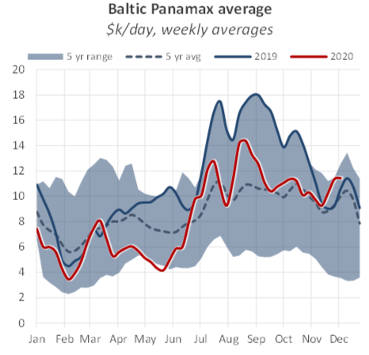
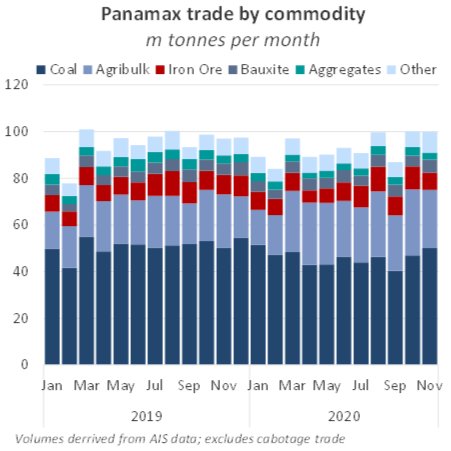
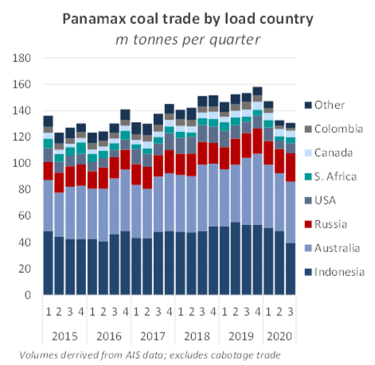
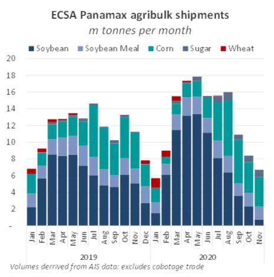
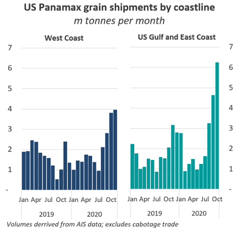
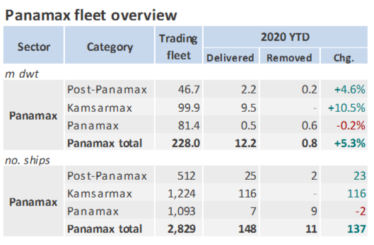
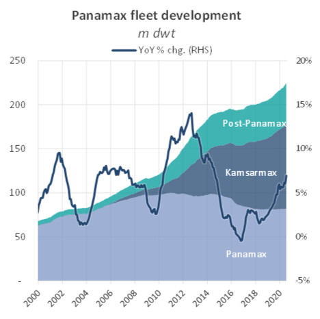

# The Big Picture: 2020 Review: The Panamax Market

**Date:** December 06, 2020  
**Publisher:** Breakwave Advisors | **Category:** Market Insights  
**Original URL:** [https://www.breakwaveadvisors.com/insights/2020/12/4/the-big-picture-2020-review-the-panamax-market](https://www.breakwaveadvisors.com/insights/2020/12/4/the-big-picture-2020-review-the-panamax-market)  

---

*By Nick Ristic*

This year has been a mixed bag for the Panamaxes, with the market caught between opposing forces. After a choppy first few months, a boost in grain shipments has helped to pull rates back to healthy levels, but persisting weakness in coal trade has capped earnings.

### Freight

Like the smaller ships, which we reviewed last week, Panamaxes too have seen large swings in earnings this year. The Baltic Exchange’s Panamax (74k dwt) average plummeted to a five-year low of $3,345/day in February, remaining subdued for most of Q1 and Q2. Rates over the first half of this year averaged just over $6,900/day, 16% lower compared to Q1-Q2 2019, which was itself a weak first half.

> **Figure 1: Bmr 50**  
> [Local Asset](file:///C:/Users/Dell/Github/Shipping/corpus/03-breakwave/insights/2020/assets/2020-12-06_the-big-picture-2020-review-the-panamax-market_img_bmr50_92bcd5cd7adb.png)

Rising in tandem with the Capes, the reversal came in June, with Panamax freight rising to a peak of just over $15,000/day in August. However the market did not seem able to climb to last-year’s highs, with average rates over Q3 settling 27% lower YoY. Over this period, demand has been pulled in both directions by bullish and bearish market forces, as the Covid-19 crisis has hit the various commodity markets in different ways.

### Coal Trade Down

As we covered previously, coal trade has been one of the dry bulk commodities worst affected by the pandemic. Coal is the top commodity shipped on Panamaxes (inc. Kamsarmaxes and Post-Panamaxes) by volume, so naturally this has taken a heavy toll on Panamax demand.

> **Figure 2: Bmr 51**  
> [Local Asset](file:///C:/Users/Dell/Github/Shipping/corpus/03-breakwave/insights/2020/assets/2020-12-06_the-big-picture-2020-review-the-panamax-market_img_bmr51_d780fb31aa27.png)

Over the first eleven months of this year, total coal volumes shipped on Panamaxes (excluding cabotage trade) amounted to 507.5m tonnes, 9% lower YoY.

Last week’s report discussed the drivers of lower Pacific coal volumes, but Atlantic coal trade, which is a staple for vessels that trade in this basin, has also been hammered. Lockdowns in Europe had a devastating effect on coal demand for Atlantic suppliers. Reduced power demand and a collapse in LNG prices hit thermal coal purchases, while weaker steelmaking activity lowered coking coal requirements. Meanwhile, we also saw significant supply disruption, in the form of a three-month strike at Colombia’s second largest coal producer. The strike ended earlier this week, but took an estimated 5.1m tonnes of coal out of the seaborne market this year. Panamax coal liftings from the Atlantic’s top suppliers, the US and Colombia, over January-November, fell by 26% YoY to 39.2m tonnes, though the sharpest declines were seen in June, which saw shipments tumble by 57% YoY.

> **Figure 3: Bmr 52**  
> [Local Asset](file:///C:/Users/Dell/Github/Shipping/corpus/03-breakwave/insights/2020/assets/2020-12-06_the-big-picture-2020-review-the-panamax-market_img_bmr52_22ada0367d9d.png)

We saw this weakness in Atlantic flows reflected in transatlantic freight rates, which underperformed in the first half of the year. According to the Baltic Exchange, earnings on this trade slumped to just $716/day in May, only a few dollars higher than the all-time lows of 2014.

There have however been some brighter spots for coal trade. Russian coal exports on these vessels have made gains, from both the country’s western and eastern coast. Shipments over the first eleven months of the year totalled 92.6m tonnes, up by 15% YoY, though much of the growth came in October and November, when a combined 21.9m tonnes was shipped, 41% greater YoY. Russia’s coal miners have been one of the beneficiaries of China’s informal ban on Australian coal imports, with these suppliers able to provide material of a similar quality.

We expect these volumes to remain elevated through the remainder of the year, but growth is limited by the production capabilities of these miners. With Russian supply reportedly close to being sold out, we have also seen Chinese buyers increasingly show interest in US supply. We are yet to see a significant increase in China-bound shipments from the US, but prices there remain relatively firm, and we may see an uptick in volumes in the final weeks of the year.

### Grain Provides Support

It hasn’t all been bad news for Panamax demand this year. While coal volumes were struggling over the first half of the year, the Panamaxes received support from a booming grain market, helping to offset lost demand. Soybean shipments from East Coast South America (ECSA) surged in March, as the seasonal exporting period began and over the subsequent months we watched shipments rocket to record highs. Soybean exports from Brazil and Argentina on bulk carriers hit an all-time high of 15.2m tonnes in May, an increase of 45% YoY. Meanwhile, total volumes over the first half of the year reached 63.8m tonnes, a 35% jump relative to last year. Approximately 90% of ECSA’s soybean shipments are moved on Panamaxes.

The boost was driven both by record Brazilian yields and by a resurgence in Chinese buying activity, which was subdued in 2019 as pig farms grappled with an outbreak of swine flu. The rebuilding of China’s pig herd, consolidation into larger industrialised farms, and a favourable exchange rate helped to drive a surge in Chinese soy purchases.

Corn trade also remained strong this year, though it fell slightly short of 2019’s record volumes. ECSA corn shipments so far this year stand at 55.5m tonnes, a decline of 12% YoY but still 50% higher versus 2018.

> **Figure 4: Healthy Feed Demand in China Has Sustained Through the Second**  
> *Healthy feed demand in China has sustained through the second half of the year, allowing US exporters to capitalise. The US export season kicked off in August, and there too, volumes have soared. Exports grew by around 75% YoY in October, and will likely remain strong as the year draws to a close (see ourBig Pictureon 20 November). This has recently helped to support rates in the USG and in the North Pacific.*  
> [Local Asset](file:///C:/Users/Dell/Github/Shipping/corpus/03-breakwave/insights/2020/assets/2020-12-06_the-big-picture-2020-review-the-panamax-market_img_bmr53_f75c3bdc2258.png)

> **Figure 5: Bmr 54**  
> [Local Asset](file:///C:/Users/Dell/Github/Shipping/corpus/03-breakwave/insights/2020/assets/2020-12-06_the-big-picture-2020-review-the-panamax-market_img_bmr54_633f20c915f6.png)

Total grain trade on Panamaxes so far this year amounts to approximately 264m tonnes, marking an 18% improvement over the same period in 2019.

### Demand Switchover

With elevated grain trade picking up some of the slack left by reduced coal flows, we’ve recorded a shift in the make-up of Panamax demand in 2020. Coal’s share of trade by tonnes moved has fallen from 54% in 2019 to below 50% so far this year. Agribulks meanwhile have become increasingly important, with their share of trade increasing from 21% to 26% over this period.

But due to the greater distances involved in the grain trades, we have seen these goods supersede coal in their importance to Panamax demand. Accounting for differing voyage lengths, coal’s share of demand has fallen from 42% to 39% since 2019, while the grains’ share of demand has grown from 36% to 41%, surpassing coal on an annual basis for the first time.

### Supply

Further weighing on earnings, the Panamax fleet has seen the highest level of fleet growth in 2020 of all the dry bulk sectors. With 148 ships delivered within this segment and only 11 removed, carrying capacity in this sector has surged by 5.3% since the start of the year to 228m dwt.

> **Figure 6: Removals of Over-Age Panamaxes Have Been Extremely Limited Over**  
> *Removals of over-age Panamaxes have been extremely limited over the past couple of years, and many of these ships find employment in regional coal trades (see ourBig Pictureon 20 August), due to draft limitations on this business, though demolitions have seen a slight uptick in the past few weeks. The vessels in this group which have been scrapped so far this year had an average age of 28 years and an average size of around 73k dwt.*  
> [Local Asset](file:///C:/Users/Dell/Github/Shipping/corpus/03-breakwave/insights/2020/assets/2020-12-06_the-big-picture-2020-review-the-panamax-market_img_bmr55_4d9b0a2ee2c6.png)

Additions have focused heavily on the Kamsarmaxes. This relatively young vessel class has seen 9.5m dwt join the fleet since 1 January, pushing capacity up by 10.5%. This year also saw a milestone for the Kamsarmax fleet as it overtook the smaller Panamaxes by number of ships, a symbol of this design’s position as the new face of the Panamax fleet.

> **Figure 7: Bmr 56**  
> [Local Asset](file:///C:/Users/Dell/Github/Shipping/corpus/03-breakwave/insights/2020/assets/2020-12-06_the-big-picture-2020-review-the-panamax-market_img_bmr56_203139b31100.png)

---

**Tags:** Dry Bulk, Panamax, Grains, Coal  
