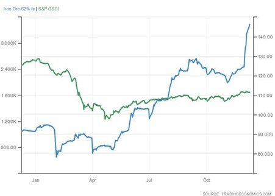

# Iron Ore Trade: What Is the Crystal Ball Saying?

**Date:** December 10, 2020  
**Publisher:** Breakwave Advisors | **Category:** Market Insights  
**Original URL:** [https://www.breakwaveadvisors.com/insights/2020/12/10/iron-ore-trade-what-is-the-crystal-ball-saying](https://www.breakwaveadvisors.com/insights/2020/12/10/iron-ore-trade-what-is-the-crystal-ball-saying)  

---

*By Ulf Bergman*

> **Figure 1: Iron Ore Vs**  
> *Iron ore vs. S&P GSCI composite index*  
> [Local Asset](file:///C:/Users/Dell/Github/Shipping/corpus/03-breakwave/insights/2020/assets/2020-12-10_iron-ore-trade-what-is-the-crystal-ball-saying_img_ironorepellets_4425ade9df22.jpg)

It is the time of the year when the crystal balls get dusted off and put to work to see what next year will bring. Any projections made a year ago are likely to have missed the targets by a considerable margin, as the COVID-19 barely registered for pundits at that stage. The focus then was on a potential trade deal between China and the US, with declining geopolitical tensions and a boost in trade as a result. Instead, the world got a year with many notable firsts, with countries in lockdown, negative oil prices and vaccines developed in less than a year to name a few. The trade deal did indeed materialize, but compliance with it so far has been disappointing, to say the least.

Iron ore turned out to be of the few rare stellar performers of the year, with prices rising around 60 percent since the beginning of the year. Hence, outperforming the US equity market indices by a considerable margin, despite those trading around new all-time high levels. Broader commodity indicators, such as the S&P GSCI, have despite this languished throughout the year, as the pandemic sent the demand for oil and refined products lower. Industrial and agricultural commodities have also benefited, as China’s economy recovered sharply and has gone from strength to strength driving demand. However, only rarer commodities, such as rhodium, have managed to do better than iron ore so far this year, with the growth in Chinese industrial production pushing demand higher.

> **Figure 2: Ulf 83**  
> [Local Asset](file:///C:/Users/Dell/Github/Shipping/corpus/03-breakwave/insights/2020/assets/2020-12-10_iron-ore-trade-what-is-the-crystal-ball-saying_img_ulf83_cf9f191984f2.jpg)

It is debatable how much of the price increase of iron ore can be directly attributed to the strong growth in demand for steel in the Chinese industrial sector, as iron ore futures gained popularity among investors as a proxy for investing in the Chinese recovery. Traded volumes of iron ore futures have increased during the year and contributed to the strong performance of the commodity. Nevertheless, demand for physical iron ore looks unlikely to decline in any material way anytime soon, as the Chinese economy and industrial production can be expected to keep the positive momentum going and the rest of the world will start its recovery process in earnest, as the vaccines start to roll out.

> **Figure 3: Market Chart 3**  
> [Local Asset](file:///C:/Users/Dell/Github/Shipping/corpus/03-breakwave/insights/2020/assets/2020-12-10_iron-ore-trade-what-is-the-crystal-ball-saying_img_image-asset_14b3b8bff62a.jpeg)

Iron ore prices could potentially start softening somewhat next year, as Brazil looks set to resolve many of the production problems that have plagued its iron ore output over the last year. For iron ore to continue its rally with rising Brazilian production would probably require Chinese stimulus programmes to remain in place unchanged. However, with the Chinese economy continuing to show considerable strength, it is likely that Chinese authorities will see a need to start tapering the stimulus programmes. Any reduction is nevertheless only likely to be gradual and without drama, as the authorities would be wary of curbing the strength of the post-COVID recovery.

Weaker iron ore prices, because of increasing Brazilian production, could be good news for the dry bulk shipping sector and see greater volumes shipped. Especially, as China has indicated that there is no real appetite for defusing the tensions with Australia at present. In light of this, Brazilian iron ore could benefit, despite that the Australian imports currently are exempt from the restrictions, and shipping would see an increase in tonne-mile demand. In addition, US investment bank Goldman Sachs see the current low port stockpiles of iron ore decreasing further in the first half of next year. They are projecting that inventories will fall below 100 million tonnes for the first time since 2016 by the end of the second quarter, signaling tight supply and a strong likelihood of a continued strong flow of seaborne iron ore.

---

**Tags:** Capesize  
