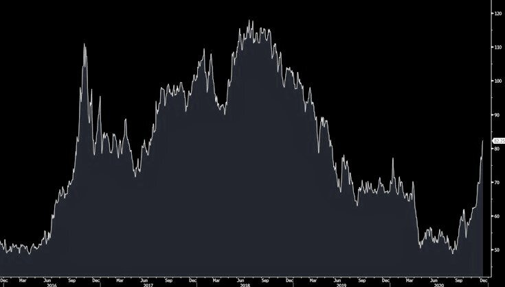
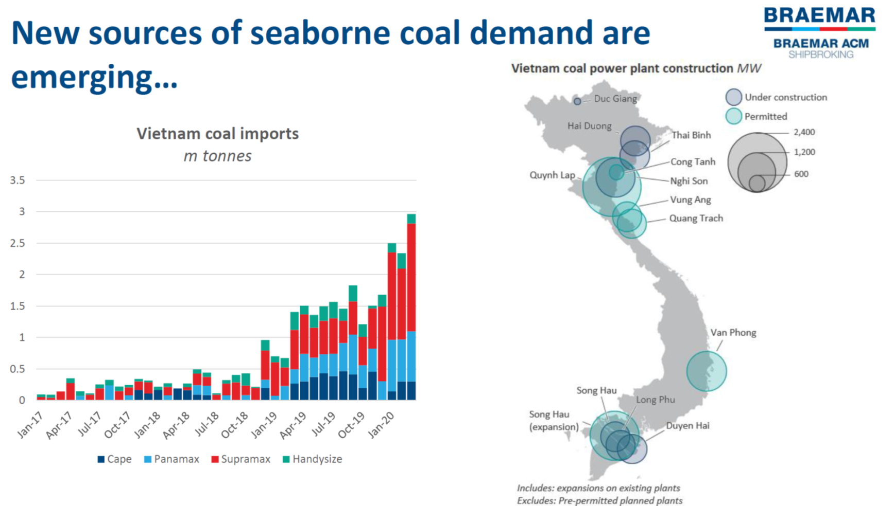
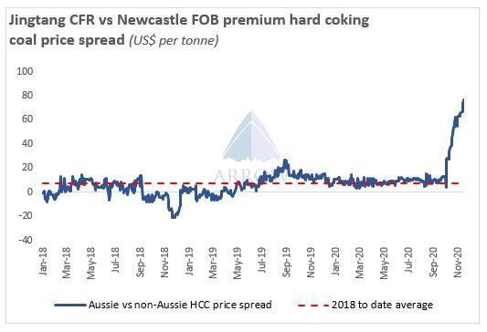

# Coal: The King is Dead... Long Live the King!

**Date:** December 14, 2020  
**Publisher:** Breakwave Advisors | **Category:** Market Insights  
**Original URL:** [https://www.breakwaveadvisors.com/insights/2020/12/13/coal-the-king-is-dead-long-live-the-king](https://www.breakwaveadvisors.com/insights/2020/12/13/coal-the-king-is-dead-long-live-the-king)  

---

> **Figure 1: Richards Bay Coal Price**  
> *Richards Bay Coal Price, USD/tonne*  
> **Interactive Data & Source:** [Globaltimes](https://www.globaltimes.cn/content/1209840.shtml) | [Local Asset](file:///C:/Users/Dell/Github/Shipping/corpus/03-breakwave/insights/2020/assets/2020-12-14_coal-the-king-is-dead-long-live-the-king_img_ship19_27f3d0a7611d.jpg)

It is no secret that coal has for years now been considered the most “evil” fuel of choice in a world that rapidly is changing in term of energy mix, with new technologies and methods aiming at providing greener, less polluting primary energy generation processes. A fuel of choice for more than century, coal is deeply embedded in the global energy mix, especially in the fast growing Asian economies and although change is happening, the rate is not as fast as it seems, with new coal power generation still in the works and retirement of older coal plants only in small numbers. Although we have probably already passed the peak of global coal demand, investment in supply is pulling back much faster than the rate of decline in consumption, leading to short term spikes in prices.

Such dynamics could potentially lead to another mini boom in coal mining, as prices that for years now reflect a declining industry, have recently been moving higher both in the spot as well as in the futures market. At the end of the day, regulations can go so far when it comes to emission standards, especially when profitability shifts rapidly as is the case currently in the coal markets.

> **Figure 2: “China Domestic Coal Prices Have Moved Northwards Since Their**  
> *“China domestic coal prices have moved northwards since their nadir April, and this rally has sharpened over the past few weeks as concerns are mounting around China’s stockpiles for the winter ahead. From the domestic supply side, the outlook is not particularly bright. Central government probes into over-production, licensing and safety are discouraging miners from maximizing output, at a time when power plants are calling for output expansion. Production is at similar levels to last year, not ideal if you want to ween yourself off imports during both a potentially cold winter and a booming economic recovery.”*  
> **Interactive Data & Source:** [Globaltimes](https://www.globaltimes.cn/content/1209840.shtml) | [Local Asset](file:///C:/Users/Dell/Github/Shipping/corpus/03-breakwave/insights/2020/assets/2020-12-14_coal-the-king-is-dead-long-live-the-king_img_coalprice2crb28229_1747dafed242.jpg)

Then there are the near term trade dynamics that are having a profound impact on prices and are distorting trade flows.[Yesterday’s announcement](https://www.globaltimes.cn/content/1209840.shtml)by China that it is temporarily suspending the annual quota system that has been in place for years in order to bring coal prices down, reflects such a shifting trade dynamics, especially with Australian coal now[officially shut out](https://www.theguardian.com/australia-news/2020/dec/14/china-formalises-cut-to-australias-coal-imports-state-media-reports)from China. New trade patters and cargoes from far away are slowly entering the arena and will impact both prices for the material as well as freight, especially given the current hot iron ore market. Competition for ships is good for shipowners, and the increasing demand for both coal and iron ore at the same time bodes well for Capesize rates in the near future.

Arrow Research focuses on China and the challenges that the world’s largest coal consumer is facing:

But it is not only China. Other regions are actually growing in terms of coal demand, with countries like[Vietnam](https://en.wikipedia.org/wiki/List_of_coal-fired_power_stations_in_Vietnam)and[Pakistan](https://en.wikipedia.org/wiki/List_of_power_stations_in_Pakistan)in the process of adding coal-fired generation capacity over the next several years.

Vietnam is an interesting example, that should see increasing imports over the next several years, in line with recent trends, as the chart below, courtesy of Braemar ACM, shows:

> **Figure 3: China’s Top Economic Planning Agency Requested Power Companies**  
> *China’s top economic planning agency requested power companies to cap the buying price of coal amid a surge in the cost of the fuel, the Futures Dailyreported. The cap was set at 640 yuan ($98) per ton after a Saturday meeting between the National Development Reform and Commission and 10 power operators, the report said, citing people it didn’t identify. The NDRC will investigate the origins of coal purchases if prices go above the cap, and require companies to file a report, Futures Daily said. The agency also asked companies to avoid getting high-priced coal as much as possible, and coordinate supplies among the power plants they own.*  
> **Interactive Data & Source:** [Bloomberg News](https://www.bloomberg.com/news/articles/2020-12-13/china-tells-power-firms-to-cap-coal-purchase-cost-futures-daily) | [Local Asset](file:///C:/Users/Dell/Github/Shipping/corpus/03-breakwave/insights/2020/assets/2020-12-14_coal-the-king-is-dead-long-live-the-king_img_vietnamcoal_15193f6b6f3a.png)

Still, China is effectively the price setter of coal, as it is the largest importer and by far the largest user of coal in the world. With prices skyrocketing as a result of strong demand, a series of mining accidents in China that has led to production curtails and the ongoing trade dispute between China and Australia, China’s regulators have now decided to intervene in order to put a lid on rising energy prices that ultimately could hurt the economy as a whole:

[Bloomberg reports](https://www.bloomberg.com/news/articles/2020-12-13/china-tells-power-firms-to-cap-coal-purchase-cost-futures-daily):

And then there is the recent trade dispute between China and Australia and the effective import ban of Australia’s coal that has led to a massive dislocation in the Asian-focused coal trading market with flows being redirected based on relative pricing of the global coal benchmarks.

Arrow Research continues:

*Chinese buyers are paying a massive premium (~$77pmt) for non-Australian coking coal. With iron ore prices hitting record highs, raw material costs are soaring, putting steel producers' margins under pressure.*

> **Figure 4: With China Now on a Global Hunt for Coal**  
> *With China now on a global hunt for coal, especially metallurgical coal, regions that historically have been priced out in terms of (coking) coal supplies, are suddenly becoming relevant. The US is a prime example, with coking coal prices on the East Coast rising sharply and with buyers around the world rushing to secure cargoes as the steel market is struggling to keep up with rising costs of materials, from iron ore, to coking coal to scrap.*  
> **Interactive Data & Source:** [Argusmedia](https://www.argusmedia.com/en/news/2167048-atlantic-coking-coal-chinese-appetite-grows) | [Local Asset](file:///C:/Users/Dell/Github/Shipping/corpus/03-breakwave/insights/2020/assets/2020-12-14_coal-the-king-is-dead-long-live-the-king_img_coalpremiumchrt_f4bdc2a17ca3.jpg)

[Argus has more](https://www.argusmedia.com/en/news/2167048-atlantic-coking-coal-chinese-appetite-grows)on the subject:

*US coking coal prices have firmed further this week as Chinese demand continues to extend into 2021 with buyers seeking year-long supply deals with US mining firms. The Argus fob daily assessment for low-volatile coking coal held steady at $127.50/t fob Hampton Roads today but rose by $2.50/t yesterday, driven by Chinese demand and supply limitations for December and January loadings.*

So, where does that leave the dry bulk freight market?

Well, vessel positioning is always extremely important when it comes to freight rates. Consensus view prior to the recent spikes in bulk commodity prices (iron ore, coal) was that any potential winter rally was not happening and thus positioning should be defensive as the year draws to an end (i.e. sell freight). Now, with the coal quota lifted and with iron ore prices flirting with decade highs, a potential rush to cover shipping requirements combined with significant physical arbitrage trading due to price dislocations in coal, could come back with a vengeance and push freight rates higher in a odd counter-seasonal manner.

Futures, as always has been the case, have been pricing the traditional slump in rates during the first quarter of the year. But this year has been anything than normal. The probability of a “holiday rally” is increasing, and such a price move will catch most traders by surprise (let alone “short”), an ingredient that points to a potential price spike rather than normal price advance. Yet, lots of wild cards are still out there (weather, port delays, politics, etc.) but currently tides are shifting and dry bulk owners should be excited as we enter 2021.

After all, Santa Claus rallies are not only for stocks…

---

**Tags:** Coal, Dry Bulk, Capesize, Panamax, China, India, Usa  
