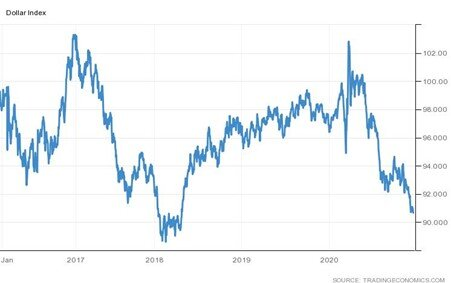

# Commodity Prices: The Pressure Is On

**Date:** December 15, 2020  
**Publisher:** Breakwave Advisors | **Category:** Market Insights  
**Original URL:** [https://www.breakwaveadvisors.com/insights/2020/12/15/commodity-prices-the-pressure-is-on](https://www.breakwaveadvisors.com/insights/2020/12/15/commodity-prices-the-pressure-is-on)  

---

> **Figure 1: By Ulf Bergman**  
> [Local Asset](file:///C:/Users/Dell/Github/Shipping/corpus/03-breakwave/insights/2020/assets/2020-12-15_commodity-prices-the-pressure-is-on_img_image-asset_50ac01d18a49.jpeg)

China is starting to see surging commodity prices as a potential threat to industrial profit margins and the continued strength of the country’s industrial expansion, which by now is well beyond what can be deemed a recovery. In many aspects, the country is at risk of being a victim of its own success, with its appetite driving commodity prices higher. Recent news that Chinese authorities are requesting iron ore producers, such as BHP, to explain the surging prices must be seen as an acknowledgement that the strength of the industrial commodity markets could dent the ongoing industrial success story. That it could derail the expansion completely appears to be rather unlikely, but nevertheless the potential impact on the industrial output is significant enough for Chinese authorities to take notice.

A recovery in Brazilian iron ore output could assist the Chinese leadership in achieving softer iron ore prices, but Brazil is struggling with the effects of the pandemic, heavy rains, and the long-term effects of last year’s dam collapse. Hence, concerns regarding higher iron ore prices would indicate that imports from Australia will remain unaffected by the ongoing trade tensions. Given the dominance of Australian iron ore in total Chinese imports, any reduction in imports would increase the prices further for Chinese buyers.

An economic recovery in the rest of the world is also likely to work against the Chinese efforts to control the iron ore prices, with demand increasing as vaccines are rolled out and economies can reopen in earnest. The likelihood of an additional fiscal stimulus package in the US is also increasing by the day, with both Democrats and Republicans confident that Congress will agree on a 900 billion dollars coronavirus-aid bill ahead of the holidays. On the other side of the Atlantic, the European Union has managed to find a compromise to break the deadlock surrounding its new budget and an additional pandemic stimulus package. The increasing risk appetite among investors, as vaccines and economic packages are being approved, and the concerns over increasing US government debt levels are putting pressure on the US dollar, which is at its weakest level in 30 months against a basket of currencies.

### Us Dollar Index

> **Figure 2: Ulf 84**  
> [Local Asset](file:///C:/Users/Dell/Github/Shipping/corpus/03-breakwave/insights/2020/assets/2020-12-15_commodity-prices-the-pressure-is-on_img_ulf84_0a70a2991245.jpg)

The depreciating dollar will mitigate some of the effects of rising iron ore prices for Chinese buyers, but if it is enough is clearly open for debate. Producers are likely to be wary of the negative impact any Chinese restrictions would have on their profits, as already illustrated with the bans of many Australian imports. However, given the importance of imported iron ore to Chinese industrial production, mining companies are not entirely without leverage, and it could potentially develop into a high-stake game of chicken.

It is not just iron ore prices that appear to be of concern to Chinese authorities. With domestic coal prices rising, import quotas have been lifted and the regulators are allowing power plants to import coal without clearance restrictions. Not entirely surprising, Australian coal is not included in the new measures and is still banned, as buyers can find substitutes in sufficient quantities. China has also recently voiced that it is not to be blamed for the rising prices for agricultural commodities, despite its rising imports. The country has argued that it is not dominant enough to push the prices higher, which may be an attempt to signal its reluctance to pay the increasing prices.

If the attempts by China to exert influence on the commodity prices are effective or not, remain to be seen. Despite a dominating position in many markets, there are still many other factors to consider. For shipping, ever increasing commodity prices would not necessarily be good news, as volumes may start to suffer at some point and reduce the tonnage demand.

---

**Tags:** Us Dollar, Global Economy, China  
