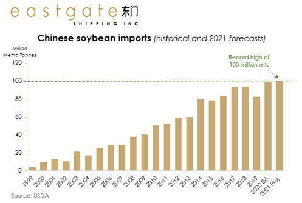
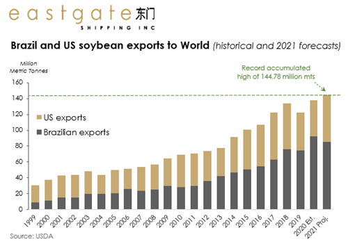

# Panamax bulkers set to benefit from the strong Chinese grain demand in 2021

**Date:** December 23, 2020  
**Publisher:** Breakwave Advisors | **Category:** Market Insights  
**Original URL:** [https://www.breakwaveadvisors.com/insights/2020/12/22/panamax-bulkers-set-to-benefit-from-the-strong-chinese-grain-demand-in-2021](https://www.breakwaveadvisors.com/insights/2020/12/22/panamax-bulkers-set-to-benefit-from-the-strong-chinese-grain-demand-in-2021)  

---

*By*[*Sevi Katemoglou*](mailto:sevi.katemoglou@eastgate.gr)

***In the midst of a generalized turmoil caused by a health crisis, subdued trading activity and political tensions in many fronts, we turn to grains to find some positive insights.***

> **Figure 1: Market Chart 1**  
> [Local Asset](file:///C:/Users/Dell/Github/Shipping/corpus/03-breakwave/insights/2020/assets/2020-12-23_panamax-bulkers-set-to-benefit-from-the-strong-chinese-grain-demand-in-2021_img_image-asset_29220c8c1bda.jpeg)

It is true that this year grains have managed to “save the day” for Panamaxes as they proved to be a significant pillar of support for the medium-sized bulkers, which on many occasions ran unusually higher than the larger asset class of Capesizes. Although Panamax carriers’ TCE rates in 2020 so far did not manage to hit highs that would exceed the 2019 marks, the longhaul grain volumes somewhat offset the thinning trade of other major dry bulk commodities, essentially offering some comfort to Panamax and Kamsarmax Owners.

It is common knowledge that China dominates demand for dry bulk shipping and agricultural products are no exception. The Asian nation is by far the largest soybean importer (consumes excess of 60% of global imports) and as such, forecasts that its demand will stand strong and even accelerate in 2021 are seen as a positive omen for the dry bulk shipping market. According to latest estimates by the United States Department of Agriculture, China is set to import about 100 million tonnes of soy in the 2020/21 marketing season, which if realised, would mark an all-time high.

> **Figure 2: Eastgate 1**  
> [Local Asset](file:///C:/Users/Dell/Github/Shipping/corpus/03-breakwave/insights/2020/assets/2020-12-23_panamax-bulkers-set-to-benefit-from-the-strong-chinese-grain-demand-in-2021_img_eastgate1_c3975676e114.png)

The heated Chinese demand for the oilseed, primarily used as feed for livestock, can be attributed to the recovery of the domestic swine herd, which in 2019 was depleted by almost half due to the deadly swine flu. The domestic pig population is en route to a full recovery and that leads to the simple fact: pigs need to eat. The relatively low state reserves and the overall pandemic-induced food security concerns are also favouring Chinese bean imports.

Indeed, the feed needs of the world’s most populous nation are relatively inelastic. But where will the beans be sourced from?

> **Figure 3: 2eastgate 1**  
> [Local Asset](file:///C:/Users/Dell/Github/Shipping/corpus/03-breakwave/insights/2020/assets/2020-12-23_panamax-bulkers-set-to-benefit-from-the-strong-chinese-grain-demand-in-2021_img_2eastgate1_ccea4d8c2637.png)

Brazil is expected to harvest a record soybean crop in 2021 of up to 133 million metric tonnes; the country’s exports to the world, however, are estimated to reach 85 million metric tonnes (which would account for a 7.7% yearly contraction). On the other end, US soy exports to the world are forecast to increase by an impressive 31% y/y to nearly 60 million metric tonnes. This leaves us with the somewhat safe conclusion that, provided no other catastrophe hits us in the coming year, accumulated soy exports and subsequent bulk shipments will both be elevated.

A principal reason for the pickup in US exports is the Phase One agreement which has boosted sales of American agricultural goods. Indeed, soybean volumes out of the States in 2021 are expected to surpass by 1.5% the 2017 levels, the baseline year for the Sino-US trade pact.

Global corn exports are also forecast to increase by a nearly 8.6% y/y, while wheat exports will likely stay flat on the year.

It is worth noting that the importance of the grain trade in the dry bulk shipping market lies not so much on its proportion in the overall dry bulk commodities trade (it accounts for about one fourth), but most importantly on the fact that its transportation requires long voyages, therefore it has a major impact on the tonne-mile demand.

Of course, grains do not constitute a panacea; we’d need industrial activity and demand for the other major dry commodities of iron ore and coal to also pick up so that we indeed see a brighter 2021 with increased demand for bulks and subsequently for the vehicles that transport it.

---

**Tags:** Dry Bulk, Panamax, Grains  
