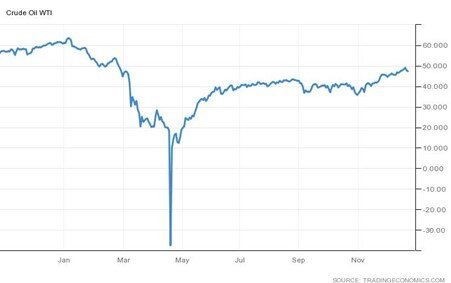

# 2020: A Year with Some Notable Firsts

**Date:** December 24, 2020  
**Publisher:** Breakwave Advisors | **Category:** Market Insights  
**Original URL:** [https://www.breakwaveadvisors.com/insights/2020/12/23/2020-a-year-with-some-notable-firsts](https://www.breakwaveadvisors.com/insights/2020/12/23/2020-a-year-with-some-notable-firsts)  

---

*By Ulf Bergman*

> **Figure 1: Crude Oil - West Texas Intermediate (Usd/barrel)**  
> *Crude Oil - West Texas Intermediate (USD/barrel)*  
> [Local Asset](file:///C:/Users/Dell/Github/Shipping/corpus/03-breakwave/insights/2020/assets/2020-12-24_2020-a-year-with-some-notable-firsts_img_image-asset_52a39047e637.jpeg)

The current year is unlikely to be easily forgotten and probably mostly for the wrong reasons. In terms of data output, it is hard to think of a year that could qualify as a more significant outlier and the data from 2020 will cause considerable consternation among quantitative modellers for years to come. The big question will be how to treat the year analytically and if it needs to be excluded from any time-series used, as the data is likely to be rather unrepresentative, unless another pandemic hits in the near future. It probably does not help that next year is likely to qualify as another outlier with the pendulum swinging the other way, assuming the world economy stages a recovery with the arrival of vaccines.

The year has also seen a few notable firsts, with negative oil prices perhaps standing out in the commodity space. The rapid decline in demand for crude oil in the spring pushed the West Texas Intermediate (WTI) contracts briefly into negative territory, as the storage tanks filled up. The Brent contracts fared better, as they are cash settled and there is no need to take physical delivery and worry about storage. The initial production cuts to support the oil price have been extended as demand have failed to rebound. For shipping, the drop in demand for oil and falling prices meant that the expected dominant theme for the year failed to gain traction, with discussions on scrubbers and compliant low-sulphur fuel relegated to obscurity. The price spread between the compliant fuel and the high-sulphur fuel collapsed, as the pandemic slashed demand for refined oil products.

> **Figure 2: Ulf 95**  
> [Local Asset](file:///C:/Users/Dell/Github/Shipping/corpus/03-breakwave/insights/2020/assets/2020-12-24_2020-a-year-with-some-notable-firsts_img_ulf95_08d55db00b82.jpg)

The Baltic Exchange’s Capesize Index was another notable first-time visitor in the negative territory, as freight rates fell well below break-even in the early parts of the year as the pandemic curtailed industrial production in China and, later, elsewhere. Whether by design or by accident, negative prices and index levels provide interesting mathematical challenges for modellers and analysts and year-on-year comparisons in the early parts of next year could make for interesting reading.

After an abysmal start to the year and index levels below zero for some time, the largest dry bulk segment recovered in the middle of the year, as Chinese industrial production started to recover. An ever-increasing demand for iron ore caused congestion in the Chinese ports and tied up dry bulk tonnage. While the demand for industrial commodities in China continued to grow strongly and pushing prices north, a great deal of the issues surrounding port congestion receded. Hence, the latter part of the year saw charter rates softening, but as the year is coming to an end the segment is coming alive yet again.

The pandemic also temporarily closed many ship recyclers, which reduced the scrapping activities and many old vessels continued to trade despite the low charter rates. In addition, a cartel of Bangladeshi breakers attempted to keep prices down for vessel bought for scrap contributed to the low levels of scrapping. However, the last few weeks have seen demolition activities picking up, as ship recycling prices have recovered, with some large dry bulk tonnage heading for the beaches. The largest cash-buyer of vessels for recycling, GMS, expects prices to remain stable, which could provide an incentive to many owners of old vessels to send them to the breakers. Hence, there is the possibility that increasing demolition rates could carry on into the next year and provide support for the freight rates.

News that US lawmakers have agreed on a new stimulus bill and that vaccines have been approved both in the US and the European Union are likely to support a continued strong commodity demand, despite recent increases in infection rates and new lockdowns. The time factor involved in rolling out vaccinations across the world is likely to see industrial production and commodity demand picking up at measured pace, but with Chinese industrial production firing at all cylinders the commodity demand and prices can be expected to remain strong in the coming year.

---

**Tags:** Crude Oil, Dry Bulk, Capesize  
