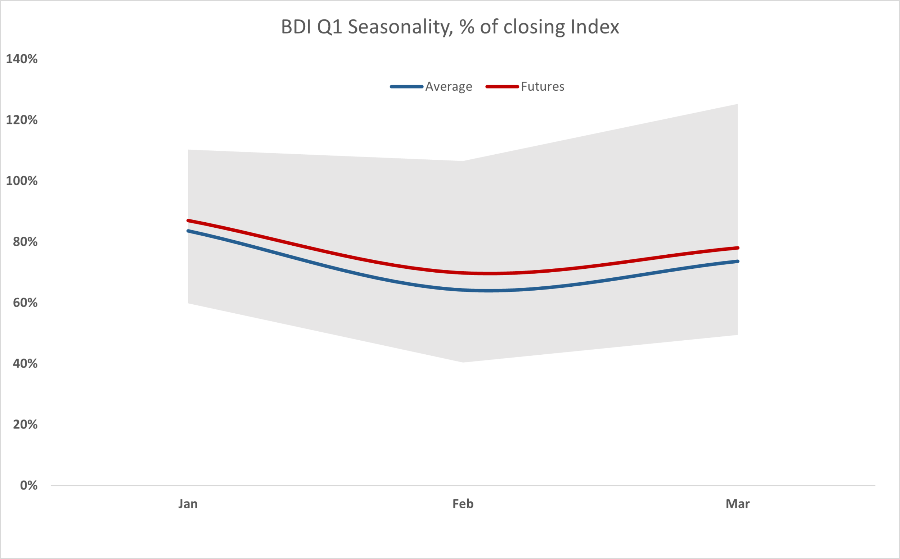
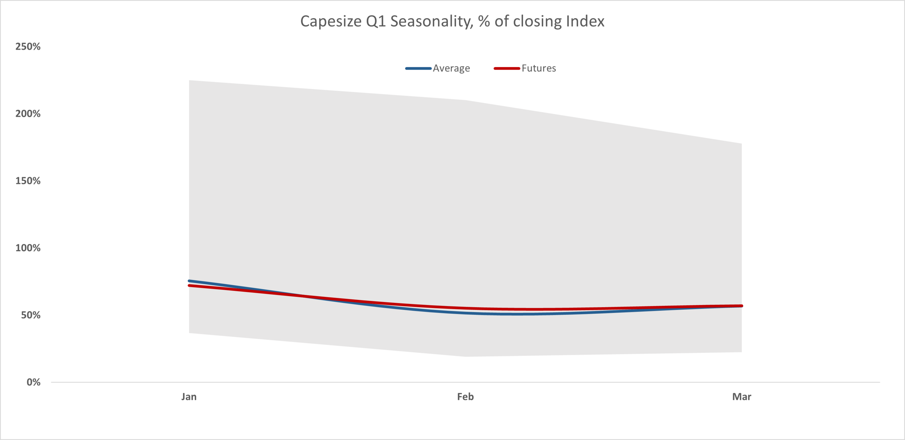

# A Quiet Week for Dry Bulk, While Futures Seem Fairly Priced based on History

**Date:** December 29, 2020  
**Publisher:** Breakwave Advisors | **Category:** Market Insights  
**Original URL:** [https://www.breakwaveadvisors.com/insights/2020/12/28/a-quiet-week-for-dry-bulk-while-futures-fairly-priced-based-on-history](https://www.breakwaveadvisors.com/insights/2020/12/28/a-quiet-week-for-dry-bulk-while-futures-fairly-priced-based-on-history)  

---

The week between Christmas and New Year’s has historically been a very quiet period for shipping, as is the case in many other markets, especially given the absence of reported indices and thus limited information on the state of the physical market. The rally in Capesize rates over the past two weeks that brought the index above the 16,000 mark has more than offset the weakness in the smaller size segments, with he Baltic Dry Index (BDI) also seeing good support towards the end of the year. As a result of this end-of-year rally, Capesize spot rates, as reflected in the Baltic Capesize Index, closed at the highest level for any end-of-year value in seven years, with the only exception of 2017 (although the index during that period was in a steep decline duting most of December, opening at ~15,000 on January 2, 2018).

Given the absence of physical information, the last week of the year is quite tricky for shipping investors. Looking at the core Capesize segment, it is difficult to identify any particular pattern, as in the last ten years rates fell in four such instances, rose in three and remained relatively unchanged in three years. However, if one looks at the trend of the spot market during the last ten index days of December, there is a clear pattern of continuation of such trend during the “dead” week of December, as the table below shows:

Missing image: https://images.squarespace-cdn.com/content/v1/5a4d1d26e5dd5b537a6647c5/1609181031458-WQROWKRARB0I7BZHV9AW/table+dec.png

Based on the fact that the Capesize index rose 40% in the last ten trading days on December, one would expect the positive momentum to continue, based on the historical pattern depicted on the table above.

So, what does the futures market tells us about near term expectations?

With the futures curve in steep backwardation, the market is expecting the seasonally weak first quarter period to once again affect spot rates. Futures for the first three months of 2021 are priced at basically the average discount of the last ten years versus the closing Index of the previous year. Looking at the BDI as a whole, there is as a slight optimism versus historical averages, but given the volatility of the market, it is negligible:

> **Figure 1: BDI Q1 Ftures**  
> [Local Asset](file:///C:/Users/Dell/Github/Shipping/corpus/03-breakwave/insights/2020/assets/2020-12-29_a-quiet-week-for-dry-bulk-while-futures-fairly-priced-based-on-history_img_bdiq1ftures_42f74f8d0db3.png)

Capesize futures also have a similar pattern, basically priced very close to historical levels, yet a touch less optimistic versus the BDI pattern:

> **Figure 2: Capesize Q1 Futures**  
> [Local Asset](file:///C:/Users/Dell/Github/Shipping/corpus/03-breakwave/insights/2020/assets/2020-12-29_a-quiet-week-for-dry-bulk-while-futures-fairly-priced-based-on-history_img_capesizeq1futures_a927d208d620.png)

The sharp rise in iron ore prices during the past few months combined with broader optimism in capital markets around the world, could potentially explain the slight optimism in freight futures. Combining that with the fact that last week the Capesize market closed with a positive momentum, and it is easy to understand such a slight optimism towards the near future.

The New Year is only a few days away, and although a lot can happen in such a volatile market (today some reported fixtures point to weaker rates in both the Atlantic as well as the Pacific), history is on the side of the bulls at least till the first week of January when traders return back to their desks for a brand new trading year.

---

**Tags:** Dry Bulk, Capesize, Baltic Dry Index  
