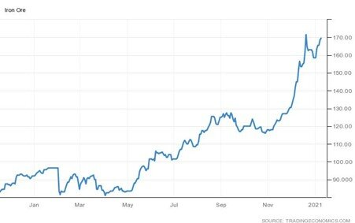
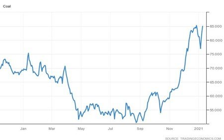

# Not Quite Fimbulwinter*, but More Cold Weather on the Way

**Date:** January 11, 2021  
**Publisher:** Breakwave Advisors | **Category:** Market Insights  
**Original URL:** [https://www.breakwaveadvisors.com/insights/2021/1/11/not-quite-fimbulwinter-but-more-cold-weather-on-the-way](https://www.breakwaveadvisors.com/insights/2021/1/11/not-quite-fimbulwinter-but-more-cold-weather-on-the-way)  

---

*By Ulf Bergman*

The year has begun in a dramatic fashion for the dry bulk sector, with the Baltic Dry Index gaining around thirty percent in only a matter of days and reaching a three-month high. The rapid gains are to a great extent driven by a very buoyant mood in the capesize segment, which has seen gains of around fifty percent in a week. Despite recent efforts by the Chinese authorities to temper the rapid increase, iron ore prices have almost returned to the nine-year high recorded in the latter part of December last year. The persistent high levels of the iron ore prices are likely to spur miners to maximise their output and, hence, maintain a strong demand for shipping tonnage, especially in the larger segment. A limited supply of available tonnage in both the Pacific and Atlantic basins is also seen as a contributing factor to the healthy freight rates.

### Iron Ore (Usd/t)

> **Figure 1: Ulf 201**  
> [Local Asset](file:///C:/Users/Dell/Github/Shipping/corpus/03-breakwave/insights/2021/assets/2021-01-11_not-quite-fimbulwinter-but-more-cold-weather-on-the-way_img_ulf201_f0c2d556c73f.jpg)

The current weather situation in the Northern Hemisphere, with temperatures well below normal in many parts, is also adding to a positive picture for dry bulk shipping. The cold snap is contributing to an increase in demand for thermal coal, especially in China where it is still the dominating source of energy. Coal prices have, like iron ore, also returned to the highs seen in late December in light of tight domestic supplies in China.

### Coal (Usd/t)

> **Figure 2: Fimbulwinter: The Harsh Winter That Precedes the End of The**  
> ** Fimbulwinter: the harsh winter that precedes the end of the world in Norse mythology.*  
> [Local Asset](file:///C:/Users/Dell/Github/Shipping/corpus/03-breakwave/insights/2021/assets/2021-01-11_not-quite-fimbulwinter-but-more-cold-weather-on-the-way_img_ulf202_ad95d8569546.jpg)

The cold weather is also affecting the tonnage supply, as cargo discharge operations are delayed due to icy conditions in some ports in North-East Asia and reducing the available tonnage as a result. Meanwhile, meteorologists are not expecting the cold snap to end anytime soon, with even colder conditions likely to arrive in the coming weeks. A recent rise in temperatures in the stratosphere above the North Pole is expected to push very cold air, usually contained in the Arctic, into many parts of the Northern Hemisphere and contribute to an even greater plunge in temperatures and additional problems in some ports.

The continuation of the cold conditions is likely to see the consumption of coal remaining high in China, putting additional pressure on the already stretched inventories. Hence, requiring a larger than usual restocking which could support tonnage demand through the rest of the winter and into the second quarter.

---

**Tags:** Coal  
