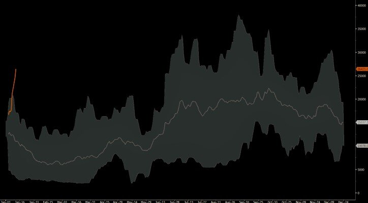
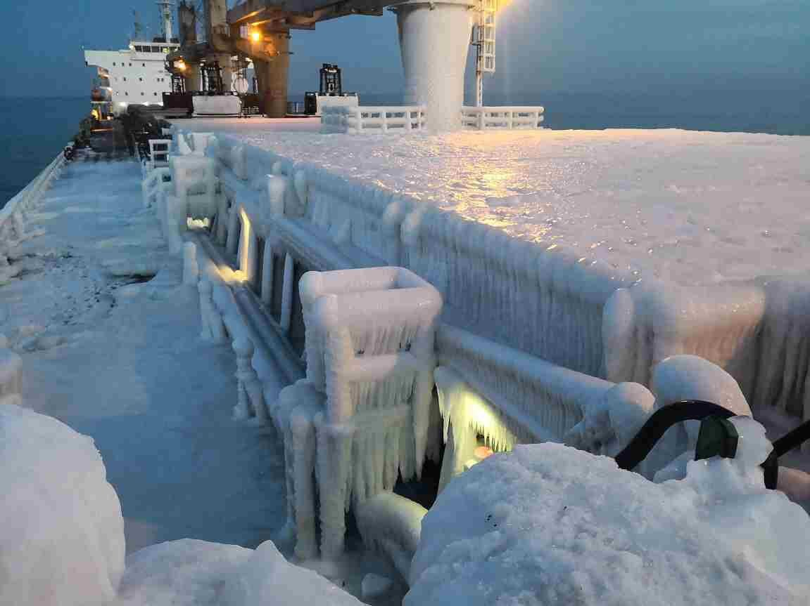
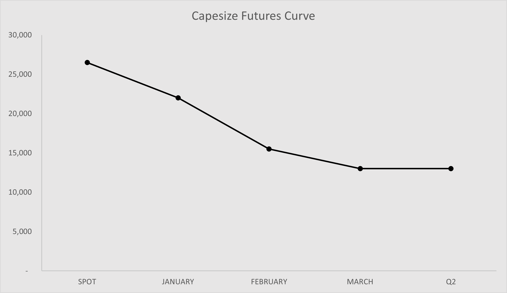

# Capesizes: Where Do We Go From Here

**Date:** January 12, 2021  
**Publisher:** Breakwave Advisors | **Category:** Market Insights  
**Original URL:** [https://www.breakwaveadvisors.com/insights/2021/1/11/ar4nqv0geb3d0on6zju7b9atkni2r6](https://www.breakwaveadvisors.com/insights/2021/1/11/ar4nqv0geb3d0on6zju7b9atkni2r6)  

---

It is frequently said in the markets that consensus is usually wrong and this can’t be any more true for Capesize rates so far this year. Complacency, as a result of two consecutive years of abysmal returns during the first quarter, and lack of imagination given the recent rangebound months-long market, has led to one of the strongest rallies in Capesize spot rates in a decade. Expectations for single digit rates gave away to a guessing game over how high is high for spot in January, and although everyone who follows this market knows that such strength in rates is unsustainable this time of the year, squeezes like the one we are experiencing are extremely hard to map, let alone predict the timing of a reversal with any degree of accuracy. After all, it is the marginal ship that sets the market, and the inelastic nature of supply could push pricing way beyond any reasonable supply/demand equilibrium.

### Capesize Index Historical Range, Usd/day

> **Figure 1: Capes Range**  
> **Interactive Data & Source:** [Breakwave Advisors Market Insights](https://www.breakwaveadvisors.com/insights/2020/12/28/a-quiet-week-for-dry-bulk-while-futures-fairly-priced-based-on-history) | [Local Asset](file:///C:/Users/Dell/Github/Shipping/corpus/03-breakwave/insights/2021/assets/2021-01-12_ar4nqv0geb3d0on6zju7b9atkni2r6_img_capesrange_fe33d22af062.jpg)

As we have frequently done here though, we would try to put some context on the rally and provide our view on the near term direction of rates, although we want to stress out the inability (including of course ours) to accurately call tops in the dry bulk market.

> **Figure 2: Ice Vessel 1**  
> **Interactive Data & Source:** [Breakwave Advisors Market Insights](https://www.breakwaveadvisors.com/insights/2020/12/28/a-quiet-week-for-dry-bulk-while-futures-fairly-priced-based-on-history) | [Local Asset](file:///C:/Users/Dell/Github/Shipping/corpus/03-breakwave/insights/2021/assets/2021-01-12_ar4nqv0geb3d0on6zju7b9atkni2r6_img_icevessel1_0bd540f114ea.jpg)

In late December, as we discussed[here](https://www.breakwaveadvisors.com/insights/2020/12/28/a-quiet-week-for-dry-bulk-while-futures-fairly-priced-based-on-history)and[here](../pdfs/2021-01-12_ar4nqv0geb3d0on6zju7b9atkni2r6_breakwavedecember222020report_2864b3322715.pdf), the necessary ingredients were in place for a winter rally in Capesize rates that could propel the spot market into the 20,000 range. The market reached such level faster than we expected and obviously overshoot (as it always does) on the back of mainly the catalysts that we identified: Strong demand from Australia as a result of record-high iron ore prices (that also have put a[lot of political pressure to miners](https://www.scmp.com/economy/china-economy/article/3114234/china-australia-relations-miner-rio-tinto-questioned-china)to bring such prices down to earth) and a dwelling supply of ships in the Atlantic as owners expected the same abysmal market like in the past few years thus refused to sail to Brazil and preferred to stay in the Asia region.

However, the great majority of market participants remained convinced that seasonality will once again plunge spot rates back to cash-breakeven levels in the single digit region no matter what.

Now, we can say with certainty that this time is different (and obviously it is with spot approaching 30,000). Nevertheless, the current situation is mainly positional tightness reflecting weather delays, a tight ballasting list (number of ships sailing back to Atlantic from Asia) and favorable weather conditions both in Australia as well as in Brazil. The current setup will soon change, and with that, rates will come off as the winter progresses.

In our view, however, the likelihood of single digit spot rates has declined dramatically and as such, the bottom will be “a higher low” versus last year’s dramatic drop. That sets up the market for another leg higher from “a higher low”, which bodes well for the full 2021 for Capesizes.

So what does our crystal ball say for the next four weeks?

> **Figure 3: Vale Iron Ore 2**  
> [Local Asset](file:///C:/Users/Dell/Github/Shipping/corpus/03-breakwave/insights/2021/assets/2021-01-12_ar4nqv0geb3d0on6zju7b9atkni2r6_img_valeironore2_073efe0c6191.jpg)

We expect rates to peak in the next week or so, sharply reverse course and drop towards the 20,000 range. Fortunately, the futures market is conservative enough to already having priced such outcome with February Capesize futures contract some 45% below spot. We expect a significant reduction in length from futures traders, however, for those looking to trade the other side of this rally (i.e. short), the decline in spot rates will lead to muted declines in futures as the bearishness of market participants have kept futures at such steep discounts to spot that the risk actually lies on the upside rather the other way around (freight futures lack the “carry trade” link to spot that other commodity futures have, making it more of a view on the spot rather than an extension of it).

We expect spot rates to bottom out in late February/early March, and weather permitting (i.e. rains in Brazil) to once again turn higher and rally as we enter the second quarter of the year. On the other hand, we anticipate near-dated freight futures to remain muted, if not strengthen, as expectations are too bearish as we stand (see chart below).

> **Figure 4: Cape Futures**  
> [Local Asset](file:///C:/Users/Dell/Github/Shipping/corpus/03-breakwave/insights/2021/assets/2021-01-12_ar4nqv0geb3d0on6zju7b9atkni2r6_img_capefutures_bdc70091c1e8.png)

High iron ore prices, fleet growth, broader economic activity and considerable stimulus by governments around the globe make the current environment particularly attractive for dry bulk shipping. As a result, we believe a strategy of buying the dips in freight will prove quite profitable this year as long as sentiment towards shipping (and thus the forward futures curve) remains sour enough to provide such an opportunity. After all, it is the interaction between what the market believes versus what actually happens that presents the opportunities to profitably trade in shipping.

So far, such strategy has worked. Do you think the consensus view will prove to be better for the rest of the year?

---

**Tags:** Capesize, Dry Bulk  
