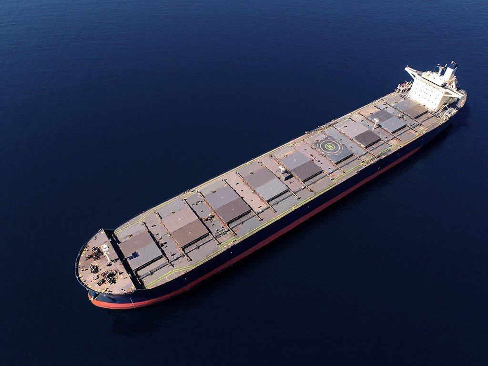
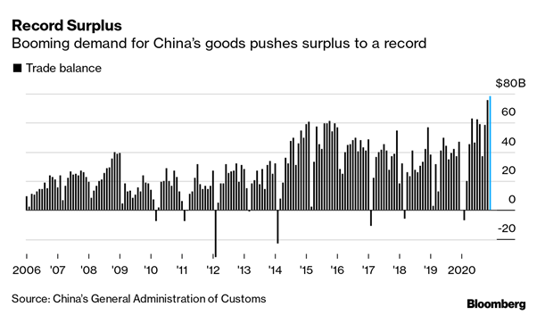

# December: Record Trade Surplus and Changing Commodity Trade-Flows

**Date:** January 15, 2021  
**Publisher:** Breakwave Advisors | **Category:** Market Insights  
**Original URL:** [https://www.breakwaveadvisors.com/insights/2021/1/15/december-record-trade-surplus-and-changing-commodity-trade-flows](https://www.breakwaveadvisors.com/insights/2021/1/15/december-record-trade-surplus-and-changing-commodity-trade-flows)  

---

*By Ulf Bergman*

> **Figure 1: Ship23**  
> [Local Asset](file:///C:/Users/Dell/Github/Shipping/corpus/03-breakwave/insights/2021/assets/2021-01-15_december-record-trade-surplus-and-changing-commodity-trade-flows_img_ship23_53706762a226.jpg)

Chinese data for December have turned out to be quite a mixed bag for trading, with both new records and disappointments. The country’s trade surplus grew to a new monthly record, as exports continued to grow fueled by a continued strong demand for health supplies and products for homeworking as the coronavirus is yet again surging in many parts of the developed world. Given the time factor for the roll out of vaccines and rapidly increasing infection rates, with new stricter restrictions being imposed, it looks unlikely that the Chinese export boom will abate in the coming months. The export boom can be expected to fade somewhat once the pandemic is fully under control and the consumers shift their spending towards leisure and services. In the meantime, container shipping is likely to continue to provide some of the bottlenecks for the world economy, with considerable port congestion in the US and Europe. In addition, containers and shipping slots are in short supply for exporters and delay some shipments.

> **Figure 2: Ulf 210**  
> [Local Asset](file:///C:/Users/Dell/Github/Shipping/corpus/03-breakwave/insights/2021/assets/2021-01-15_december-record-trade-surplus-and-changing-commodity-trade-flows_img_ulf210_789a0d3132a2.png)

For imports of commodities, the month of December proved to be a bit less rosy in China. Many commodities, such as iron ore, copper and oil, saw reduced volumes imported, both on a month-on-month and year-on-year basis. Coal was one of the exceptions among the major commodities, with imports rising by over 200 percent as policy makers eased import restriction in the wake of tight supplies and falling temperatures. It is way too early to tell if December’s disappointing commodity imports are an indication of slowing demand in China or a one-off following many months of new records. However, given the strength of the Chinese economy in 2020 and a continued strong demand for the country’s exports, it is unlikely that commodity demand will slow considerably in the near-term.

Economists survey by Reuters are also expecting the fourth quarter growth, which is reported on Monday, to show an accelerating economy growing 6.1 percent compared to a year earlier. This would also be a stronger than the growth in the third quarter and provide a strong momentum into the new year. The Chinese economy is also expected to grow by 8.4 percent in 2021, according to another survey by Reuters.

> **Figure 3: Steelmill Interior**  
> [Local Asset](file:///C:/Users/Dell/Github/Shipping/corpus/03-breakwave/insights/2021/assets/2021-01-15_december-record-trade-surplus-and-changing-commodity-trade-flows_img_steelmill-interior_f30e42690926.jpg)

At the same time there is a reorientation of some of the commodity trade flows in Asia-Pacific following the restrictions imposed by China on the imports from Australia. Chinese coal import volumes from Indonesia soared to new record levels in December at the same time as Australian imports fell to virtually zero, from around ten million tonnes in June. While the Indonesian coal exports to China reached new highs, volumes to the country’s traditional main customer, India, declined considerably. Between April and December last year, the monthly volumes imported from Indonesia fell by five million tonnes and almost halved. The reduction has allowed Australia to become the top supplier to India, on the back of strong growth in the coal trade between the two countries.

While it may appear as the two nations have swapped markets, it is not quite as straightforward as that, with the thermal coal exported from Indonesia having a lesser energy value than its Australian counterpart. The Indonesian coal is also trading at a discount to Australian coal, due to the lower quality, but has recorded stronger gains compared to the Australian Newcastle index since their lows in September last year on the back of rising Chinese demand. A large part of Australia’s rising exports to India is also coking coal rather than thermal coal, which China now must source at more distant shores.

---

**Tags:** Copper, China, Indonesia  
