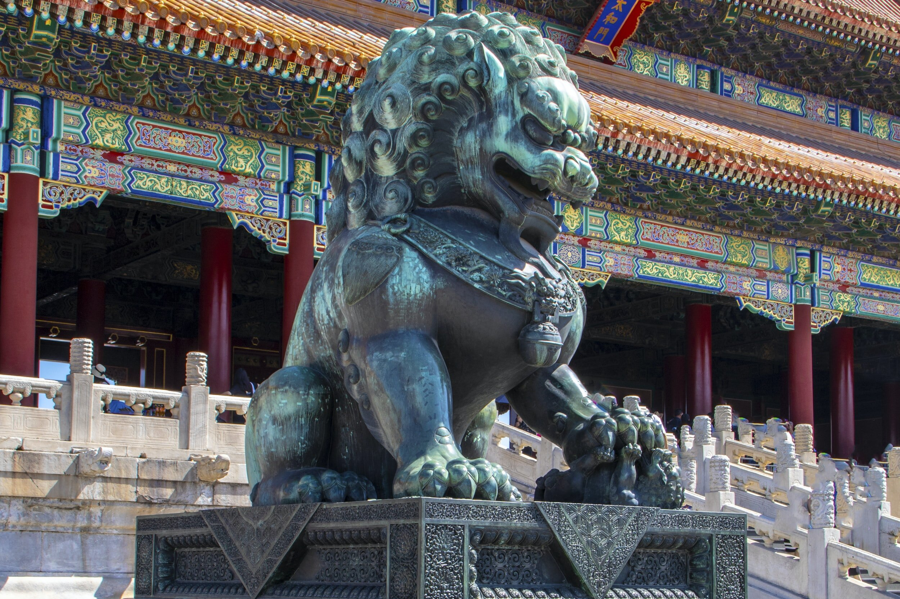
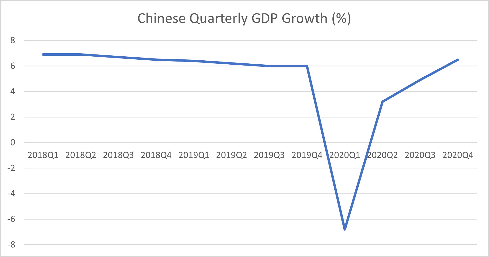

# A New Year - Same Old Story

**Date:** January 18, 2021  
**Publisher:** Breakwave Advisors | **Category:** Market Insights  
**Original URL:** [https://www.breakwaveadvisors.com/insights/2021/1/18/a-new-year-same-old-story](https://www.breakwaveadvisors.com/insights/2021/1/18/a-new-year-same-old-story)  

---

> **Figure 1: By Ulf Bergman**  
> [Local Asset](file:///C:/Users/Dell/Github/Shipping/corpus/03-breakwave/insights/2021/assets/2021-01-18_a-new-year-same-old-story_img_image-asset_54014a3fb1ad.jpeg)

Only a few weeks into the new year and it is already looking extraordinarily similar to the second half of the previous one. The news flow feels remarkably familiar, i.e., China is doing very well, and the rest of the world is not. The Chinese economy has been widely expected to deliver positive growth for the full year, given the strength of the second half of last year, and the official 2.3 percent growth published on Monday was even slightly better than the economists’ expectations. While the full year growth was the lowest since 1976, incidentally the same year as Chairman Mao Zedong passed away, it is likely to be the only major economy that grew last year, as the coronavirus ravaged the global economy.

The data for the final quarter of last year also pointed towards a strong economy with continued momentum. The growth levels are back at pre-pandemic levels, exhibiting an almost V-shaped recovery. The published fourth quarter and December GDP data were, like the full year growth, stronger than expected and the December industrial output surged by 7.3 percent compared to the previous year.

> **Figure 2: Ulf 210**  
> [Local Asset](file:///C:/Users/Dell/Github/Shipping/corpus/03-breakwave/insights/2021/assets/2021-01-18_a-new-year-same-old-story_img_ulf210_61a818d0cb5c.png)

The strong finish of the year could indicate that the momentum will carry into the new year, with continued strong industrial production and an increasing demand for industrial commodities. As a result, the usual seasonal weakness for commodities and shipping freight rates in the run up to the Chinese New Year looks unlikely to materialise this year, making 2021 yet another outlier. In addition, the extreme cold weather that have been descending on North- East Asia and the trade friction between China and Australia are factors supportive of dry bulk freight rates. Extended waiting times due to icy conditions in the ports, increased demand for thermal coal and changing trade patterns due to restrictions on many imports from Australia are all contributing to an increased tonnage demand.

While the Chinese economy is showing considerable strength, there are also some signs that it is not all plain sailing going forward. There are growing concerns about the continued divergence between the strength of the export driven industry and the sluggish development of the domestic economy. Wages have not yet returned to pre-pandemic levels hurting the prospects for growth in consumer spending, which fell around four percent in 2020.

The extensive economic stimulus measures introduced by the Chinese government have also seen debt levels surging, prompting the leadership to indicate that the programmes will be reined in as the recovery continues. The reduction of the fiscal stimulus is probably going to be a very drawn-out affair, with the Chinese leaders likely to be conscious of the implications of a too rapid reduction when the domestic demand is struggling to keep up. The real challenge for the Chinese leaders is to create an environment where the spending shifts from the government and state-owned companies to the consumers and the private sector.

---

**Tags:** China, Global Economy  
