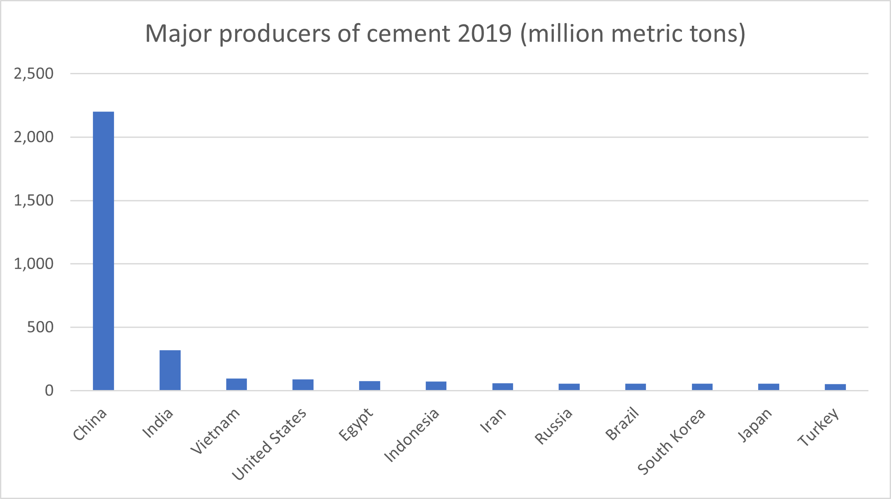

# Bidenomics: Will Shipping Benefit?

**Date:** January 21, 2021  
**Publisher:** Breakwave Advisors | **Category:** Market Insights  
**Original URL:** [https://www.breakwaveadvisors.com/insights/2021/1/21/bidenomics-will-shipping-benefit](https://www.breakwaveadvisors.com/insights/2021/1/21/bidenomics-will-shipping-benefit)  

---

> **Figure 1: By Ulf Bergman**  
> [Local Asset](file:///C:/Users/Dell/Github/Shipping/corpus/03-breakwave/insights/2021/assets/2021-01-21_bidenomics-will-shipping-benefit_img_image-asset_24ca9c380554.jpeg)

The eyes of the world turned towards Washington DC, as Joe Biden was sworn in as the 46th President of the United States of America. The new administration is not lacking challenges with the coronavirus still rampant across the nation and unemployment well above pre-pandemic levels. The vaccination programme is also still in its infancy, but the new administration is setting ambitious goals for the coming months.

The new President has also proposed a new economic stimulus programme worth almost two trillion dollars, which is equivalent of nine percent of the pre-COVID19 GDP and among the largest of any other stimulus package in the past. Many Republican members of the Senate have baulked at the size of the proposal, with the support for local governments seen as especially contentious. While the Democrats are controlling both houses after the elections, any such deal would require a supermajority of 60 and, hence, require some Republicans’ support. It is most likely that an experienced congressional operator, such as President Biden, is aware of this and the proposed extent of the stimulus is only the opening of negotiations and that the eventual value of a stimulus bill will be somewhat lower.

A large part of the fiscal stimulus focuses on direct payments to the population, with individuals receiving up 1,400 USD. With the spread of the coronavirus still underway and any meaningful level of vaccinations likely to be some months away, the funds paid out to the US population are likely to continue to support the strong growth for the e-commerce. The spending by consumers can be expected to remain in favour of goods rather than services until the spread of the virus is under control, which is likely to boost imports and maintain the current high rates in the container shipping. The additional demand for consumer goods is likely to further fuel the current container shortages and the congestions in many ports, with freight rates likely to remain high for some months.

The second phase, which is expected to be presented in the early parts of February, of the Biden-administration’s plans to revive the American economy is likely to focus on long-term investments in areas such as infrastructure and green energy. Unlike the first package, which is debt financed, the second phase is anticipated to be, at least, partially financed by tax increases. An increase in infrastructure investments was widely expected when the previous administration took office, and the shipping sector anticipated a boost in cargo volumes to support such a programme. However, the investments largely failed to materialise. This time around, with a virus damaged economy, it appears more likely that the much-needed infrastructure investments will occur out of necessity. A strong boost in infrastructure spending would be very good news for the shipping industry, with dry bulk likely to be a contender for the top beneficiary spot. Increasing investments in infrastructure and green-energy facilities will fuel the demand for dry bulk materials, such as iron ore, steel and cement.

Depending on the extent of the new infrastructure investments, the ramped-up demand for construction materials may require increasing imports as domestic production may not be able to expand sufficiently. Shipping, and in particular dry bulk, will benefit from an increase in demand for tonnage to import the construction material to the US. While the US is the fourth largest producer of cement in the world, its output is dwarfed by the Chinese production. A large increase in demand for cement, if the investment programme is sizeable, would probably force the US to find additional sources overseas. China is the dominant producer, with almost seventy percent of global output, and is a likely candidate for providing additional volumes required. Such a development would add some additional tonne-mile demand for the mid-sized vessels in the dry bulk sector for the voyage across the Pacific.

> **Figure 2: Market Chart 2**  
> [Local Asset](file:///C:/Users/Dell/Github/Shipping/corpus/03-breakwave/insights/2021/assets/2021-01-21_bidenomics-will-shipping-benefit_img_image-asset_d37e847872ea.png)

Another striking aspect of the inauguration speech was how the new president sees the country’s place in the world. The customary American approach of working with its allies and international organisations, promoting global trade among other things, has returned and is likely to benefit the shipping industry. The growing protectionism that the world has seen for the last few years is not beneficial for shipping in the longer-term, with less goods moving around the world. However, with the world’s largest economy now back in a more traditional role, the process of increasing protectionism may not disappear but retreat to some extent.

> **Figure 3: China Us**  
> [Local Asset](file:///C:/Users/Dell/Github/Shipping/corpus/03-breakwave/insights/2021/assets/2021-01-21_bidenomics-will-shipping-benefit_img_chinaus_43a996c352d2.jpeg)

How the Trans-Pacific relationship between the US and China will evolve with a new occupant in the White House remains to be seen. The new administration is likely to retain some of the grievances, such as trade imbalance and intellectual properties, and the future of the “phase one” agreement from last year may also be another problem. According to data compiled by Bloomberg, China only purchased 58 percent of the pledged 172 billion dollars, with energy purchases especially weak at a meagre 39 percent. The pandemic may be a valid cause for the failure to live up to the deal, which was widely welcomed by the shipping world. A return to some form of normality, both politically and economically, could perhaps see a greater degree of compliance with the trade deal.
