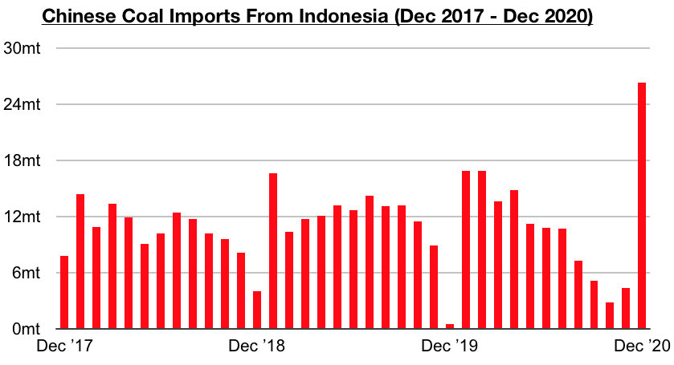
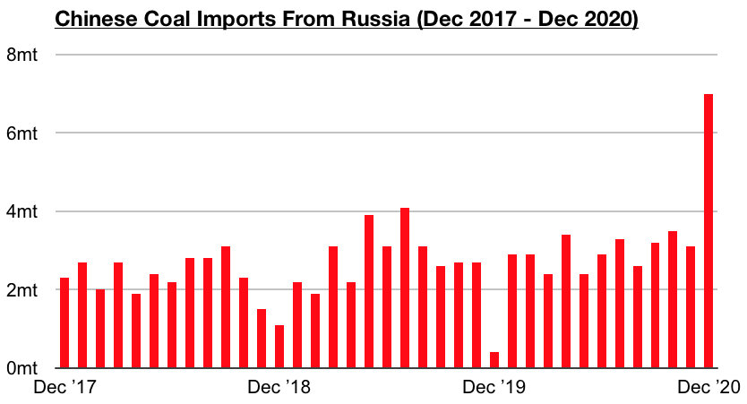
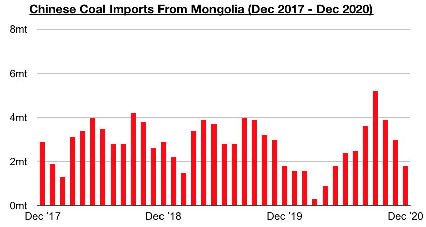
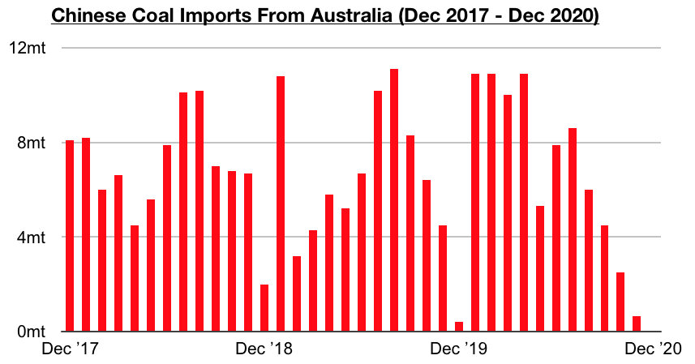

# Recent Surge in Indonesian Coal Exports to China

**Date:** February 03, 2021  
**Publisher:** Breakwave Advisors | **Category:** Market Insights  
**Original URL:** [https://www.breakwaveadvisors.com/insights/2021/2/1/recent-surge-in-indonesian-coal-exports-to-china](https://www.breakwaveadvisors.com/insights/2021/2/1/recent-surge-in-indonesian-coal-exports-to-china)  

---

[by Jefffey Landsberg](mailto:jeffrey@commodore-research.com)

A breakdown of China’s December coal import data by country shows that Indonesia was again the largest exporter of coal to China. Mongolia was able to replace Indonesia as the largest source of China’s coal imports back in September and October, but Indonesia’s exports to China rose in November and ended up surging in December. As we first discussed back in our Weekly China Reports back in November, Indonesia’s Coal Mining Association has been anticipating a huge increase in coal exports to China.

While their expectations for a year-on-year increase of 200 million tons for this year still is most likely a fantasy in our opinion, exports did surge in December and are likely to continue to find strength this year. Indonesia exported 26.3 million tons of coal to China in December. This is up month-on-month by 21.9 million tons (498%), year-on-year by 26.2 million tons (37,500%), and contributed to approximately 67% of China’s total coal imports. Indonesia being able to supply such a large amount of coal to China has made it easier for China to maintain its ban on Australian coal imports.

> **Figure 1: Indonesia Comm**  
> [Local Asset](file:///C:/Users/Dell/Github/Shipping/corpus/03-breakwave/insights/2021/assets/2021-02-03_recent-surge-in-indonesian-coal-exports-to-china_img_indonesiacomm_afdb7c648142.jpg)

Russia exported 7 million tons of coal to China in December. This is up month-on-month by 3.9 million tons (126%), year-on-year by 6.6 million tons (1,650%), and contributed to approximately 18% of China’s total coal imports

> **Figure 2: Russia Comm**  
> [Local Asset](file:///C:/Users/Dell/Github/Shipping/corpus/03-breakwave/insights/2021/assets/2021-02-03_recent-surge-in-indonesian-coal-exports-to-china_img_russiacomm_518a19574c54.jpg)

Mongolia exported only 1.8 million tons of coal to China in December. This is down year-on-year by 1.2 million tons (-40%), is unchanged from a week ago, and contributed to only approximately 5% of China’s total coal imports. As we discussed in our Weekly China Reports last year, a surge in coronavirus cases in Mongolia late last year affected border clearance and coal trucking into China.

> **Figure 3: Mongolia Comm**  
> [Local Asset](file:///C:/Users/Dell/Github/Shipping/corpus/03-breakwave/insights/2021/assets/2021-02-03_recent-surge-in-indonesian-coal-exports-to-china_img_mongoliacomm_41b81f59c299.jpg)

Australia did not export any coal to China in December. This is down month-on-month by 650,000 tons and year-on-year by 400,000 tons. China’s ban on coal imports from Australia remains in effect.

> **Figure 4: Australia Comm**  
> [Local Asset](file:///C:/Users/Dell/Github/Shipping/corpus/03-breakwave/insights/2021/assets/2021-02-03_recent-surge-in-indonesian-coal-exports-to-china_img_australiacomm_fb1b40008c3a.jpg)
