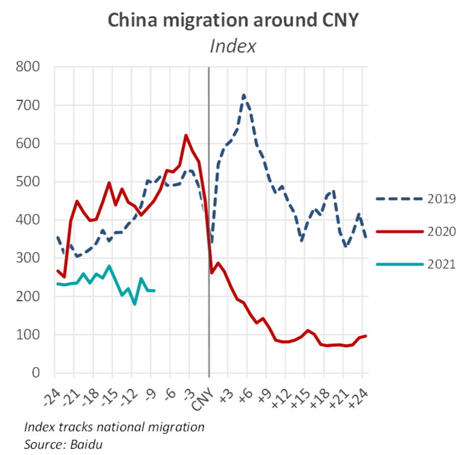
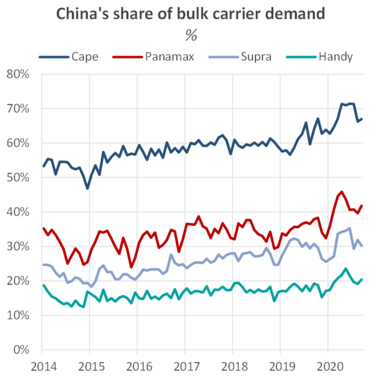
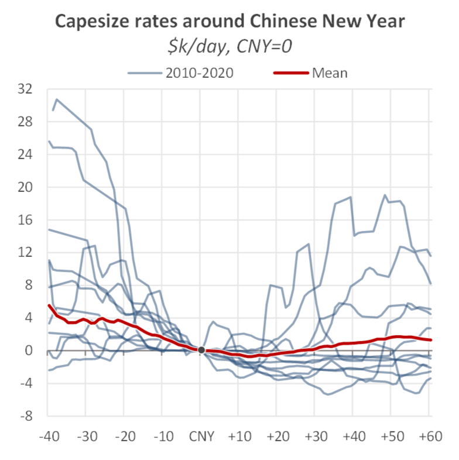
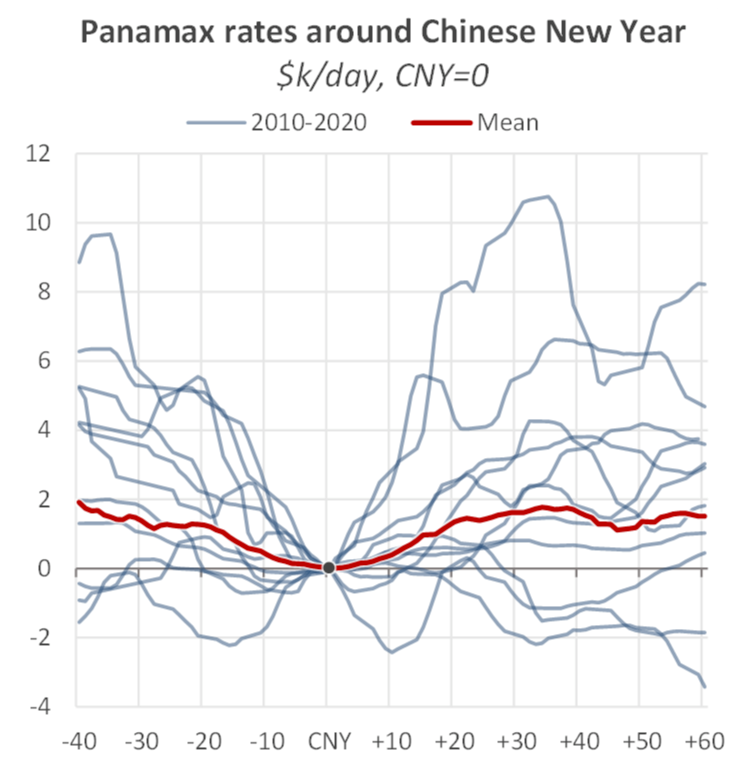

# The Big Picture: Chinese New Year

**Date:** February 05, 2021  
**Publisher:** Breakwave Advisors | **Category:** Market Insights  
**Original URL:** [https://www.breakwaveadvisors.com/insights/2021/2/4/the-big-picture-chinese-new-year](https://www.breakwaveadvisors.com/insights/2021/2/4/the-big-picture-chinese-new-year)  

---

*By Nick Ristic*

### Home for the Holidays

China’s Lunar New Year festivities begins next week, along with what is often called the largest human mass-migration event in the world. Migrant workers return to their home towns, businesses close down for the national holiday and domestic tourism picks up. In a normal year (such as 2019) we tend to see a spike in domestic travel, followed by a lull in movement and then another sharp rise as people return to cities.

But the economic impact usually extends beyond the one-week holiday. Activity winds down in the weeks leading up to this period, and it can take a month before firms return to full capacity. The disruption tends to be greatest in the manufacturing and construction industries, which rely heavily on migrant labour, and operations at factories and construction sites, for example, have to be cut back until they return.

> **Figure 1: Pandemic of Course Changed This Dynamic**  
> *The Pandemic of course changed this dynamic. As China restricted travel around the same time as the holiday to curb the spread of the virus in 2020, many industries found themselves without workers, and those thatwereoperational were faced with severe supply-chain issues that throttled output. For example, steel output was not heavily impacted by labour shortages, but a build-up in steel product stockpiles that were unable to be trucked to manufacturers did weigh on margins, and push mills to curb production.*  
> [Local Asset](file:///C:/Users/Dell/Github/Shipping/corpus/03-breakwave/insights/2021/assets/2021-02-05_the-big-picture-chinese-new-year_img_bmr70_193cae8481da.png)

### The ‘u-Shaped’ Dip: Fact or Myth

Given China’s dominance over dry bulk shipping demand, the market has come to expect a softening in rates around this time of the year. Chinese raw material imports accounted for about two thirds of Capesize demand in 2020, measured in terms of dwt employment from all voyages completed in the year. Last year also marked a sharp increase in this share versus previous years, as economic activity elsewhere in the world faltered. China also plays a linchpin role in the other bulker markets. Its share of demand in 2020 was around 40% for the Panamaxes, 30% for Supramaxes, and 20% for Handies.

> **Figure 2: Bmr 71**  
> [Local Asset](file:///C:/Users/Dell/Github/Shipping/corpus/03-breakwave/insights/2021/assets/2021-02-05_the-big-picture-chinese-new-year_img_bmr71_24d8e7562a11.png)

With this country being so crucial to Cape demand, it seems logical to assume that the slowdown in industrial activity during the holiday period would create a lull in rates, followed by a U-shaped rebound. But looking at previous years, this effect does not seem too impressive.

> **Figure 3: Bmr 73**  
> [Local Asset](file:///C:/Users/Dell/Github/Shipping/corpus/03-breakwave/insights/2021/assets/2021-02-05_the-big-picture-chinese-new-year_img_bmr73_19ab72a990b2.png)

The start of CNY falls on different dates every year, but by indexing freight rates over the last decade to the start of the holiday in each year, we can look for trends in what happens before and after the holiday. Capesize rates do tend to fall in the lead up to CNY: Over 2010-2020, rates on average fell by around $3,600/day during the month preceding the holiday period.

However in the weeks after, we did not typically see the mythical rebound in rates. On average, rates showed no increase a month after the start of the holiday, and 50 days out, they only increased by an average of $1,700/day. In six of the last ten years, Cape rates remained below pre-CNY levels 60 days after the holiday started.

There are likely many reasons behind this feature, but one could be that the pre-CNY market tends to still be running on the fumes of the previous Q3-Q4 seasonal jump in demand, which is in part driven by elevated restocking of iron ore ahead of the holiday. These effects do not carry over after the break. CNY is also not the only issue dragging on the Cape market in Q1. In China, this time of year also sees pollution controls such as limits to steel production, sintering and coal burn, which weigh on imports of key Capesize cargoes. This period is also when we tend to see wet weather disrupt the iron ore supply chain, both in Australia and Brazil, which can muddy a post-holiday rebound in demand.

These factors could however also explain why the Panamax market exhibits the pattern a little better, though the ‘U-shape’ is still fairly muted. Over the month leading up to CNY, Panamax rates typically fall by an average of $1,400/day, and in the month after the start of the holiday, they rise by an average of $1,600/day.

> **Figure 4: In Response to a Recent Flare-Up in COVID-19 Cases (the Worst**  
> *In response to a recent flare-up in Covid-19 cases (the worst since last year’s first wave), new restrictions on travel have been introduced in China. Authorities are keen to avoid a repeat of last year’s disruption, and are discouraging unnecessary travel during the holiday. The government estimates that movement will be 40% lower than normal levels over this period, which will continue to weigh on industries like travel and tourism, but it should also insulate areas like manufacturing and construction. Indeed, about a week ahead of this year’s New Year break,Baidu’sindex of national migration shows travel is down by around 57% versus 2019.*  
> [Local Asset](file:///C:/Users/Dell/Github/Shipping/corpus/03-breakwave/insights/2021/assets/2021-02-05_the-big-picture-chinese-new-year_img_bmr72_abc399a05e94.png)

Given that this market is not directly exposed to the aforementioned headwinds facing iron ore in Q1, Panamax rates appear to be much more likely to bounce back following the holidays. The period after CNY also coincides with the start of the South American grain export season, which provides a boost in long-haul employment that is increasingly driven by Chinese demand.

### What’s Happening This Year?

This year so far has already seen unusually strong rates and is correcting downwards, so it is likely that the market will continue to soften, but an atypical CNY could prevent rates from dipping too low. In addition, there are other factors that have the potential to support rates in the coming weeks. Capesize congestion in China is still almost double historical average levels (currently over 14m dwt), owing to the ban on Australian coal imports, wider coal import restrictions and Covid-19 related disruptions. Over the past few months, this element has proven capable of tightening the market, even when the fundamentals may not seem exciting.

Australian shipments of iron ore were temporarily cut by a cyclone earlier this week but output now seems to be getting back to normal, and in Brazil, dry weather over the past week is reportedly helping shipments recover from weeks of disruption due to heavy rain. At the time of writing, March FFAs in these markets trade at a discount to both today’s indices and February-dated FFA contracts, indicating that the market is not expecting a rebound to pre-CNY levels of demand. Though with a February vs. March spread of $1,000 for the Capes and only $175 for the Panamaxes, participants don’t seem to be pricing in a significant pull-back in the coming weeks either.

As we enter the Year of the Ox, let’s hope that the characteristics of strength and balance translate into a sustained demand recovery in 2021.

---

**Tags:** China  
