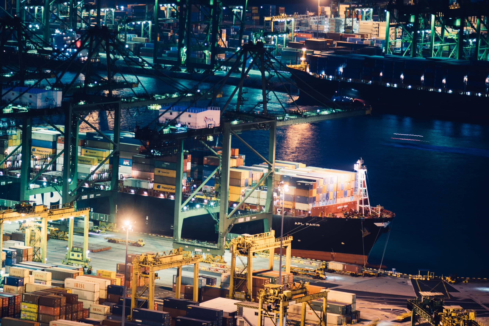

# Port Congestion: A Shifting Focus?

**Date:** February 08, 2021  
**Publisher:** Breakwave Advisors | **Category:** Market Insights  
**Original URL:** [https://www.breakwaveadvisors.com/insights/2021/2/5/port-congestion-a-shifting-focus](https://www.breakwaveadvisors.com/insights/2021/2/5/port-congestion-a-shifting-focus)  

---

> **Figure 1: By Ulf Bergman**  
> [Local Asset](file:///C:/Users/Dell/Github/Shipping/corpus/03-breakwave/insights/2021/assets/2021-02-08_port-congestion-a-shifting-focus_img_image-asset_8d3486498e9d.jpeg)

The news that China is allowing eight vessels to berth and discharge their cargoes of Australian coking coal, after many months of waiting, have raised hopes among some observers that the ban on Australian imports may come to an end. It is not yet clear if it is the result of change in policy by Chinese authorities or if it is a humanitarian move to allow the crews on the vessels to be changed. The mix of panamaxes and capesizes will offload around 850,000 tonnes of coal in the two Chinese ports of Caofeidian and Jingtang. The cargoes do not yet have customs clearance according to reports and it is not yet clear if the coal will find its way to Chinese steel mills or if it is destined to fill up space in a bonded warehouse.

Despite the good news, especially for the crews, that eight vessels can discharge and re-join the global fleet there are nevertheless a considerable number of bulkers off the Chinese coast awaiting further developments. According to reports, there are still approximately three million tonnes of Australian coking coal onboard vessels awaiting to be offloaded in Chinese ports or resold to alternative markets.

The news that Chinese authorities were allowing some cargoes to discharge saw prices for tier-one imported coking coal falling by USD 1.85 per tonne to USD 216.15 per tonne, on hopes that the ban is set to ease. The import ban has forced importers to substitute Australian coal with imports from Canada and the US, as much of the coking coal found in less distant locations are of lower quality and have the potential of damaging the steel furnaces if used in larger quantities.

As noted in a previous Insights contribution, the rising input prices for Chinese industrial production have contributed to a softening business climate and higher steel prices due to a ban on Australian coking coal could continue to be a drag on the economic performance. Hence, the ban on Australian imports could be relaxed, to some extent, as the Chinese leadership would deem it too costly. The advantage with an unofficial ban is that a reversal carries only a limited political price and any changes to the stance can be implemented rapidly and with minimal intervention.

While an ease of a ban on Australian coal imports would alleviate the human cost for the crews onboard the affected vessels and reduce the number of large dry bulk carriers waiting in Chinese waters, congestion is likely to be a theme for the months ahead. Last year’s deal between China and Indonesia, aiming at increasing Chinese imports by 200 million tonnes per year, have already resulted in increasing congestion for panamaxes both in Indonesian and Chinese ports as the trade have increased considerably.

> **Figure 2: Market Chart 2**  
> [Local Asset](file:///C:/Users/Dell/Github/Shipping/corpus/03-breakwave/insights/2021/assets/2021-02-08_port-congestion-a-shifting-focus_img_image-asset_0a14b290097c.jpeg)

The Brazilian soybean harvest was initially delayed by drought during the planting season and now further delayed by heavy rains during the initial stages of the harvest. Only about two percent of the sowed areas have so far been harvested, compared to approximately nine percent a year ago. The delayed harvest has raised fears that there will be congestion in the Brazilian port, as parts of the four million tonnes projected to be shipped in February are now more likely to move out in March. Hence, March, and even April, could be remarkably busy times in the Brazilian ports. According to the Brazilian agricultural statistics agency, Conab, the country is projected to produce more than 130 million tonnes in the 2020-21 growing season and some 85 million tonnes are expected to be exported.

In addition to a delayed harvest, there is also the threat of a truckers’ strike in Brazil that could cut the flow of the soybeans to the ports, as road transportation accounts for around 60pc of the country's transportation. The strike and associated delays have the potential of tying up more tonnage with longer waiting times in the ports.

Typically, the agricultural commodities are carried at sea onboard the medium and smaller sized bulk carriers. With many panamaxes facing congestion and delays in the Indonesia-China coal trade, any tightness in the tonnage market can be expected to spread to the smaller supramax and handysize segments.

---

**Tags:** Ports, Congestion, Capesize, Panamax  
