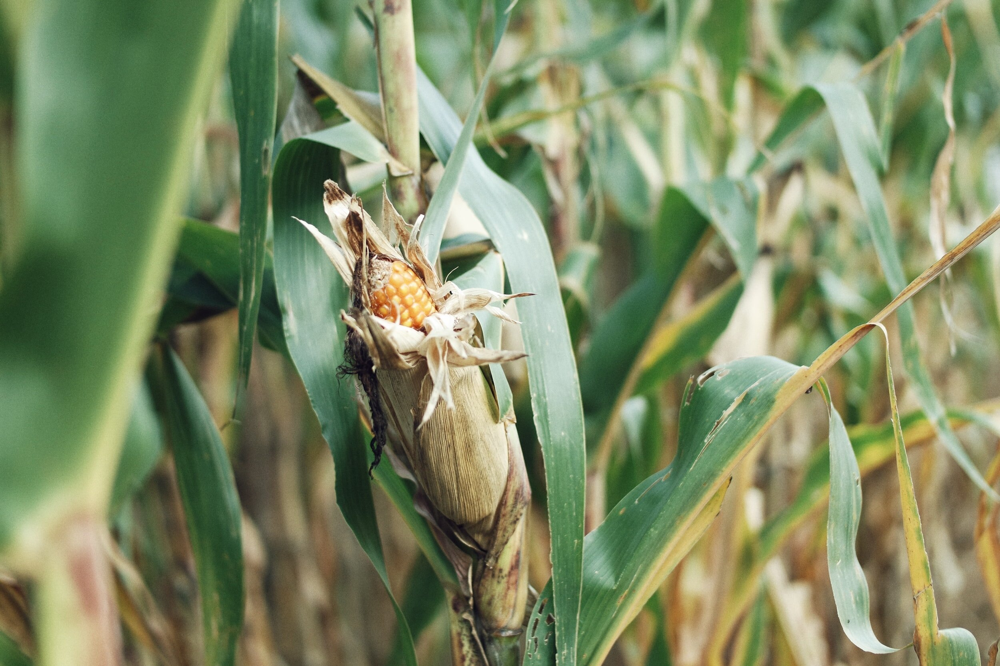
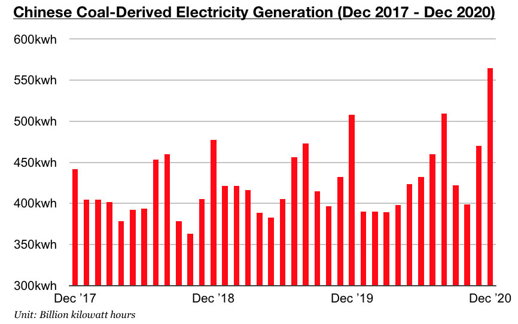

# 2021 Ushering in New Positive Changes for Chinese Coal and Corn Demand

**Date:** February 10, 2021  
**Publisher:** Breakwave Advisors | **Category:** Market Insights  
**Original URL:** [https://www.breakwaveadvisors.com/insights/2021/2/8/2021-ushering-in-new-positive-changes-for-chinese-coal-and-corn-demand](https://www.breakwaveadvisors.com/insights/2021/2/8/2021-ushering-in-new-positive-changes-for-chinese-coal-and-corn-demand)  

---

By[Jeffrey Landsberg](mailto:jeffrey@commodore-research.com)

Dry bulk prospects for this year remain promising. While the upcoming Lunar New Year holiday has ushered in a normal cooling in spot cargo demand, China’s overall economy remains very encouraging. In addition, SHIBOR lending rates fell significantly last week. As we discussed in our most recent Weekly China Report, the overnight SHIBOR (Shanghai Interbank Offered Rate) closed last week at 1.91%, which marks a decrease of one hundred and thirty-seven basis points from the previous week. The one-month SHIBOR closed last week at 2.75%, which marks a decrease of eight basis points from the previous week. China’s massive corn purchases seen in recent weeks also remain very encouraging for the dry bulk market looking forward.

> **Figure 1: Ship19**  
> [Local Asset](file:///C:/Users/Dell/Github/Shipping/corpus/03-breakwave/insights/2021/assets/2021-02-10_2021-ushering-in-new-positive-changes-for-chinese-coal-and-corn-demand_img_ship19_27f3d0a7611d.jpg)

Also encouraging is that Chinese steel production has remained very strong in recent weeks. Daily crude steel production at large and medium-sized mills averaged 2.18 million tons during January 21 - January 31. This is 2% less than the record 2.22 million ton production average that was seen during the previous ten days, but it is still up year-on-year by 10%. It remains encouraging that China’s steel production stayed robust in January despite last month's surge in global iron ore prices. Chinese steel prices have also remained at very high levels even as a large amount of steel has continued to be produced. The average price of hot rolled coil in China, for example, ended last week at 4,595 yuan/ton. This has marked a week-on-week decline of just 15 yuan and is up year-on-year by 635 yuan (16%). Chinese steel stockpiles have also continued to climb in recent weeks (as in the norm for this time of year), but the stockpile growth is not having any adverse impact on Chinese steel prices and steel production.

> **Figure 2: Market Chart 2**  
> [Local Asset](file:///C:/Users/Dell/Github/Shipping/corpus/03-breakwave/insights/2021/assets/2021-02-10_2021-ushering-in-new-positive-changes-for-chinese-coal-and-corn-demand_img_image-asset_93812272bb7f.jpeg)

Also of note in China is that electricity consumption growth remains likely to be very strong this year. As was widely reported last week, the China Electricity Council is anticipating that the nation’s electricity consumption this year will grow by 6 to 7%. Forecasts, targets, and predictions released by the Chinese government (including state sponsored entities like the China Electricity Council) should never be treated as gospel, but for 2021 we believe this forecast is fairly prescient. China’s overall industrial production last year grew in total by 2%, and electricity consumption ended up growing by 3.1%. Industrial production data for January 2021 is still pending, but of note is December experienced year-on-year growth of 7.3%, and Q4 2020 in total experienced year-on-year growth of 7.1%. For this year, we anticipate that China’s overall industrial production will continue to grow by at least 7%, and we expect that electricity consumption will grow by 7 to 9%.

Thermal coal-derived electricity generation is poised to remain China’s primary source of electricity generation. Thermal coal-derived electricity generation contributed to 71% of China’s total electricity production last year. In comparison, it contributed to 72% in 201 as there recently has been almost no shift away from thermal coal consumption in China. Overall, coal has remained a relatively dirty word throughout the world — but, as we have been continuing to stress in our work, it has still remained king in China. Of note is that for years China's central government has been working to increase nuclear power generation as one way to help reduce coal burn, but China's nuclear power goals are still not being met. This is a very significant issue that we continue to examine in our Weekly China Reports.

> **Figure 3: Coal Comm**  
> [Local Asset](file:///C:/Users/Dell/Github/Shipping/corpus/03-breakwave/insights/2021/assets/2021-02-10_2021-ushering-in-new-positive-changes-for-chinese-coal-and-corn-demand_img_coalcomm_173e1708d732.jpg)

For the dry bulk shipping and seaborne coal markets, it remains very supportive that thermal coal has continued to contribute to such a large amount of China’s overall electricity production. This will remain in effect again this year — and new is that this year is poised to see a drastic year-on-year increase in the nation’s overall electricity consumption. Also new is that China is experiencing much stronger than normal demand for corn imports this year. Staying the same this year is that steel production growth has remained robust.

---

**Tags:** Coal, Corn, China  
