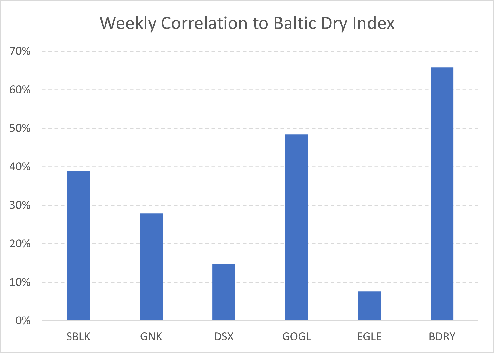
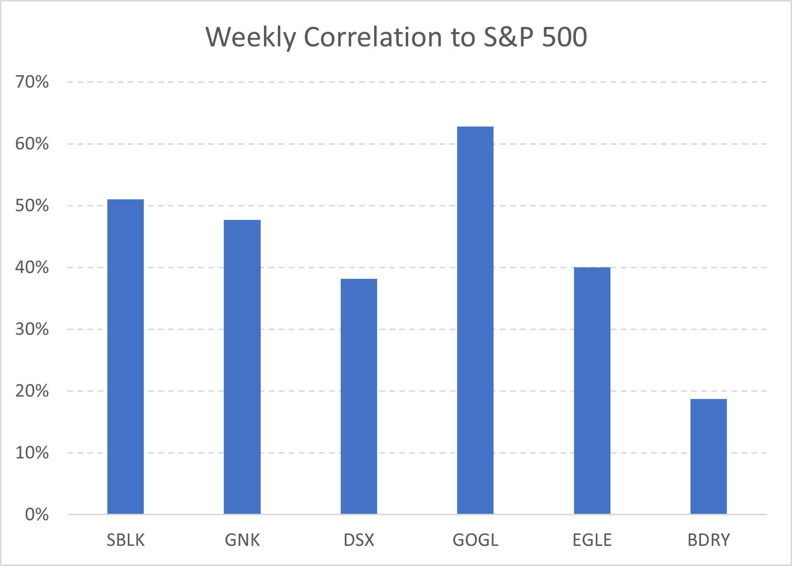
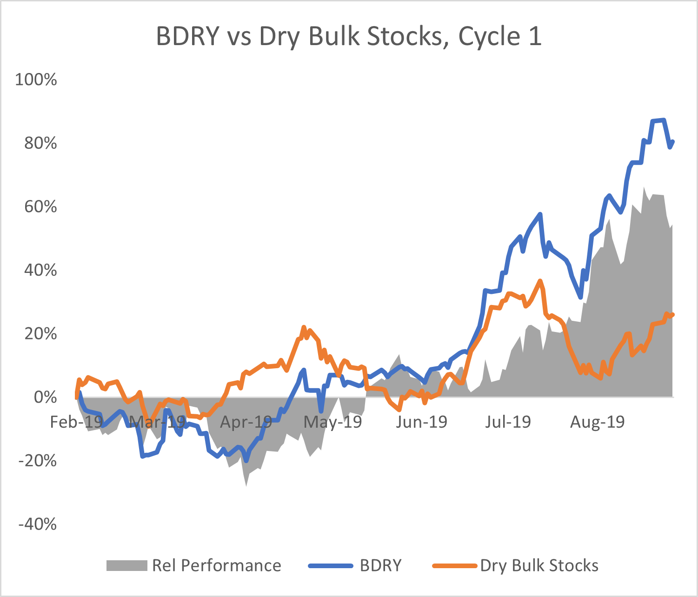
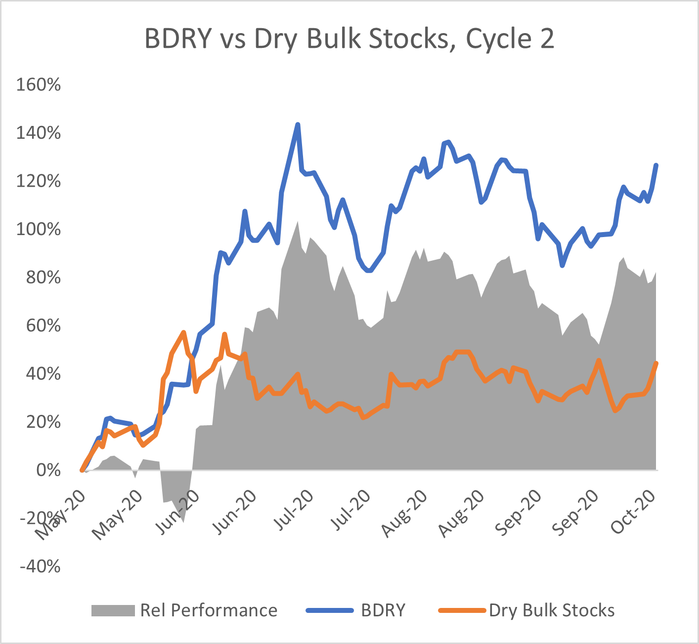

# The (Un) Correlated Nature of Dry Bulk Stocks

**Date:** February 12, 2021  
**Publisher:** Breakwave Advisors | **Category:** Market Insights  
**Original URL:** [https://www.breakwaveadvisors.com/insights/2021/2/10/the-un-correlated-nature-of-dry-bulk-stocks](https://www.breakwaveadvisors.com/insights/2021/2/10/the-un-correlated-nature-of-dry-bulk-stocks)  

---

*“Dry bulk rates are going up, I better put some money to work!”*

> **Figure 1: Dry Bulk Equities Have Had a Relatively Low Correlation To**  
> *Dry bulk equities have had a relatively low correlation to shipping rates: As the chart below shows, the weekly correlation of the five largest dry bulk stocks to the Baltic Dry Index has not been meaningful. Golden Ocean is the most correlated stock to the Baltic Dry Index, which we suspect is due to the fact that the primary listing is in Norway which traditionally is a more shipping focused market. As expected, BDRY exhibits the strongest correlation to dry bulk spot rates as captured by the Baltic Dry Index, given the direct exposure to dry bulk futures.*  
> **Interactive Data & Source:** [Etfmg](https://etfmg.com/funds/bdry/) | [Local Asset](file:///C:/Users/Dell/Github/Shipping/corpus/03-breakwave/insights/2021/assets/2021-02-12_the-un-correlated-nature-of-dry-bulk-stocks_img_image-asset_ce8efe9803b5.jpeg)

For those that have been involved in shipping, the previous sentence is something that probably has come up as a thought over and over again, as the cyclical and volatile nature of shipping offers outsized returns during short periods of time. However, predicting the direction of rates might actually be the easiest part of anyone’s investment process. After all, one has to buy something that will increase in value and be able to sell in order to profit out of her own prediction, but that might not be as straightforward as it sounds.

Take for example oil. A disruption in oil production due to an unforeseen event can be an opportunity for an investor to profit by taking a long position in an oil-related investment. The first and most correlated (and easily accessible) instrument would be oil futures. If the actual physical flow of oil is disrupted, the scarcity of the commodity will push the price of oil higher. As a result, the futures will also rise in tandem, reflecting the natural arbitrage between futures and spot. An investor that buys the futures at the right time might be able to sell it higher, making a profit on her trade.

Then, there are stocks. Oil producing equities might also increase in value, but a big part of the value of an equity encompasses longer term cash flows, so the impact of a short term cash inflow benefit might not be as profound when it comes to added value. More importantly, (back to our oil example) there is no natural arbitrage mechanism between oil prices and oil equities, thus in order for oil equities to move higher, other investors must also be convinced to buy the same stock. This is not easy, as a number of considerations might come into play: For example, what if the oil shock is large enough that could potentially cause a recession and thus lead to lower demand down the road? Such a scenario might be negative for oil stocks, thus actually the opposite reaction might be true and the stocks will decline then in value. Or what if oil stocks are “out of favor?” After all, investors preferences play a major role overwriting any near term fundamentals.

In shipping, equities behave in an unpredictable fashion as well. Indeed, shipping rates are by far the most important element when it comes to valuation. However, shipping equities are still stocks and subject to various external factors that affect performance other than shipping rates. A spike in rates might be good for the short run and will most likely have a positive impact on profitability, but if investors expect that to be short lived, then the impact on valuation will be small. As a result, our investor who accurately predicted the rise in rates is left without a meaningful profit.

Freight futures that settle against shipping rates exist, but are out of reach for the great majority of investors.[BDRY, the ETF that invests in freight futures](https://etfmg.com/funds/bdry/)is the only instrument globally through which an investor can access freight futures in an easy and convenient way similar to buying any other stock. Absent this option, there is no other simple way for an investor to directly participate in the dry bulk market.

Over time, correlations between spot shipping rates, equities and freight futures vary, but more recently correlations have been particularly weak. As an example, if we look at the last eight months (from June 1, 2020 to February 1, 2021) a number of conclusions can be made:

> **Figure 2: Source: Bloomberg**  
> *Source: Bloomberg*  
> [Local Asset](file:///C:/Users/Dell/Github/Shipping/corpus/03-breakwave/insights/2021/assets/2021-02-12_the-un-correlated-nature-of-dry-bulk-stocks_img_correlbdi_8277e649d449.png)

- *Dry bulk equities actually have higher correlation to the S&P 500 than to dry bulk rates:*Again, this is might sound odd, but it is not surprising. Actually, dry bulk equities have a higher correlation to the broader market than to shipping rates. This is not necessarily bad, but an investor has always to keep in mind that it is not only the performance of shipping rates that will determine the dry bulk stock performance, but also the performance of the stock market as a whole (sometimes even more).

> **Figure 3: Source: Bloomberg**  
> *Source: Bloomberg*  
> [Local Asset](file:///C:/Users/Dell/Github/Shipping/corpus/03-breakwave/insights/2021/assets/2021-02-12_the-un-correlated-nature-of-dry-bulk-stocks_img_correls26p_f7028fe6c6f0.png)

The uncorrelated nature of shipping, however, is easily visible on the very low correlation of BDRY to the S&P 500. Again, this is not surprising. After all, shipping rates historically have exhibited no significant correlation to stocks due to the idiosyncratic nature of the industry and since BDRY holds futures on shipping rates, the correlation to stocks is very low.

So, what has been the performance of shipping stocks relative to changes in shipping rates over the last few dry bulk cycles? Short answer: Not good. After all, Capesize rates went from ~$2,000/day to almost $40,000/day in the summer of 2020, while dry bulk stocks barely moved (see chart below). Another mini rally in the fall also led to minimal outperformance of shipping stocks. In 2019, a major rally in rates during the summer went virtually unnoticed by dry bulk stock investors (see second chart below). On the other hand, so far this year, despite relatively low rates, shipping stocks have rallied considerably, in line with the broader market and the rampant investor enthusiasm towards equities of any kind.

### Cycle 1: February 2019-September 2019

> **Figure 4: Dry Bulk Stocks Is the Marketcap Weighted Average of: Dsx**  
> *Dry Bulk Stocks is the marketcap weighted average of: DSX, EGLE, GNK, GOGL, SALT, SB, SBLK*  
> [Local Asset](file:///C:/Users/Dell/Github/Shipping/corpus/03-breakwave/insights/2021/assets/2021-02-12_the-un-correlated-nature-of-dry-bulk-stocks_img_cycle1_9b74e6151a6b.png)

### Cycle 2: May 2020-October 2020

> **Figure 5: Dry Bulk Stocks Is the Marketcap Weighted Average of: Dsx**  
> *Dry Bulk Stocks is the marketcap weighted average of: DSX, EGLE, GNK, GOGL, SALT, SB, SBLK*  
> [Local Asset](file:///C:/Users/Dell/Github/Shipping/corpus/03-breakwave/insights/2021/assets/2021-02-12_the-un-correlated-nature-of-dry-bulk-stocks_img_cycle2_4b5036769899.png)

For a generalist investor this might be good news, but for the savvier shipping investor, probably it defies the purpose of doing her homework and trying to predict the main driver of shipping value, i.e. freight rates.

Overall, shipping is a cyclical industry, and not necessarily a good fit for the long term, buy and hold investor (at least not in dry bulk). Externalities and unrelated macro noise affects shipping stocks, as it affects a lot of other sectors. As a result, shipping equities serve a purpose on the broader asset diversification sphere, but for pure dry bulk exposure one needs to consider instruments that directly correlate to shipping rates and provide the much sought after “beta”, similar to other commodity-based industries (see Oil, Natural Gas, Agricultural Commodities, etc.). After all, you always have to know what you invest in and picking the right instrument in order to achieve the best possible outcome of a predetermined investment thesis is the essence of investing.

---

**Tags:** Shipping Stocks, Dry Bulk, Freight Futures  
