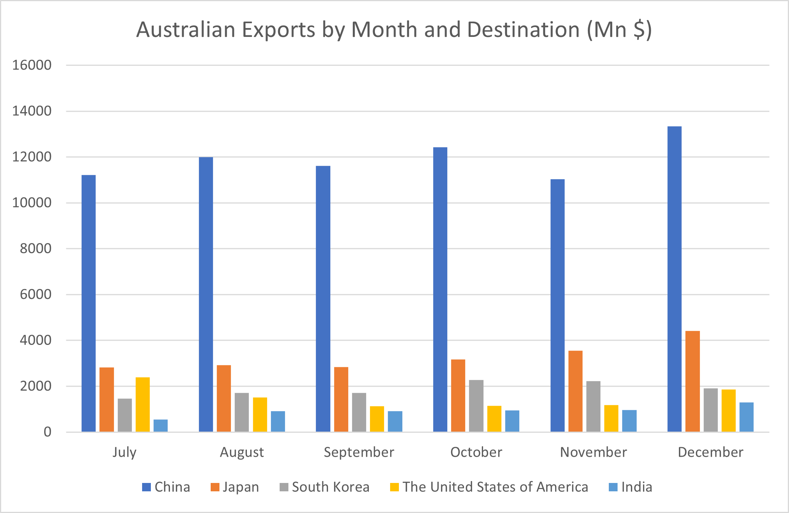
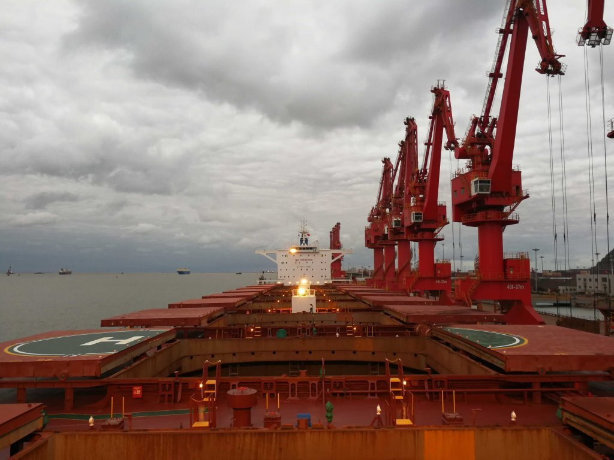
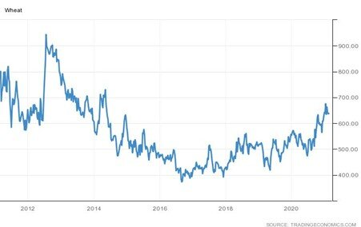

# Trade Frictions: Australian Exports to China Are Still Rising

**Date:** February 16, 2021  
**Publisher:** Breakwave Advisors | **Category:** Market Insights  
**Original URL:** [https://www.breakwaveadvisors.com/insights/2021/2/15/trade-frictions-australian-exports-to-china-are-still-rising](https://www.breakwaveadvisors.com/insights/2021/2/15/trade-frictions-australian-exports-to-china-are-still-rising)  

---

*By Ulf Bergman*

Conventional wisdom would dictate that trade frictions result in falling trade volumes, especially if a dispute is rather one-sided with one side imposing import bans. However, recent data from the Australian customs authorities show that exports to China have remained strong in the last few months, despite the ongoing tensions between the two nations during the second half of last year. China continued to be, by a considerable margin, the largest market for Australia’s exports and volumes even increased in December.

> **Figure 1: Ulf 400**  
> [Local Asset](file:///C:/Users/Dell/Github/Shipping/corpus/03-breakwave/insights/2021/assets/2021-02-16_trade-frictions-australian-exports-to-china-are-still-rising_img_ulf400_ada814997d13.png)

Coal imports from Australia have been largely absent from Chinese ports during the last few months, with many vessels spending months awaiting clearance to discharge their cargoes. Chinese authorities have also been quick to downplay the significance of recent developments, when some vessels were allowed to offload their cargoes of Australian coal. The move has been portrayed as a humanitarian step for the benefit of the crews onboard the trapped bulkers, rather than a change in policy.

A rather pragmatic approach by Chinese authorities to any import bans have seen trade continuing undisturbed in commodities that are of great importance to the Chinese economy and where substitutes are hard to find. Hence, the flow of Australian iron ore has been allowed to continue unabated, as the only other source of considerable quantities, Brazil, continued to struggle with a return to full production levels. While the increasing iron ore prices can explain some of the increases in exports between November and December, volumes also increased by around eleven percent.

> **Figure 2: Wheat Prices 2016-2021 (Us Cents/bushel)**  
> *Wheat Prices 2016-2021 (US cents/bushel)*  
> [Local Asset](file:///C:/Users/Dell/Github/Shipping/corpus/03-breakwave/insights/2021/assets/2021-02-16_trade-frictions-australian-exports-to-china-are-still-rising_img_ship14_247ea213659f.jpg)

Following export restrictions by Russia and Argentina, Chinese buyers bought a record 800,000 tonnes of Australian wheat in December after no purchases since August. The new monthly record was almost the double of the previous one from the early 2014. The increase in wheat exports offset the loss of coal exports and contributed to the rising exports. There are also suggestions that Chinese purchasers have bought considerable quantities for delivery in the coming months. However, given the destiny of many Australian coal shipments, there could be some reluctance among Australian shippers to respond to the newfound Chinese appetite for its wheat. A Chinese move to replenish depleted state reserves and a growing demand coming from the rebuilding of the country’s pig herd is likely to push global prices for wheat and other grains higher.

> **Figure 3: Ulf 401**  
> [Local Asset](file:///C:/Users/Dell/Github/Shipping/corpus/03-breakwave/insights/2021/assets/2021-02-16_trade-frictions-australian-exports-to-china-are-still-rising_img_ulf401_8c510a72d691.jpg)

The Australian customs data also show that some of the country’s coal have found alternative markets, with increasing shipments to Japan (+27%), India (+38%) and South Korea (+48%). Thermal coal consignments increased to Japan and South Korea, while much of the growth in exports to India were hard coking coal for the steel industry.

---

**Tags:** China, Wheat, Coal  
