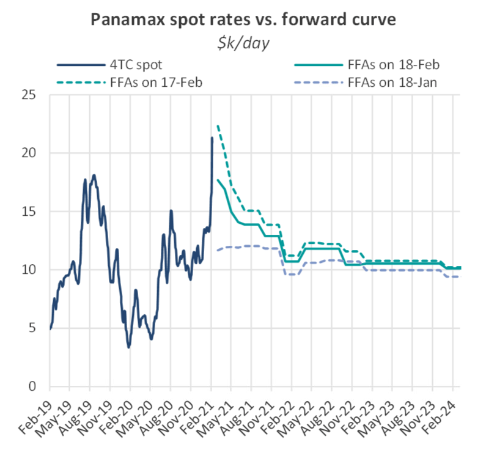
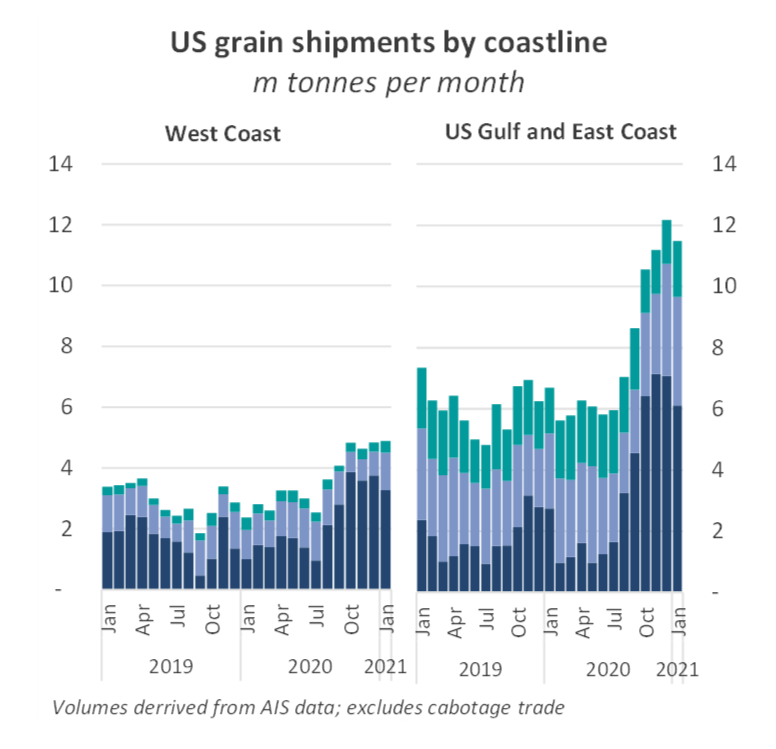
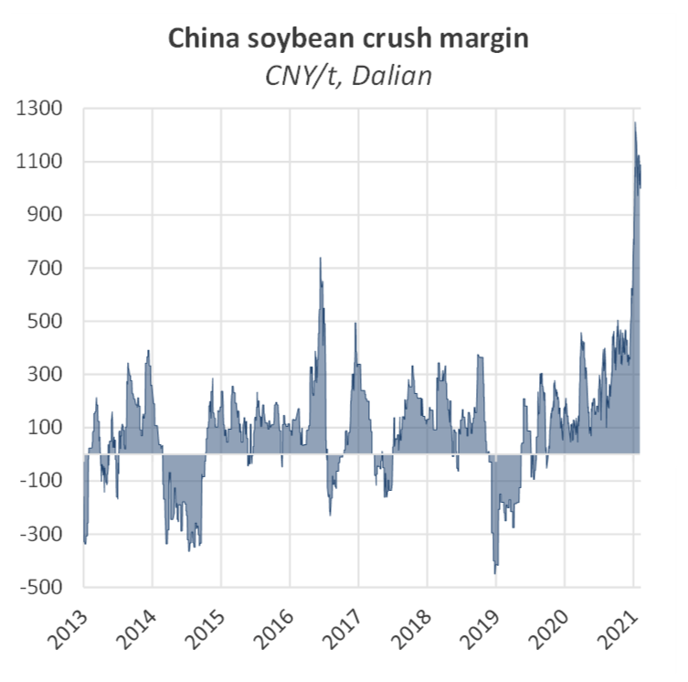
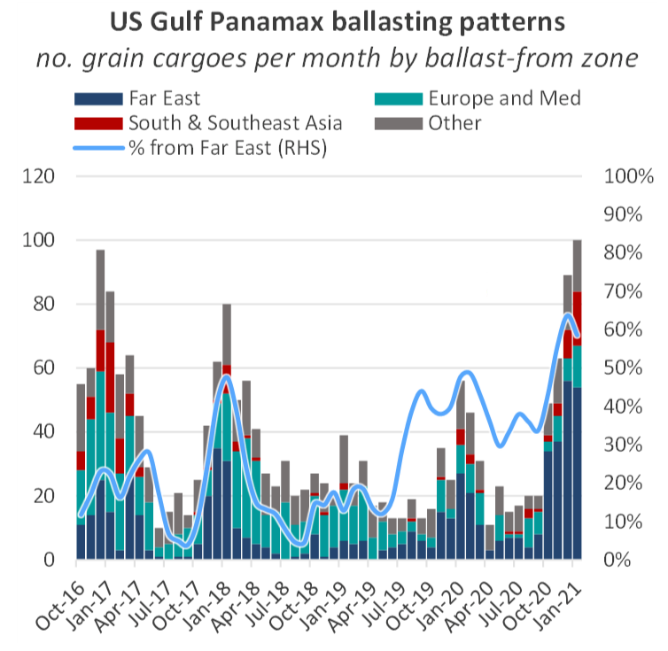

# The Big Picture: Panamax Rates

**Date:** February 19, 2021  
**Publisher:** Breakwave Advisors | **Category:** Market Insights  
**Original URL:** [https://www.breakwaveadvisors.com/insights/2021/2/18/the-big-picture-panamax-rates](https://www.breakwaveadvisors.com/insights/2021/2/18/the-big-picture-panamax-rates)  

---

*by Nick Ristic*

### Up and Away

The Panamax market has made headlines this week after a spectacular rally. Not only is this movement highly unseasonal, it has pushed freight rates to their highest levels in over ten years. Kamsarmax rates hit $22,659 yesterday, amid news that ice-class and IWL-breaching ships had been fixed for more than $100,000/day for short-haul trips in icy conditions. This represents a two-fold jump in rates since the start of the year and an increase on last August’s peak by 38%. The other markets have been hoisted up too, but average Kamsarmax rates still currently hold a $6,550/day premium over the Capes, based on indices published today.

Movements in the paper markets have been even more extreme. Since the start of the week, the March Panamax FFA contract gained more than $10,000 in value, hitting a high of more than $27,000 yesterday, before retreating back down to $17,500 at the time of writing. Despite the fall, these price expectations still represent a 163% improvement versus March 2020.

> **Figure 1: Bmr 80**  
> [Local Asset](file:///C:/Users/Dell/Github/Shipping/corpus/03-breakwave/insights/2021/assets/2021-02-19_the-big-picture-panamax-rates_img_bmr80_597306c8959e.png)

### Agribulk Boost

The driver of this rally, which has been gathering pace since November last year, appears to be a surge in grain volumes from the US. After two seasons of depressed shipments, owing to a tit-for-tat trade dispute between Washington D.C. and Beijing, Q4 2020 saw American agricultural sales surge, surpassing pre-trade-war levels. US grain shipments on Panamaxes over the last three months, which represent the seasonal peak in exports, totalled 31m tonnes. This is more than double versus the period a year earlier and 56% greater than volumes shipped over this portion of the 2017/18 season. Liftings from the US’ Atlantic coastlines have shone the brightest, soaring by 133% YoY over this November-January period.

> **Figure 2: Bmr 81**  
> [Local Asset](file:///C:/Users/Dell/Github/Shipping/corpus/03-breakwave/insights/2021/assets/2021-02-19_the-big-picture-panamax-rates_img_bmr81_1ae3c6b9c475.png)

With pork prices rapidly rising in China, its grain crushers have shown unrelenting demand for US soybeans and corn. Prices of these goods have been propelled to their highest levels since 2014, and still, the profitability of processing them has reached record levels. Soybean crush margins in Dalian, for example, have recently hit an all-time high of 1,250 RMB/t. American exporters have also been able to capitalise on weather-related weakness in Black Sea grain crops, in addition to the seasonal dip in available cargoes from South America.

> **Figure 3: 2bmr 81**  
> [Local Asset](file:///C:/Users/Dell/Github/Shipping/corpus/03-breakwave/insights/2021/assets/2021-02-19_the-big-picture-panamax-rates_img_2bmr81_bc9377e871e0.png)

### Ballasters Travelling Further

Increased flows from the US to the Far East seem to have caught the Panamax market off guard, adding to an existing tonnage imbalance between the Atlantic and Pacific Basins. With demand becoming more concentrated on China, and grain supply outside of North America constrained, vessels are having to ballast longer distances to load ports. 60% of Panamaxes loading in the US Gulf since October came from the Far East. This is up from an average of 33% during the exporting seasons of the two years prior to the trade dispute.

> **Figure 4: 32bmr 81**  
> [Local Asset](file:///C:/Users/Dell/Github/Shipping/corpus/03-breakwave/insights/2021/assets/2021-02-19_the-big-picture-panamax-rates_img_32bmr81_27f84c4d6605.png)

And even within this cohort of Far East ballasters, ships are travelling further to get to the Gulf. Typically, more than 95% of these vessels would transit the Panama Canal, but so far in 2021 this figure has been around 83%, with the remainder taking the ~50% longer voyage around the Cape of Good Hope. This is likely due to heavier congestion around the Panama canal, which owners are keen to avoid in such a strong market. Greater numbers of ships taking this route has translated to another layer of inefficiency in the fleet.

Lower dry bulk shipments into India and countries in Europe and the Mediterranean has also translated to fewer vessels opening up in these regions, which would typically serve as tonnage for Atlantic shippers. Over the last 3 months, Panamaxes loading in the US Gulf region ballasted for 43 days on average, up from a stable average of around 31 days over the last five years.

### Other Markets Squeezing the Fleet

Patterns in other commodity markets are also driving this dynamic. Chinese coal receipts have surged over the past few weeks, as authorities have responded to the highest domestic coal prices since 2008 by relaxing import restrictions. This has kept more ships in the Pacific and away from the key grain exporting regions.

Chinese coal imports on Panamaxes jumped by 58% MoM and 27% YoY to 17.7m tonnes in January, according to AIS cargo tracking data, although this in part reflects queuing ships being allowed to discharge.

A hot domestic market has also absorbed more Panamaxes into coastal trades. Volumes of coal moved between Chinese ports on Panamaxes has remained above 20m tonnes per month since June last year, 20% higher versus 2019’s average. Many of these ships are overage, so would not be otherwise trading in the grain market, but this increase does represent a significant reduction in the number of vessels competing for Pacific coal business. China’s import quota system and bans on Australian coal meanwhile continue to constrain supply. Over January, Panamax queues in China averaged 10.7m dwt, 42% higher than the 5-year average over this period. This congestion is easing as quotas are relaxed but levels still remain historically high.

Inefficiencies are also growing in South America, where the impending surge in 2020/21 soybean crop shipments has been pushed back on delayed harvests. This disruption has, on one hand, driven even higher demand for North American agricultural goods, but at the same time has led to growing queues of vessels positioned for this trade, further tightening the market.

### Where to From Here?

Today, the FFA market has seen a sell-off almost as spectacular as the initial upswing, with the March Panamax contract shedding almost $5,000 in value at the time of writing. But despite today’s correction, continued strength in this market is not off the cards. $17,500/day in March for a Panamax is, after all, still a very healthy market.

The South American exporting season begins in earnest next month, and despite projections of a fall in shipments from the region this year, these volumes should sustain demand once activity in the US seasonally cools.Much depends now on the Pacific market, and whether ships will be paid to stay in this basin rather than ballast over to the Atlantic, where they command a premium.

The Cape market, which enjoyed a boost from this rally also now seems to be cooling off, and price expectations for March are now more or less where they were at the start of the year. Iron ore volumes in both basins have shown signs of improvement recently, but with demand still seasonally weak and a sizeable ballaster list for Brazilian cargoes, we don’t expect fireworks from this market in the coming weeks.

---

**Tags:** Panamax, Capesize, Coal, Grains  
