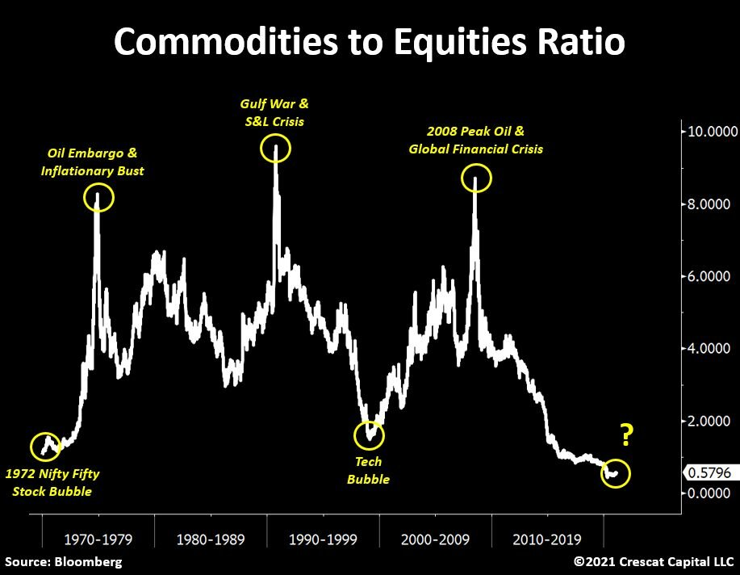
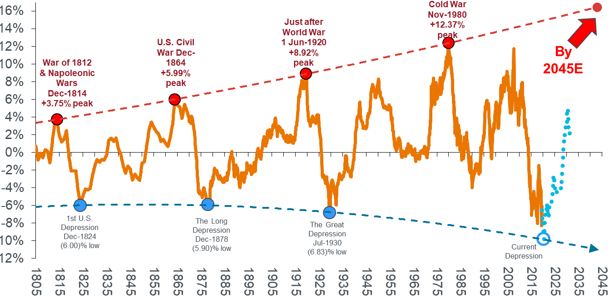
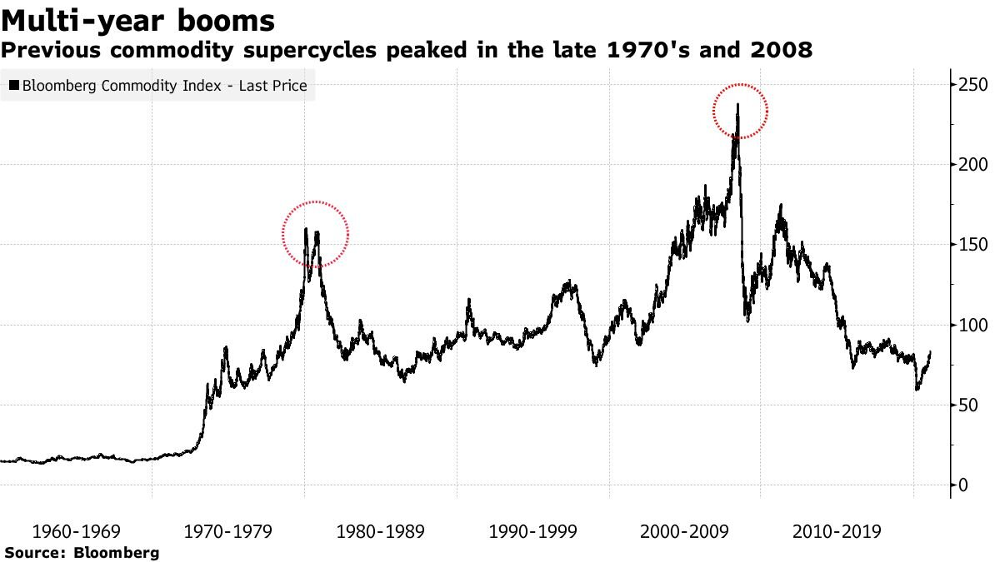
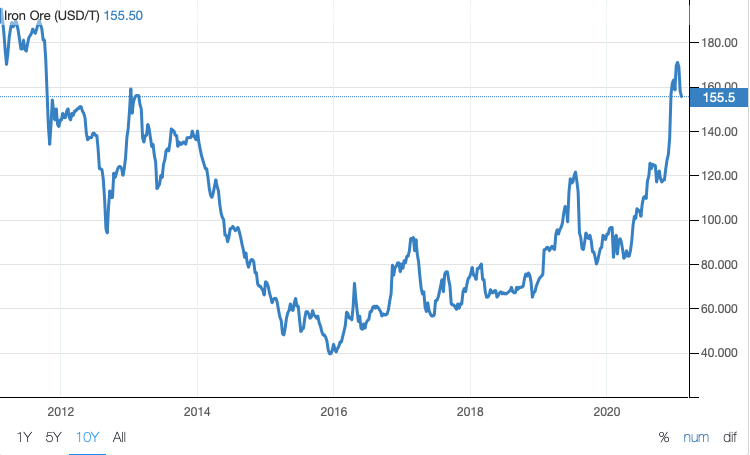

# “The macro opportunity of a lifetime” ?

**Date:** February 26, 2021  
**Publisher:** Breakwave Advisors | **Category:** Market Insights  
**Original URL:** [https://www.breakwaveadvisors.com/insights/2021/2/24/the-macro-opportunity-of-a-lifetime-](https://www.breakwaveadvisors.com/insights/2021/2/24/the-macro-opportunity-of-a-lifetime-)  

---

The environment that has been creating the bullish tailwinds for equities and fixed income is coming to an end, and people are beginning to look for alternatives.

The value proposition for buying commodities and selling stocks has never been so pronounced.**Otavio Costa**, Partner atis calling it “The macro opportunity of a lifetime”.

> **Figure 1: Crescat Capital**  
> **Interactive Data & Source:** [Breakwave Advisors Market Insights](https://www.breakwaveadvisors.com/insights/2021/2/10/the-un-correlated-nature-of-dry-bulk-stocks) | [Local Asset](file:///C:/Users/Dell/Github/Shipping/corpus/03-breakwave/insights/2021/assets/2021-02-26_the-macro-opportunity-of-a-lifetime_img_image-asset_2210568c8be1.jpeg)

Everyone fromto**Bank of America**to**Ospraie Management**are calling for a commodities bull market as government stimulus kicks in and vaccines are deployed around the world to fight the coronavirus. Investing luminaries from**Point72**to**Pimco**are calling for commodity prices to move higher.

With agricultural prices soaring, metal prices hitting some of the highest levels in years and oil now well above $50 per barrel,**JPMorgan Chase & Co.**is also calling it: Commodities appear to have begun a new supercycle expected to last many years.

A long-term boom across the commodities complex appears likely with Wall Street betting on a strong economic recovery from the pandemic but also looking to hedge against inflation. On top of that, prices might also jump as an “unintended consequence” of the fight against climate change, which threatens to constrain oil supplies while boosting demand for metals needed to build renewable energy infrastructure, batteries and electric vehicles.

According to**Daniel Sullivan**, Head of Global Natural Resources at**Janus Henderson Investors**, there have been six commodity peaks in the past 227 years, with the most recent peak in June 2008. Analysis shows that the current supercycle is following the average path of these historic supercycles, pointing to a turn in commodities through the 2020’s.

### Us Commodity Price Index 1795 to Present

> **Figure 2: Source: Stifel Report June 2020**  
> *Source: Stifel Report June 2020. Note: Shown as 10yr rolling compound growth rate with polynomial trend at tops and bottoms. Blue dotted line illustrates a forecast estimation. Source: Warren & Pearson Commodity Index (1795-1912), WPI Commodities (1913-1925), equal-weighted (1/3rd ea.) PPI Energy, PPI Farm Products and PPI Metals (Ferrous and Non-Ferrous) ex-precious metals (1926-1956), Refinitiv Equal Weight (CCI) Index (1956-1994), and Refinitiv Core Commodity CRB Index (1994 to present).*  
> **Interactive Data & Source:** [Breakwave Advisors Market Insights](https://www.breakwaveadvisors.com/insights/2021/2/10/the-un-correlated-nature-of-dry-bulk-stocks) | [Local Asset](file:///C:/Users/Dell/Github/Shipping/corpus/03-breakwave/insights/2021/assets/2021-02-26_the-macro-opportunity-of-a-lifetime_img_image-asset_4c50c0cc4430.png)

In China, rising infrastructure spending, rate cuts, increasing pressure to the local governments to support the auto industry and some relaxation of housing policies are all positive for metals demand. The copper price, which is often seen as a bellwether for global economic growth, has gained a massive 50% to US$3/lb since the lows in March 2020, while gold has set a new record high of US$2,000/oz. Silver, rare earth metals and uranium are also emerging quickly from a long slow period of sub-par returns and we believe other commodities are likely to follow.

“Looking at the 2020s, we believe that similar structural forces to those which drove commodities in the 2000s could be at play,” said investment bankin a report. “Policy driven demand is going to create a capex cycle that is bigger than the BRICs (Brazil, Russia, India, China) in the 2000s, not quite as big as the ’70s, but we are talking about that kind of a bull market in commodities.”

> **Figure 3: Goldman Sachs**  
> **Interactive Data & Source:** [Breakwave Advisors Market Insights](https://www.breakwaveadvisors.com/insights/2021/2/10/the-un-correlated-nature-of-dry-bulk-stocks) | [Local Asset](file:///C:/Users/Dell/Github/Shipping/corpus/03-breakwave/insights/2021/assets/2021-02-26_the-macro-opportunity-of-a-lifetime_img_image-asset_da7ac2f097d5.jpeg)

### Iron Ore Market Seen As the Cornerstone of a New Commodities Super Cycle

Many market experts single out iron ore, the main ingredient for steel, as a commodity heading for an inflection point when prices stay at elevated levels for a considerable period of time.

Analysts at**Morgan Stanley**also hold to a bullish scenario for iron ore prices in the years ahead. They laid out a ‘plausible scenario’ in a recent report of iron ore prices trading at more than $US165 per tonne for a three-year period out to 2024.

Australia accounts for the lion’s share of supply for the seaborne market for iron ore, with the balance largely made up by Brazil which has suffered some recent supply setbacks.

Steel production in China seen as robust and growing in years ahead. China’s urbanization levels are currently around 50% compared to a level of 80% in Europe and North America, indicating the Asian country still has some way to go to equal urbanization rates in Western countries.

Current steel production in China is around 1.1 billion tonnes per year and has increased by around 200 million tonnes in the past few years. “That means another 300 million tonnes a year of iron ore is needed”,**Magnetite Mines**directorsaid.

> **Figure 4: Mark Eames**  
> **Interactive Data & Source:** [Breakwave Advisors Market Insights](https://www.breakwaveadvisors.com/insights/2021/2/10/the-un-correlated-nature-of-dry-bulk-stocks) | [Local Asset](file:///C:/Users/Dell/Github/Shipping/corpus/03-breakwave/insights/2021/assets/2021-02-26_the-macro-opportunity-of-a-lifetime_img_image-asset_6d2194c6d3b4.png)

**“In the years to come, it’s highly probable that a great many investors will look back on 2020 and wonder how they missed these signs of a new commodity bull market”**

The long era of monetary-policy dominance is over, leading to a heightening of inflation risks not seen since the 1960s. Investors are deeply underweight and will need real assets such as commodities as a hedge against inflation. Commodities are generationally cheap, both compared to themselves and to other assets.

Prices have already jumped from their low point in the spring. Copper, iron ore and soybeans have risen to their highest levels in more than six years, spurred by a Chinese buying spree.

“We very much believe that the fundamentals are now in place for a new, structural, bull market to begin,” said**Robert Howell**, senior research strategist at**Gresham Investment Management**, the commodities-focused unit of**Nuveen**with $5.8 billion in assets in the sector. “In the years to come, it’s highly probable that a great many investors will look back on 2020 and wonder how they missed these signs of a new commodity bull market.”

Commodities are stereotypical cyclical assets, rising and falling in synchrony with the global economy. That puts them first in line to benefit from the recovery that could be unleashed by virus vaccines.

“We are optimistic on commodities overall, as recovering global economic growth and the possibility of higher inflation should be supportive for prices,” says**Evy Hambro**, who helps manage $16 billion as global head of thematic and sector investing at**BlackRock**Inc.

**Nic Johnson**, who manages about $20 billion of commodity index investments as well as a separate hedge fund at**Pimco**, believes commodities “will benefit from the global reflationary theme.”

**Obtain dry bulk shipping exposure. Diversify into an uncorrelated, global macro theme.**

China’s economy is gradually recovering to pre-pandemic levels, with factory output rising at its fastest rate in ten years. There is little reason to expect any other country being the main source of excess demand for commodities in 2021, as China returns to old methods of building its way out of a downturn.

> **Figure 5: Erling Naess**  
> **Interactive Data & Source:** [Breakwave Advisors Market Insights](https://www.breakwaveadvisors.com/insights/2021/2/10/the-un-correlated-nature-of-dry-bulk-stocks) | [Local Asset](file:///C:/Users/Dell/Github/Shipping/corpus/03-breakwave/insights/2021/assets/2021-02-26_the-macro-opportunity-of-a-lifetime_img_erlingnaess_6e808382cad7.jpg)

Erling Naess

It will, however, probably not be alone. Governments around the globe have already made their intentions plain on to drive a recovery from the pandemic through spending on aging or missing infrastructure, which will create additional demand for industrial commodities like iron ore and copper.

Shipping is the lifeblood but also the workhorse of global economy. Norwegian shipping tycoon**Erling Naess**put it nicely a few year ago: “God must have been a shipowner. He placed the raw materials far from where they were needed and covered two thirds of the earth with water."

An allocation into dry bulk shipping may improve overall portfolio risk-adjusted returns due to the uncorrelated nature of the sector at a period when the industry is experiencing a cyclical upturn.

Dry bulk shipping is a very good diversifier, with very low correlation to other asset classes and**a levered play on the commodity cycle with high beta and volatility compared to the underlying commodities.**

Commodities are entering into a major upcycle, which adds to the favorable macro picture for shipping. The global economic rebound should continue to boost dry bulk demand. The notoriously volatile dry bulk market has started 2021 on a very positive note with rates reaching multi-year seasonal high levels. Analysts see positive fundamentals for the years ahead with supply/demand balance tightening, something that can be beneficial for freight rates.

For pure dry bulk exposure, one needs to consider instruments that directly correlate to shipping rates and provide the much sought after “beta”, similar to other commodity-based industries (see Oil, Natural Gas, Agricultural Commodities, etc.).

BDRY, the ETF that invests in freight futures is the only instrument globally through which an investor can access freight futures in an easy and convenient way similar to buying any other stock. Absent this option, there is no other simple way for an investor to directly participate in the dry bulk market.

Have a look at the latest Breakwave Advisors’ insights[here](https://www.breakwaveadvisors.com/insights/2021/2/10/the-un-correlated-nature-of-dry-bulk-stocks).

---

**Tags:** Shipping, Global Economy  
