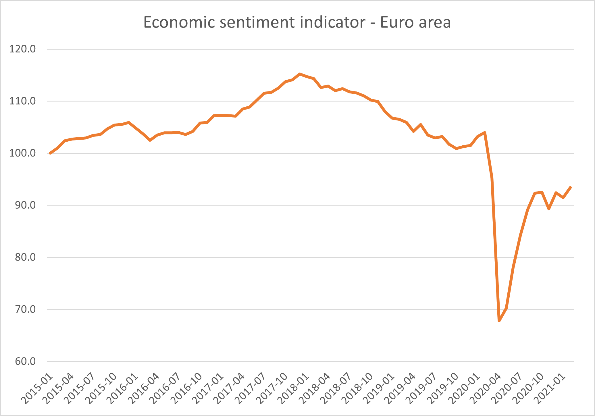
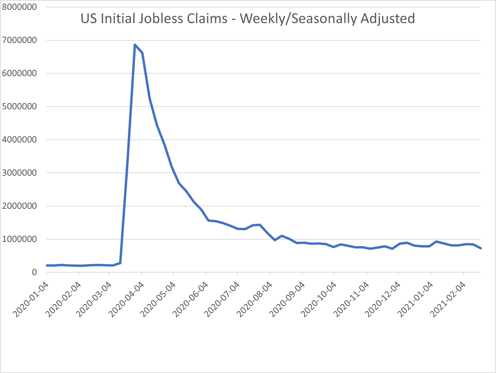
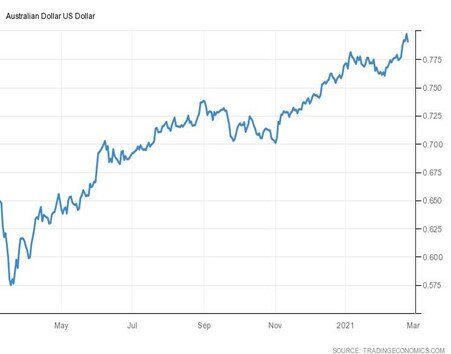

# Economic Data: A Good Day’s Harvest

**Date:** March 01, 2021  
**Publisher:** Breakwave Advisors | **Category:** Market Insights  
**Original URL:** [https://www.breakwaveadvisors.com/insights/2021/2/25/economic-data-a-good-days-harvest](https://www.breakwaveadvisors.com/insights/2021/2/25/economic-data-a-good-days-harvest)  

---

> **Figure 1: By Ulf Bergman**  
> [Local Asset](file:///C:/Users/Dell/Github/Shipping/corpus/03-breakwave/insights/2021/assets/2021-03-01_economic-data-a-good-days-harvest_img_image-asset_1c248bf8a953.jpeg)

Thursday saw some encouraging data releases, which indicate that there is hope for the global economy. First out was the Eurozone economic sentiment indicator, which increased to 93.4 from 91.5 in January and exceeded economists’ expectations. The improving sentiment was powered by rising confidence across manufacturing, services and consumers, which pushed the reading to an eleven-month high. Economists are also expecting the area’s economy to contract by just below a per cent in the first quarter before returning to growth in the following quarters. The Eurozone data also highlighted a disparity in how different sectors have coped with the pandemic, with European manufacturing having to a great extent weathered the storm and its sub-index almost back to expansionary territory. Industrial production and demand for industrial commodities are also likely to get a further boost in the coming months as the European recovery fund is starting to contribute to the recovery.

> **Figure 2: Source: Eurostat**  
> *Source: Eurostat*  
> [Local Asset](file:///C:/Users/Dell/Github/Shipping/corpus/03-breakwave/insights/2021/assets/2021-03-01_economic-data-a-good-days-harvest_img_ulf800_57556e7f7d86.png)

Across the Atlantic, the economic data were also good, with the number of Americans filing for unemployment benefits dropping more than expected. It was the largest weekly decline since the end of August and the lowest reading for three months, as infections decline and the pace of vaccinations accelerate. Additionally, new orders for manufactured durable goods climbed 3.4 per cent month-on-month in January, a considerable acceleration on the 1.2 per cent increase in December. The growth in new orders was considerably higher than what economists were expecting and the ninth consecutive month of gains. Both employment and industrial production can be expected to see additional gains as the US is rapidly moving closer to a blockbuster fiscal stimulus package, which aims to accelerate the recovery from the pandemic. If President Biden manages to get the full amount of his 1.9 trillion dollars package through Congress remains to be seen, but the outcome is likely to be of epic proportions nevertheless.

> **Figure 3: Source: Federal Reserve Bank of St**  
> *Source: Federal Reserve Bank of St. Louis*  
> [Local Asset](file:///C:/Users/Dell/Github/Shipping/corpus/03-breakwave/insights/2021/assets/2021-03-01_economic-data-a-good-days-harvest_img_ulf801_427e35ead83e.png)

The extensive size of the stimulus package is projected to put the US economy on the path of recovering its pre-pandemic size by the middle of 2021. Such a rapid reversal of fortunes for the US economy and manufacturing is likely to see a considerable increase in demand for commodities, especially as the fiscal package is geared towards infrastructure investments. The new administration’s goal of increasing the domestic proportion of federal procurements is also likely to boost the US production of steel and other construction materials, which would require increasing volumes of commodity imports.

The massive spending hikes by many governments are going to provide continued support for the demand for commodities, as a large part of the investments will find their way into infrastructure projects. However, the large build-up of debt is a cause of concern for many investors and US government bond yields have been rising in the last few days, as investors are selling off the asset class in expectation of higher inflation. At the same time, several Federal Reserve presidents asserted on Thursday that the surging Treasury yields reflect economic optimism for a solid recovery from the pandemic crisis. Hence, it looks very unlikely that the US central bank will do anything at this stage to tighten monetary policy.

Rising inflation expectations have put the US currency under pressure, despite the Federal Reserve chairman downplaying the threat of a spike in prices in his recent testimony to Congress, with the dollar index near its lowest levels for three years. The continued strong demand for commodities, driven by a recovering global economy and inflation hedging, has seen commodity-linked currencies gain against the greenback. Both the Australian and Canadian dollar are currently trading at a three-year high against their US counterpart.

> **Figure 4: Ulf 802**  
> [Local Asset](file:///C:/Users/Dell/Github/Shipping/corpus/03-breakwave/insights/2021/assets/2021-03-01_economic-data-a-good-days-harvest_img_ulf802_eb3dbc5fb59a.jpg)

---

**Tags:** Global Economy  
