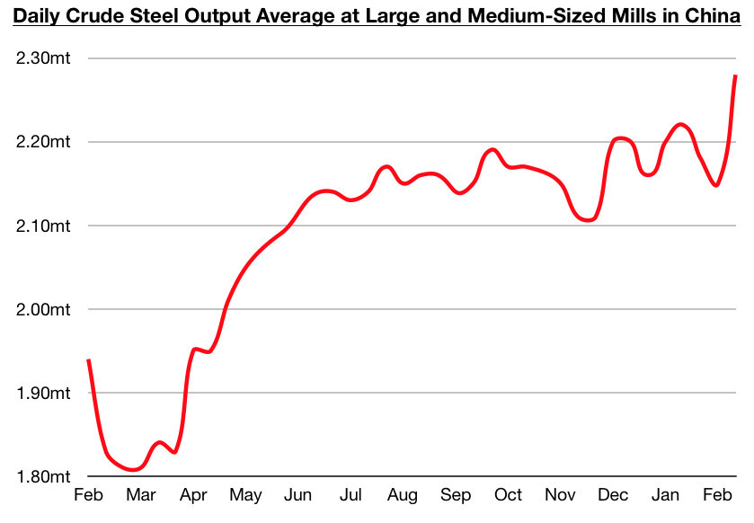

# China's Coastal Surge & An Unprecedented Lunar New Year

**Date:** March 02, 2021  
**Publisher:** Breakwave Advisors | **Category:** Market Insights  
**Original URL:** [https://www.breakwaveadvisors.com/insights/2021/2/28/chinas-coastal-surge-amp-an-unprecedented-lunar-new-year](https://www.breakwaveadvisors.com/insights/2021/2/28/chinas-coastal-surge-amp-an-unprecedented-lunar-new-year)  

---

[*by Jeffrey Landsberg*](mailto:jeffrey@commodore-research.com)

> **Figure 1: Soya Panamax**  
> [Local Asset](file:///C:/Users/Dell/Github/Shipping/corpus/03-breakwave/insights/2021/assets/2021-03-02_chinas-coastal-surge-amp-an-unprecedented-lunar-new-year_img_soyapanamax_9058e861a1ed.jpg)

Dry bulk rates were mixed last week, with capesize and panamax rates falling while supramax and handysize rates surged even further. The fact that supramax and handysize rates were again able to rise by such a large amount (supramax led the way, rising last week by an impressive 24%) has shown that the overall spot imbalance that led to last month’s initial surge in freight rates remains largely in place. As we also discussed in our most recent Weekly Dry Bulk Report and Weekly China Report, also of significance is that Chinese coastal coal freight rates jumped by an extremely large amount last week. This strength has occurred due to vessel supply tightness and not surging cargo demand.

For now, China’s spot coal cargo demand remains lower than was seen earlier this year (as temperatures in China are warmer and as port and power plant stockpiles are higher). However, vessel supply tightness is very evident in the coastal market, just as is still the case in pockets of the global dry bulk market. Of note in China is that coastal coal freight rates are finding significant strength, but domestic coal prices continue to decline. The price of benchmark domestic Qinhuangdao 5,500 kcal thermal coal, for example, ended last week at approximately 580 yuan/ton. This is down week-on-week by 11%, which marks an even greater decline than has been seen in previous weeks.

Chinese steel prices, though, continue to find impressive support. The average price of hot rolled coil, for example, ended last week at approximately 4,980 yuan/ton. This is up week-on-week by 3% and has marked yet another new high for this year. Overall, it remains very positive that Chinese steel prices have been maintaining their strength even as a robust amount of steel is being produced. The most recently released data shows daily crude steel production at large and medium-sized mills in China averaged a record 2.28 million tons during February 11 - February 20. This is 6% higher than was seen during the previous ten days and has far exceeded the prior record of 2.22 million tons.

> **Figure 2: Commodore 2**  
> [Local Asset](file:///C:/Users/Dell/Github/Shipping/corpus/03-breakwave/insights/2021/assets/2021-03-02_chinas-coastal-surge-amp-an-unprecedented-lunar-new-year_img_commodore2_c5f14acf3e90.jpg)

Overall, it is very encouraging that Chinese steel production set a record during Lunar New Year of all times, and China is continuing to show the world extremely bullish signals in the industrial, agricultural, and financial markets. We continue to believe that consensus regarding the Chinese economy is still not nearly as bullish as it should be. We also continue to anticipate that China's financial reforms seen domestically in 2019 and in prior years will continue to be abandoned, and that the government will continue to take advantage of turmoil in the United States and elsewhere and work to further enhance its power and influence globally. For the dry bulk market, this all remains extremely promising.

---

**Tags:** China, Steel  
