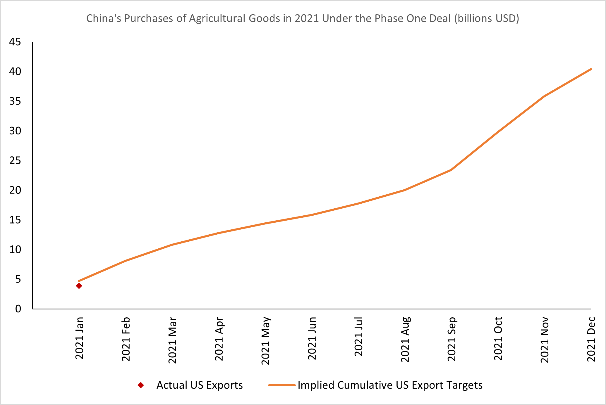
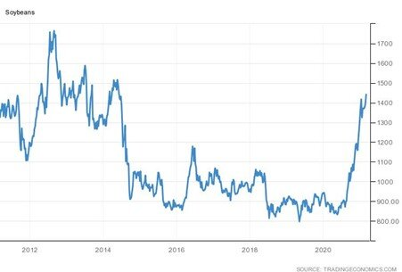

# The Phase One Deal: Not Dead in the Water

**Date:** March 04, 2021  
**Publisher:** Breakwave Advisors | **Category:** Market Insights  
**Original URL:** [https://www.breakwaveadvisors.com/insights/2021/3/4/the-phase-one-deal-not-dead-in-the-water](https://www.breakwaveadvisors.com/insights/2021/3/4/the-phase-one-deal-not-dead-in-the-water)  

---

*By Ulf Bergman*

> **Figure 1: Rope Dock**  
> [Local Asset](file:///C:/Users/Dell/Github/Shipping/corpus/03-breakwave/insights/2021/assets/2021-03-04_the-phase-one-deal-not-dead-in-the-water_img_ropedock_96c25106592d.jpeg)

The future status of the trade deal concluded between China and the US a bit over a year ago has been debated, with a new US administration taking over the reins. During the first year of its existence, compliance with it was rather underwhelming with Chinese purchases failing to meet the volumes implied. According to data compiled by the Peterson Institute for International Economics, actual Chinese imports of US goods covered by the deal amounted to 99.9 billion dollars in 2020 versus the 159.0 billion dollars implied by the agreement. The trading in agricultural commodities fared somewhat better than the other segments, with Chinese purchases surging during the second half of the year fuelled to a large extent by the restoration of the decimated swineherd. Still, Chinese imports of agricultural commodities fell well short of their targets with only 64 per cent of the committed 36.6 billion dollars.

In recent days, members of the incoming Biden administration have pledged a continued hawkish approach to the trade relations with China during congressional hearings. The new US trade representative, Katherine Tai, has also stated that China must live up to its obligations under the Phase One agreement during her recent confirmation hearing. Hence, any immediate changes in American attitudes towards the trade deal, or to trade policy in general, look very unlikely.

The start of the year has continued broadly in line with last year, with US agricultural exports to China continuing to do relatively better than energy and manufacturing exports. In January, the US exported 3.9 billion dollars worth of agricultural products to China, which is 82 per cent of the target. At the same time, US exports of manufactured goods and energy commodities to China languished at 50 and 66 per cent of targets respectively.

> **Figure 2: Source: Peterson Institute for International Economics**  
> *Source: Peterson Institute for International Economics*  
> [Local Asset](file:///C:/Users/Dell/Github/Shipping/corpus/03-breakwave/insights/2021/assets/2021-03-04_the-phase-one-deal-not-dead-in-the-water_img_ulf300_9de99baf9f53.png)

Under the terms of the agreement, US exports of covered products to China should reach a target of 193 billion dollars by the end of this year, which is an increase of 34 billion dollars on last year’s objective. For the agricultural exports, the target has risen to 40 billion dollars this year, an increase of around twenty per cent. The continued commitment by the US administration to rebalance the trade flow with China and a widely expected multi-lateral approach by President Biden, involving the country’s traditional allies, is likely to keep the pressure on China to boost its imports from the US.

A continued strong Chinese demand for US agricultural commodities, with soybeans being the dominant one, will keep prices high in the US, as inventories are dwindling. The delayed Brazilian soybean harvest is also supporting the current multi-year highs. If Chinese purchases will match the ambitious targets of the Phase One agreement for 2021 remains to be seen, but political pressure is likely to see Chinese demand remaining strong and adding to the continued strength of the agricultural markets.

> **Figure 3: Ulf 301**  
> [Local Asset](file:///C:/Users/Dell/Github/Shipping/corpus/03-breakwave/insights/2021/assets/2021-03-04_the-phase-one-deal-not-dead-in-the-water_img_ulf301_f6b73696fa76.jpg)

A continued commitment to the Phase One deal by the Biden administration is additional good news for dry bulk shipping. The rising demand for tonnage to ship American grains to China will be contributing to an already positive outlook on the back of the recovering global economy. The continued strength of the container shipping segment also keeps pushing agricultural exports to the dry bulk sector, as shippers reject agricultural cargoes from the US in their hurry to reposition empty containers to China to benefit from the high freight rates. Reports that 24 US Senators have asked the Federal Maritime Commission to investigate the situation are unlikely to change much, as the current shortage of available containers is likely to continue for some time and freight rates remaining high as a result.

---

**Tags:** China, Global Economy  
