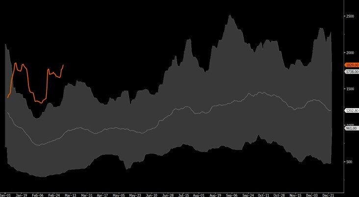
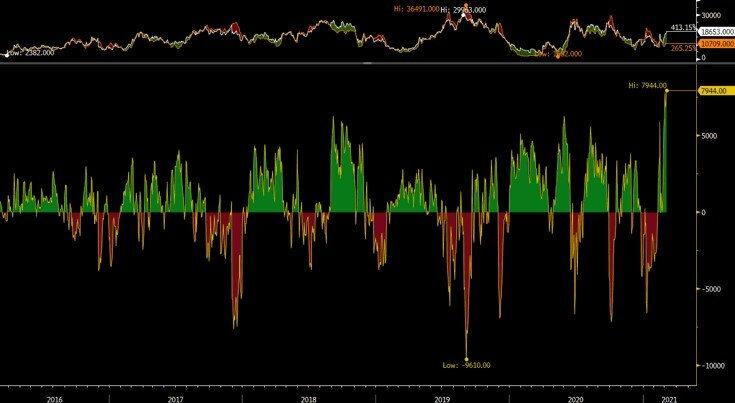
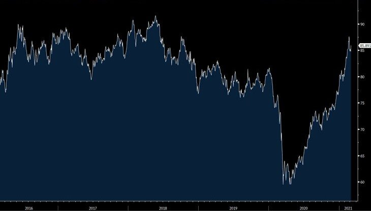

# In Dry Bulk, Nothing Goes Straight Up

**Date:** March 08, 2021  
**Publisher:** Breakwave Advisors | **Category:** Market Insights  
**Original URL:** [https://www.breakwaveadvisors.com/insights/2021/3/5/in-dry-bulk-nothing-goes-straight-up](https://www.breakwaveadvisors.com/insights/2021/3/5/in-dry-bulk-nothing-goes-straight-up)  

---

The dry bulk market is currently enjoying a renaissance, with spot rates at the highest level in more than ten years and the outlook for the near future appearing increasingly bright. If it wasn’t for the lagging Capesize market, the Baltic Dry Index, a measure of spot rates, would have already hit 2,000, a level seen only for a few brief days during the full length of the last decade with the most recent one being the summer of 2019. Panamax, Supramax and especially Handysize vessels are earning profits corresponding to well above average returns on investment for segments that historically have been considered the “lower return/lower risk” part of the dry bulk universe. Although the “big brothers”, namely Capesizes, remain subject to the iron ore market that seasonally is slow at this time of the year, this segment also is expected to see increasing activity as we exit the winter months.

### Baltic Dry Index, Current versus 10-Year Range

> **Figure 1: Front-Month Capesize Futures Minus Spot Brazil-China Spot Rates**  
> *Front-month Capesize futures minus spot Brazil-China spot rates*  
> **Interactive Data & Source:** [Breakwave Advisors Market Insights](https://www.breakwaveadvisors.com/insights/2021/1/11/ar4nqv0geb3d0on6zju7b9atkni2r6) | [Local Asset](file:///C:/Users/Dell/Github/Shipping/corpus/03-breakwave/insights/2021/assets/2021-03-08_in-dry-bulk-nothing-goes-straight-up_img_bdiseasonalitymar_492e39364205.jpg)

A lot has been said and[written](https://www.breakwaveadvisors.com/insights/2021/1/11/ar4nqv0geb3d0on6zju7b9atkni2r6)about the reasons for the recent rally in dry bulk, but as we look forward, the natural question for such a cyclical industry is what’s next.

We believe the near term outlook is less optimistic, but this is always based in the context of a broader upturn in dry bulk that we expect to materialize and last at least a few years, so a correction from current levels would only represent the natural volatility of the industry and should be seen as such rather as any meaningful change in the fundamental picture.

High freight costs is already causing issues in the[supply chain](https://www.spglobal.com/platts/en/market-insights/latest-news/agriculture/030521-firm-supramax-rates-force-east-coast-india-iron-ore-pellet-cargoes-on-capesizes-sources), and although near term this is inevitable, the market has a way of bringing such inefficiencies under control, until once again supply and demand gets out of sync. The fact that charterers are seeking Capesize ships to transport cargoes destined for Supramax ships that are almost 1/4 the size of Capesizes just to save on costs, is a great testament of the rapidly increasing importance of freight costs, the impact on shippers and eventually on consumers alike.

For the larger Capesize ships, the supply and demand balance does not look favorable near term. There is still a large number of available ships in the Atlantic while in the Pacific, some weather-related disruptions that have recently caused a mini rally in rates should soon correct. Intra-asset pair trading and relevant correlations have pushed freight futures for Capesizes higher following the more fundamental-driven rally in Panamax and Supramax futures, but we view such a move unwarranted given the above market fundamentals. After all, the Brazil-China roundtrip rate is still less than 11,000 with April futures priced now at almost 19,000. That is a staggering premium to the most important route in the Capesize market, even for shipping standards. In fact, this is the highest such premium in our most recent time series and almost 30% above the previous high.

> **Figure 2: Bloomberg Commodities Index**  
> *Bloomberg Commodities Index*  
> [Local Asset](file:///C:/Users/Dell/Github/Shipping/corpus/03-breakwave/insights/2021/assets/2021-03-08_in-dry-bulk-nothing-goes-straight-up_img_frontmonthtoc3_ff50d715ea7b.jpg)

Of course, one should not forget that the optimism of the freight futures market is also a reflection of the broader commodities space. After all, shipping and commodities go hand in hand. The Bloomberg Commodities Index has already had a decent move to say the least, although a big part of that has been the staggering rally in crude oil (~22% of the index is oil-related commodities). We are now back to the levels of mid-2018, which does not sound much, until one turns her attention to bulk commodities. There, iron ore, coal, industrial metals and grains are actually at multi-year highs, and way above the recent years.

> **Figure 3: Bbg Commm Index (2)**  
> [Local Asset](file:///C:/Users/Dell/Github/Shipping/corpus/03-breakwave/insights/2021/assets/2021-03-08_in-dry-bulk-nothing-goes-straight-up_img_bbgcommmindex28229_9faad5c35e06.jpg)

Furthermore, if one looks at seasonality, the Baltic Dry Index tends to briefly peak around mid-March, as the South America’s grain season program winds down, while Capesize seasonality does not kick in until later in May or early in June (see first chart above). Again, this time might definitely be different given the unprecedented fundamental drivers following the pandemic, but the current setup seems to have run its course for now, and although any correction will be shallow, it would still bring both spot and futures rates lower.

Finally, dry bulk is a tradable market, not an investable one. Although shipping cycles tend to be relatively long, intermediate tradable cycles are only months long, and we believe this recent cycle that started in early December is approaching its peak. Unfortunately for ship owners there is little they can do, while equity investors have not nearly enjoyed much of the benefits of the recent upturn other than the broader equity market euphoria that naturally dragged shipping equities higher. Yet, freight futures have the ability to provide tradable opportunities, and a possible correction would create another interesting setup and possibly an attractive entry point towards the next multi-month uptick later in the year.

Nothing is as simple as it sounds, and our assumptions and conclusions have a low degree of confidence this time around given the unparalleled strong first quarter performance for dry bulk, but sometimes just looking at the bigger picture pays more than focusing on the micro-factors and day to day fluctuations.

Nothing goes straight up, and this is particularly true for dry bulk.

---

**Tags:** Dry Bulk, Capesize, Panamax, Supramax  
