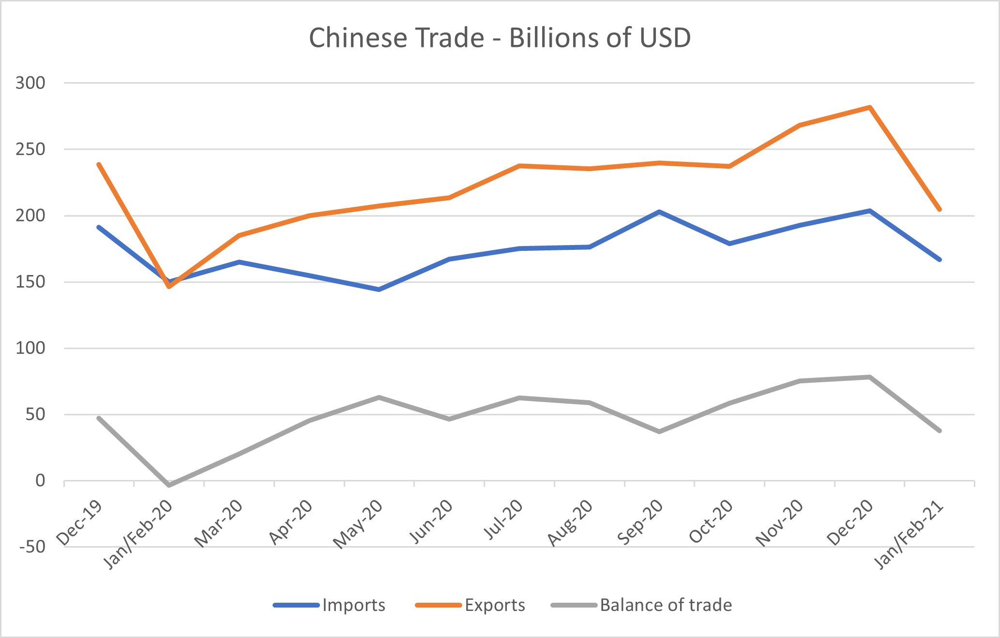

# Chinese Trade: The Seasonality Fails to Emerge

**Date:** March 09, 2021  
**Publisher:** Breakwave Advisors | **Category:** Market Insights  
**Original URL:** [https://www.breakwaveadvisors.com/insights/2021/3/8/chinese-trade-the-seasonality-fails-to-emerge](https://www.breakwaveadvisors.com/insights/2021/3/8/chinese-trade-the-seasonality-fails-to-emerge)  

---

*By Ulf Bergman*

> **Figure 1: Unsplash Image Kdvafjoqf4m**  
> [Local Asset](file:///C:/Users/Dell/Github/Shipping/corpus/03-breakwave/insights/2021/assets/2021-03-09_chinese-trade-the-seasonality-fails-to-emerge_img_unsplash-image-kdvafjoqf4m_fd895671a043.jpg)

The release of Chinese import and export data for the first two months of the year surprised on the upside, with exports being especially strong. That the year-on-year increases would look impressive was widely expected. The first two months of last year was when much of China’s economy was facing very severe restrictions as the authorities fought the early stages of the pandemic and economic activities took a hit, creating a low base for the comparison. However, China’s international trade remained strong in the early parts of 2021, despite the continued impact of the coronavirus pandemic worldwide, and exports surged by 60 per cent compared to a year ago and surpassed the 38 per cent increase projected by economists. Similarly, imports grew by 22 per cent in January and February beating the consensus forecast of 15 per cent.

The official data for January and February are normally combined to smooth out the impact of the Lunar New Year holiday, which falls at different times during the two months over the years. Due to the holiday, the period is also typically the quiet period in Chinese trade. However, this year the normal off-season sentiment failed to materialise driven by strong domestic and export demand. It is also something that has manifested itself in unseasonally strong rates in the dry bulk shipping sector during the period.

> **Figure 2: Source: The General Administration of Customs of the People’s**  
> *Source: The General Administration of Customs of the People’s Republic of China*  
> [Local Asset](file:///C:/Users/Dell/Github/Shipping/corpus/03-breakwave/insights/2021/assets/2021-03-09_chinese-trade-the-seasonality-fails-to-emerge_img_ulf1a_79dfd05538eb.png)

The data released on Sunday by the Chinese Customs also showed that the iron ore imports rose in the early parts of the year, increasing by 2.8 per cent compared to the same period last year. The world’s top steelmaking nation imported 181.5 million tonnes of iron ore in January and February, compared with 176.6 million tonnes during the same period a year ago. Unlike the import and export data, the volumes were broadly in line with analysts’ expectations.

The China Iron and Steel Association forecasts that steel demand will edge up somewhat this year, which is at odds with the industry ministry repeatedly asking producers to cut crude steel output this year in line with the country’s goal of carbon neutrality by 2060. As part of the drive towards less reliance on carbon, China has approved imports of high-grade steel scrap this year and major domestic steel producers are developing their metals scrap-recycling businesses. If any production cuts are eventually implemented remain to be seen, but If crude steel output is reduced there could be a drop in iron ore demand for the whole year and especially if increasing volumes of recycled steel are used. While such a reduction would reduce the demand for the larger vessels, increasing imports of scrap steel would be positive news for the smaller tonnage in the dry bulk shipping sector.

While iron ore imports grew at a healthy, yet modest, rate, the Chinese steel exports surged by 30 per cent compared to a year ago. Soft domestic demand in combination with low Chinese steel rebar export prices, compared to other major exporting countries, drove volumes higher. In the short-term, export volumes are likely to remain firm, supporting tonnage demand in the smaller tonnage segments. However, with a seasonal rebound in construction and a pick up in domestic demand for rebar, the Chinese steel exports may lose momentum in the coming months.

The Chinese economy has been continuing to improve since last June and gained more than what was lost during the early stages of the pandemic, which has been largely fuelled by fiscal stimulus and strong growth in exports. The economic recovery in the export markets may see the demand for Chinese goods wane somewhat, as consumers start to spend more on services and travel. It has also been widely expected that the Chinese government will start to reduce the economic stimulus during the year. Still, the country’s top economic planning agency has suggested recently that the economic rebound is not on strong footing yet, as domestic consumer spending remains subdued and the global economy still facing some headwinds. Hence, it is probably fair to assume that the Chinese leadership is in no hurry to reduce its supporting measures for the economy.

---

**Tags:** China  
