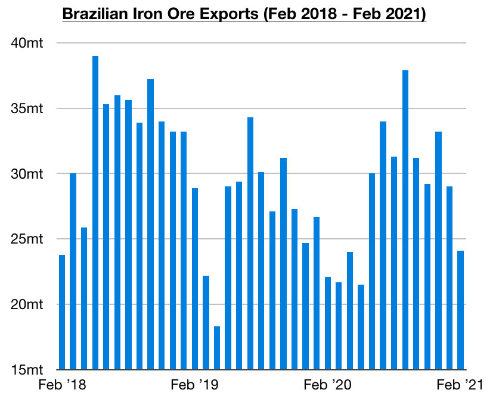

# Brazil Achieves a Significant Feat Not Seen Since 2018

**Date:** March 10, 2021  
**Publisher:** Breakwave Advisors | **Category:** Market Insights  
**Original URL:** [https://www.breakwaveadvisors.com/insights/2021/3/7/brazil-achieves-a-significant-feat-not-seen-since-2018](https://www.breakwaveadvisors.com/insights/2021/3/7/brazil-achieves-a-significant-feat-not-seen-since-2018)  

---

*By*[*Jeffrey Landsberg*](mailto:jeffrey@commodore-research.com)

Brazilian iron ore exports totaled approximately 24.1 million tons last month, which marks a month-on-month decline of 4.9 million tons (-17%) but a year-on-year increase of 2 million tons (9%). It is normal for Brazilian iron ore exports to decline on a month-on-month basis in February. This has occurred during each of the last five years. More noteworthy to us is that Brazilian iron ore exports have now increased on a year-on-year basis for four consecutive months. This marks a feat not seen since 2018.

Brazil’s iron ore exports are likely to increase year-on-year by at the very least 20 million tons this year — and an increase exceeding even 40 million tons would not at all be surprising. As we have discussed in our recent Weekly Dry Bulk Reports, Vale on its own is guiding that its production this year will rise year-on-year by approximately 15 - 35 million tons. Samarco production also resumed last year, and Samarco is expected to provide an additional 8 million tons of new Brazilian iron ore to the market this year. Anglo American’s Minas Rio mine is also expected to see its production rise by as much as 2 million tons this year.

> **Figure 1: Commodore 3**  
> [Local Asset](file:///C:/Users/Dell/Github/Shipping/corpus/03-breakwave/insights/2021/assets/2021-03-10_brazil-achieves-a-significant-feat-not-seen-since-2018_img_commodore3_d38e2f26d472.jpg)

These figures work out to Brazilian iron ore production being poised to rise year-on-year by anywhere from 23 to 45 million tons. While the cargo supply side is only part of the equation, also remaining encouraging is that China’s steel production has continued to set new records this year. In addition, global steel production outside of China has risen on a year-on-year basis for three consecutive months after having previously contracted on a year-on-year basis for eight consecutive months.

While China’s steel production could possibly decline from the record levels most recently reported (as environmental concerns remain an issue), we do not expect that production will suffer any extremely large decline this year. Also remaining extremely significant is that iron ore imported from Brazil and other nations is of much better quality than iron ore mined in China. Overall, China will continue to have great incentive to import as much foreign iron ore as possible.

---

**Tags:** Brazil  
