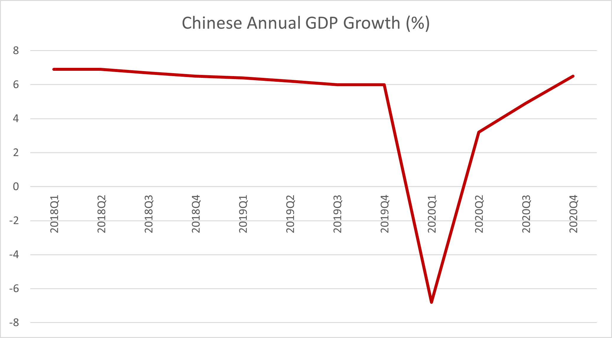
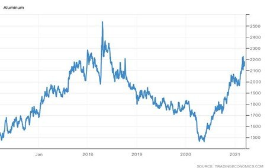

# China Targets Growth Again

**Date:** March 11, 2021  
**Publisher:** Breakwave Advisors | **Category:** Market Insights  
**Original URL:** [https://www.breakwaveadvisors.com/insights/2021/3/11/china-targets-growth-again](https://www.breakwaveadvisors.com/insights/2021/3/11/china-targets-growth-again)  

---

*By Ulf Bergman*

Many commodity traders probably breathed a sigh of relief when the Chinese Premier Li Keqiang said that the country would strive for at least six per cent of GDP growth in 2021 during a recent speech delivering the government’s annual work report. While the target may be a bit on the modest side by Chinese standards, some pundits were expecting the country to refrain from a specific growth target for the second year in a row and the statement put such fears to rest. A failure to set a growth target for the year would have been a bearish sign for the commodity markets, signalling a lack of faith in the strength of the economy by the Chinese leadership. However, the target may be seen as an exercise in restraint and management of expectations by the Chinese leaders, as some institutions, such as the IMF and the World Bank, expect annual growth to be considerably higher at above eight per cent. In another departure from tradition, the government will also propose targets each year aiming at reflecting the circumstances, instead of giving the average growth target for the coming five years.

> **Figure 1: Source: National Bureau of Statistics of China**  
> *Source: National Bureau of Statistics of China*  
> [Local Asset](file:///C:/Users/Dell/Github/Shipping/corpus/03-breakwave/insights/2021/assets/2021-03-11_china-targets-growth-again_img_ulf1b_5586239f5dde.png)

As the Chinese economy continues to improve, the government also looks to rein in on last year’s record budget deficit. However, it is more of a tapering targeting 3.2 per cent of GDP, compared to last year’s 3.6 per cent. The limited scaling back of the budget deficit suggests that the leadership still see an investment-driven growth model for 2021-2022 as the key to the continued strength of the Chinese economy, which is likely to benefit infrastructure projects and maintain a strong appetite for base metals. The government is also aiming at creating some eleven million urban jobs, which can be seen as an attempt at improving sluggish consumer spending growth, and enhancing the level of innovation in the economy.

A continued focus on investments in infrastructure and a drive to boost the domestic consumption of capital goods, e.g. cars and household appliances, is likely to see continued strong demand for many industrial metals, such as aluminium and copper. Both metals have seen strong growth in recent months as demand has picked up, with prices recovering from the lows during the first part of last year and are currently trading at multi-year highs.

> **Figure 2: Ulf 1c**  
> [Local Asset](file:///C:/Users/Dell/Github/Shipping/corpus/03-breakwave/insights/2021/assets/2021-03-11_china-targets-growth-again_img_ulf1c_f06fb24e77cc.jpg)

Iron ore prices have on the other hand suffered in recent trading sessions, as there have been some concerns about the demand outlook in China. Steel production in the city of Tangshan has fallen recently, as authorities imposed restrictions to combat rising air pollution. The measures are expected to be temporary, with output likely to recover soon. However, rising inventories in the ports have sent a bearish signal to traders and, with expectations of only a marginal increase on last year’s record steel production of just over 1 billion tonnes, there are concerns of softening demand for iron ore in China. For shipping, the saving grace may be the lower quality of the Chinese domestic supply of iron ore, which requires larger quantities of coking coal to produce pig iron. Restrictions due to rising air pollution could see Chinese steel mills switching to higher-quality iron ore to reduce the carbon input and emissions, which would benefit the seaborne trade. Iron ore imports are also recovering in the rest of the world and shipments to non-Chinese ports are expected to grow by around twenty per cent in March, to 41 million tonnes, compared to February.

---

**Tags:** China, Economics, Global Economy  
