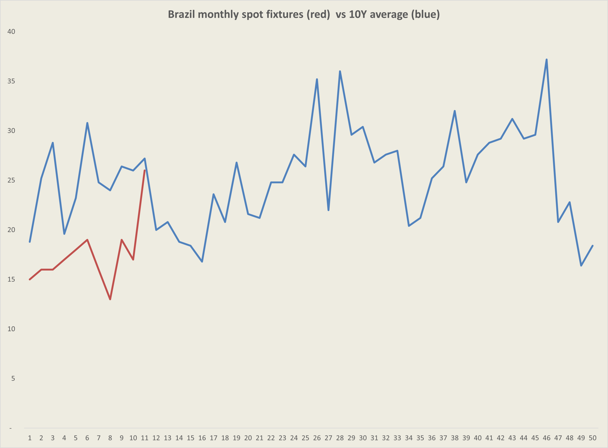
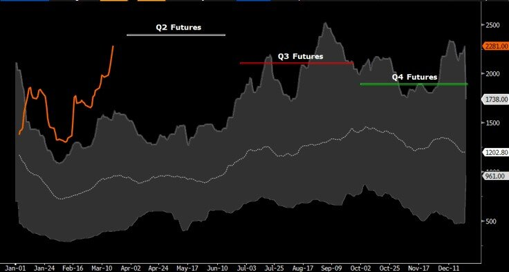

# Dry Bulk: Party Like it's 2003

**Date:** March 22, 2021  
**Publisher:** Breakwave Advisors | **Category:** Market Insights  
**Original URL:** [https://www.breakwaveadvisors.com/insights/2021/3/21/9dcienhj117wywf4e4wsa6g5a5enpk](https://www.breakwaveadvisors.com/insights/2021/3/21/9dcienhj117wywf4e4wsa6g5a5enpk)  

---

> **Figure 1: Unsplash Image Knxqv2d2pgi**  
> **Interactive Data & Source:** [Breakwave Advisors Market Insights](https://www.breakwaveadvisors.com/insights/2021/3/5/in-dry-bulk-nothing-goes-straight-up) | [Local Asset](file:///C:/Users/Dell/Github/Shipping/corpus/03-breakwave/insights/2021/assets/2021-03-22_9dcienhj117wywf4e4wsa6g5a5enpk_img_unsplash-image-knxqv2d2pgi_807fc5208684.jpg)

A few weeks ago,[we predicted](https://www.breakwaveadvisors.com/insights/2021/3/5/in-dry-bulk-nothing-goes-straight-up)that rates across dry bulk will start to top out and possibly even turn lower as we head towards the end of the month. We forecasted relatively stable Capesize rates which could lead to a convergence of the higher futures curve towards spot levels while the sub-cape sector was set for flattish to lower spot rates as seasonality would weight on South American grain cargo flow.

**So far, we have clearly been wrong.**

The dry bulk market, if anything, is stronger today, with both sentiment and fundamentals continuing to drive spot rates higher. Capesizes, despite a still anemic Atlantic market, have strengthened on the back of solid sentiment by owners, a relatively thin North Atlantic vessel supply and sound support coming from the smaller dry bulk segments. Panamax spot rates have now turned higher after a brief pause, while Supramax rates remain well supported deep into the 20,000 territory, an impressive accomplishment by any standard.

Yet, as one sees the market today, it is quite impressive the fact that owners, especially in the Capesize segment, have remained so resilient and have managed to maintain the upper hand in the spot market, despite a relatively soft cargo flow. Although Brazilian iron ore fixtures have just touched the 10-year average run rate (see chart below), so far this year they have been running well below trend.

> **Figure 2: Baltic Dry Index**  
> *Baltic Dry Index, Spot, 10-Year Range and Implied Futures*  
> [Local Asset](file:///C:/Users/Dell/Github/Shipping/corpus/03-breakwave/insights/2021/assets/2021-03-22_9dcienhj117wywf4e4wsa6g5a5enpk_img_brfixtures_dc6a0437365a.png)

So, what do we now believe for the near future?

As on our previous post, our level of confidence in any prediction remains very low. It is important to remember that during significant moves in shipping rates it is the marginal ship that sets the level and the inelastic nature of supply (ships take time to sail from port to port) can lead to spot movements in rates that are not reflective of fundamental supply/demand balances. We believe we are in such an environment now and as a result, traditional supply/demand models are fairly useless.

For Capesize spot rates, the current setup supports the idea of a meangiful spike in spot rates in the next few weeks IF Brazil exports pick up. The supply of vessels for mid-late April is now lower, the few fixtures that have recently been concluded have been trending higher while futures are clearly in a bullish mode. The spark for such an upward movement in rates rely on the major Brazilian miners that have been absent from the spot market for weeks now and a return to the spot market could lead another round of bullish sentiment and increasing spot price levels for the key Brazil-China route.

On the other hand, if the Brazilian miners stay put for another week or two, then we can not find a fundamental reason for the spot market to move higher, and that means futures prices are clearly too high (although as mentioned, we believed the same a few weeks back).

> **Figure 3: Source: Bloomberg and Breakwave Advisors**  
> *Source: Bloomberg and Breakwave Advisors*  
> [Local Asset](file:///C:/Users/Dell/Github/Shipping/corpus/03-breakwave/insights/2021/assets/2021-03-22_9dcienhj117wywf4e4wsa6g5a5enpk_img_bdiandfutures_7e61d1d8f708.jpg)

On the sub-cape segments, the futures curve remains relatively flat for the near dated futures, which translates to increased confidence by market participants on the sustainability of the current impressively high rates. We are under no illusion that we understand the complicated nature of short term spot rates for the sub-cape segments better than what market participants are willing to put their money on. Seasonality is against the bulls, and we believe shipping rates are affected by seasonality, but as previously mentioned, we are not in a normal market by any means.

Finally, if one was to state one reason for the recent rally in freight rates this year, we would just sum it up to the following: The rate of change in demand for dry bulk shipping has been extraordinary. Similar to what happened in the previous two global recessions in 2002 and 2008, the recovery in demand is again swift and steep. This does not mean that the absolute demand for dry bulk goods has materially increase. But coming out from a global pandemic, the spike in demand for shipping over a short period of time is the mirror opposite of the collapse in demand last year, and such sudden changes either way can have a material impact on shipping balances. After all, this is a logistics chain that suddenly is out of balance, and cargo owners need to ship their goods out of ports at (almost) any price since the cost of not doing so greatly outpaces the current (steep) price of freight.

---

**Tags:** Dry Bulk, Capesize, Panamax  
