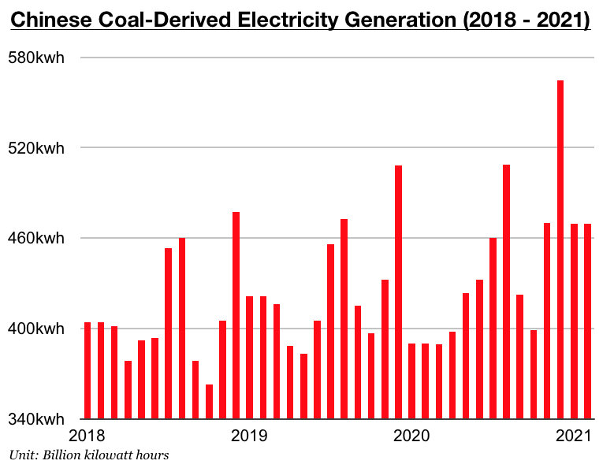

# Coal Remains King in China

**Date:** March 24, 2021  
**Publisher:** Breakwave Advisors | **Category:** Market Insights  
**Original URL:** [https://www.breakwaveadvisors.com/insights/2021/3/22/coal-remains-king-in-china](https://www.breakwaveadvisors.com/insights/2021/3/22/coal-remains-king-in-china)  

---

*By*[*Jeffrey Landsberg*](mailto:jeffrey@commodore-research.com)

Recently released data has shown that China's coal production totaled 617.6 million tons in January/February. This marks a year-on-year increase of 26%, which is the largest growth we have ever seen (our data goes back through 2010). New this year has been that several state-owned coal mining companies in China kept working and/or were on shortened leaves during last month's Lunar New Year holiday period. The same was true for many electricity producers (and heavy consumers), but coal production growth managed to exceed coal-derived electricity generation growth.

Coal-derived electricity generation in January/February totaled 939 billion kilowatt hours. This is up year-on-year by 20% -- which is of course extremely robust growth -- but this does mark the first time since October where China's coal-derived electricity generation growth has not exceeded coal production growth. It previously had been very advantageous for the dry bulk market that China's coal-derived electricity generation growth was exceeding its coal production growth. This is a significant issue that we will be continuing to monitor in our Weekly China Reports.

> **Figure 1: Comm 2**  
> [Local Asset](file:///C:/Users/Dell/Github/Shipping/corpus/03-breakwave/insights/2021/assets/2021-03-24_coal-remains-king-in-china_img_comm2_7b6ce736964d.jpg)

Total electricity production came in at 1.243 trillion kilowatt hours, which is up year-on-year by 21%. As we first discussed in our Weekly China Reports back in January (and later in subsequent reports and updates), the central government was targeting much stronger overall production for this year's Lunar New Year holiday and they have been successful in meeting their goal. Significant is the overall electricity sector in China is that coal-derived electricity generation growth this year has so contributed to 75.5% of total electricity production, even as most renewables have continued to experience great strength. This remains wonderful for the dry bulk market.

Hydropower power output totaled 129.2 billion kilowatt hours in January/February, which is up year-on-year by 6%. Nuclear power output totaled 58.4 billion kilowatt hours, which is up year-on-year by 23%. Wind power output totaled 91.6 billion kilowatt hours, which is up year-on-year by 54%. Solar power output totaled 24.8 billion kilowatt hours, which is up year-on-year by 39%. Overall, it remains quite positive that coal-derived electricity generation has stayed the dominant source of electricity in China even as electricity generated by renewable sources continues to expand. Coal remains king in China, and this is not set to change anytime soon.

---

**Tags:** China, Coal  
