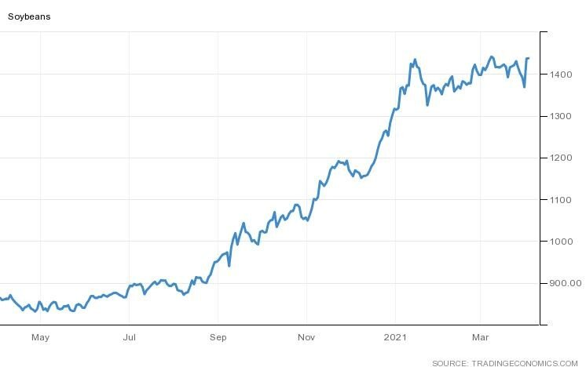

# Agri-commodities: US Planting Intentions on the Increase but Fail to Match Expectations

**Date:** April 02, 2021  
**Publisher:** Breakwave Advisors | **Category:** Market Insights  
**Original URL:** [https://www.breakwaveadvisors.com/insights/2021/4/2/agri-commodities-us-planting-intentions-on-the-increase-but-fail-to-match-expectations](https://www.breakwaveadvisors.com/insights/2021/4/2/agri-commodities-us-planting-intentions-on-the-increase-but-fail-to-match-expectations)  

---

*By Ulf Bergman*

US soybean and corn prices have remained somewhat stagnant in recent weeks compared with the steep rally in the second half of 2020. Wednesday’s release of estimates for corn and soybean plantings by the US Department of Agriculture (USDA) changed that, as the numbers failed to match the analysts’ lofty expectations and drove futures prices sharply higher. According to the data, farmers plan to sow 87.6 million acres with soybeans, which is the highest since 2018 and an increase of five per cent on last year’s acreage. Pundits had been expecting an increase above eight per cent, as greatly improved profitability levels on the back of strong Chinese demand have lifted U.S. farmers’ enthusiasm for the 2021 planting season. Hence, soybean futures jumped by five per cent in Wednesday’s trading session, as traders scaled back their supply expectations for the coming growing season.

### Soybeans (Usd/bushel)

> **Figure 1: A**  
> [Local Asset](file:///C:/Users/Dell/Github/Shipping/corpus/03-breakwave/insights/2021/assets/2021-04-02_agri-commodities-us-planting-intentions-on-the-increase-but-fail-to-match-expect_img_a_44886e02d3f7.jpg)

If analysts were disappointed with the less than spectacular increase in soybean acreage, the equivalent number for corn plantings failed to register any meaningful increase on last year’s and sent corn futures to an eight-year high. Only some 300,000 acres, accounting for less than a per cent, are expected to be added to the land planted with corn in the coming growing season, while industry watchers had expected another two million acres to be added. Unlike soybeans and corn, the planning intentions for wheat beat expectations, with an increase of five per cent. However, despite the healthy increase, the wheat planted area is the fourth-lowest since records began in 1919.

In a separate report, the USDA highlighted that inventories for both corn and soybeans are at the lowest levels seen for years. Soybean stocks are around thirty per cent lower than at the same point last year and at a five-year low, while corn stocks fell by three per cent to a seven-year low. The drop in inventories was widely expected, as the Chinese appetite for US agricultural commodities has been very strong during the last six months and depleted the stocks. The strong demand from Chinese buyers has largely been driven by the re-building of the domestic swineherd following its decimation in the wake of the African swine flu, with the “Phase One” trade deal leading to increasing amounts being sourced in the US.

For dry bulk shipping, the news of increasing planting intentions among US farmers is welcome, even though it was less than hoped for by many analysts. Much of the output growth is likely to go on export, although in light of the low inventory levels it can be argued that some of it will be used to rebuild stocks. However, Chinese demand for grains is unlikely to cool off any time soon, which will keep prices high and making it less likely that additional agricultural output will be kept off the market. The Biden administration has also stated that they expect China to live up to its commitments in the trade deal, which would suggest that China will keep up its purchases of American commodities to stand any chance of meeting the ambitious targets.

While it can be argued that the growing planting intentions are on the modest side, on the margin in an already tight market the extra volumes will support freight rates after the harvests have been completed. The prevailing high container freight rates and short supply of available empty equipment will in all likelihood continue to contribute to more agricultural exports being handled as bulk cargoes, rather than containerised. Hence, there could be additional tightness in the market for mid-sized cargoes in a few months and we may even see additional grain cargoes being shipped in capesizes.

---

**Tags:** China, Commodities, Soybeans  
