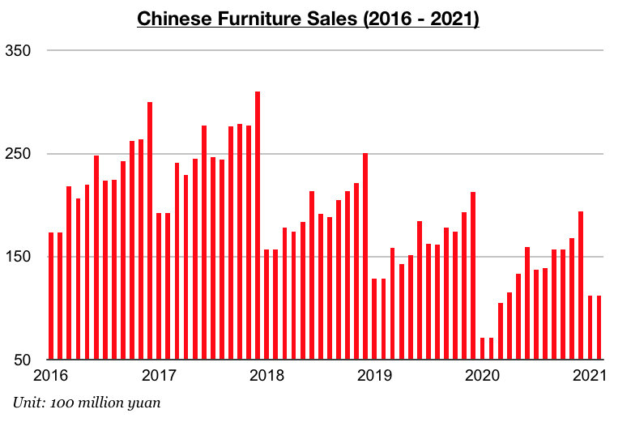
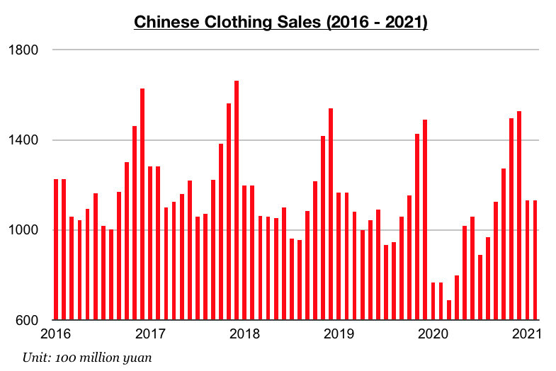
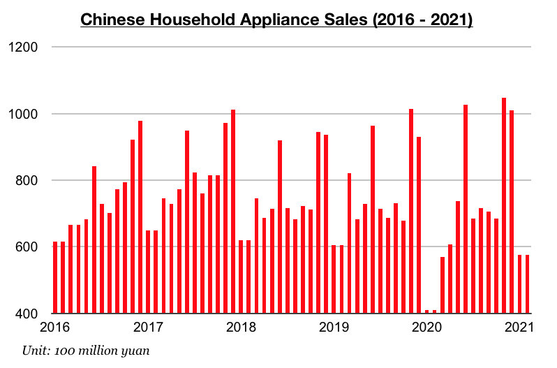

# China's Consumer Market Continues to Turn Corner

**Date:** April 07, 2021  
**Publisher:** Breakwave Advisors | **Category:** Market Insights  
**Original URL:** [https://www.breakwaveadvisors.com/insights/2021/4/5/chinas-consumer-market-continues-to-turn-corner](https://www.breakwaveadvisors.com/insights/2021/4/5/chinas-consumer-market-continues-to-turn-corner)  

---

By[Jeffrey Landsberg](mailto:jeffrey@commodore-research.com)

Various segments of China’s consumer market (which previously had long been showing signs of recession well before the coronavirus pandemic) continue to turn a corner. In fact, furniture sales, clothing sales, and household appliance sales have finally all experienced year-on-year growth (but of course the growth has certainly been enhanced by comparing to last year’s coronavirus-weakened sales totals). Previously, only clothing sales and household appliance sales were experiencing growth.

Furniture sales in China in January/February totaled 22.3 billion yuan. This marks a year-on-year increase of 57%. Previously, sales experienced a year-on-year contraction of 9% in December, which at the time last year marked the smallest contraction seen during what was then thirty-six straight months of contraction. Furniture sales in China have now finally stopped contracting, but it remains to be seen if year-on-year growth will be achieved once comparisons are no longer being made to coronavirus-weakened sales totals.

> **Figure 1: Coom 1**  
> [Local Asset](file:///C:/Users/Dell/Github/Shipping/corpus/03-breakwave/insights/2021/assets/2021-04-07_chinas-consumer-market-continues-to-turn-corner_img_coom1_cc7b3ebfe682.jpg)

Clothing sales (which includes garments, footwear, hats, and knitwear) in China have continued to experience growth. Clothing sales in China in January/February totaled 226.2 billion yuan, which marks a year-on-year increase of 47%. China’s domestic clothing sales have now grown on a year-on-year basis for six straight months. Previously, though, sales experienced year-on-year growth in December of just 2%. This year’s growth has very much been enhanced by comparing to last year’s coronavirus-weakened sales totals.

> **Figure 2: Comm 2**  
> [Local Asset](file:///C:/Users/Dell/Github/Shipping/corpus/03-breakwave/insights/2021/assets/2021-04-07_chinas-consumer-market-continues-to-turn-corner_img_comm2_7bb727aff3bf.jpg)

Household appliance sales totaled 115.2 billion yuan in January/February, which marks a year-on-year increase of 43%. Household appliance sales have now grown on a year-on-year basis during seven out of the last nine months. Previously, sales experienced year-on-year growth in December of 9%. As with the growth in furniture and clothing sales, this year’s growth in household appliance sales has been enhanced by comparing to last year’s coronavirus-weakened sales totals.

> **Figure 3: Comm 3**  
> [Local Asset](file:///C:/Users/Dell/Github/Shipping/corpus/03-breakwave/insights/2021/assets/2021-04-07_chinas-consumer-market-continues-to-turn-corner_img_comm3_8d13e3e7891b.jpg)

---

**Tags:** China  
