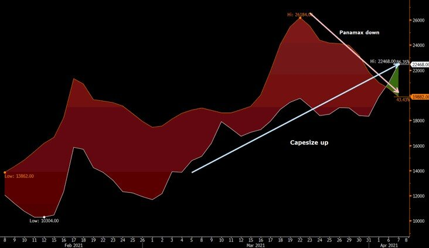

# Dry Bulk: Consolidation underway, But Ain't Over Yet

**Date:** April 07, 2021  
**Publisher:** Breakwave Advisors | **Category:** Market Insights  
**Original URL:** [https://www.breakwaveadvisors.com/insights/2021/4/7/z1m5fi0p0bpmi2etcyebwf28932cdt](https://www.breakwaveadvisors.com/insights/2021/4/7/z1m5fi0p0bpmi2etcyebwf28932cdt)  

---

> **Figure 1: Rising Demand for Everything From Soybeans to Steel Has Sent The**  
> *Rising demand for everything from soybeans to steel has sent the cost of hauling dry goods soaring more than 50% this year. Manufacturing, which first picked up in China, is now accelerating elsewhere, and countries are stepping up commodity purchases to rebuild stockpiles after running them down during lockdowns that slowed port operations and hit economic activity globally.*  
> **Interactive Data & Source:** [En Wikipedia](https://en.wikipedia.org/wiki/2021_Suez_Canal_obstruction) | [Local Asset](file:///C:/Users/Dell/Github/Shipping/corpus/03-breakwave/insights/2021/assets/2021-04-07_z1m5fi0p0bpmi2etcyebwf28932cdt_img_evergreen_a820226c791f.jpg)

Once again, shipping is capturing the attention of the broader media, as rates for both dry bulk and containers have surged in recent months and now is showing up on the price of goods across the globe. The[Suez Canal incident](https://en.wikipedia.org/wiki/2021_Suez_Canal_obstruction)also added fuel to the fire and brought the shipping market in the frontpage of newspapers globally, although the actual impact ended up minimal given the nature of the disruption, as we have also highlighted in the past few weeks.

Bloomberg is out with an article this morning, underscoring all the above and setting the facts straight, while in addition painting a bullish picture for dry bulk for the rest of the year.

[Bloomberg writes](https://www.bloombergquint.com/business/commodity-shipping-rates-are-surging-and-the-rally-isn-t-over):

*Analysts say the rally isn’t over, with rates to carry unpacked commodities like grains, iron ore and coal -- known as dry bulk -- expected to remain high this year and possibly into 2022. That’s a stark turnaround for a market that slid to a four-year low less than 12 months ago, and comes amid a tight supply of vessels. It’s also happening as the uneven recovery scrambles movements of ship containers, which carry everything from furniture to packed commodities like coffee and white sugar.*

Now, the above should come at no surprise, as it is a trend that started late last year and continues to positively affect shipping. After all, both dry bulk and containers are part of the global supply chain, and the changing dynamics of the pandemic have thrown such a system out of whack in a way that is causing significant supply squeezes across the global chain.

For dry bulk, the recent surge on the sub-cape segments is a great example of such disruption. However, shipping is cyclical and such brief imbalances of supply/demand tend to eventually correct. After all, it is highly unlikely to see Handysize vessels earning double the revenues of Capesizes given the significant differences in size for a long period of time (Handysize vessels are about 35,000dwt versus 180,000dwt for Capesizes).

### Spot Capesize and Panamax Rates, February 1 to Present

> **Figure 2: All of That Is Happening Just As the Fleet of Bulk Ships Isn’t**  
> *All of that is happening just as the fleet of bulk ships isn’t expected to grow, with very few orders on the books. President Joe Biden’s economic stimulus and infrastructure packages also bode well for commodity demand and therefore freight rates. “We are quite positive for this year and next year,” said Lars-Christian Svensen, chief commercial officer at Golden Ocean Group Ltd. “Dry commodities have been a bit dormant for the past few years, but they’re taking off at the moment.”*  
> **Interactive Data & Source:** [Bloombergquint](https://www.bloombergquint.com/business/commodity-shipping-rates-are-surging-and-the-rally-isn-t-over) | [Local Asset](file:///C:/Users/Dell/Github/Shipping/corpus/03-breakwave/insights/2021/assets/2021-04-07_z1m5fi0p0bpmi2etcyebwf28932cdt_img_c26p_911ecc515cde.jpg)

Such a correction is currently underway, as smaller size freight rates are drifting lower while Capesize rates are now pushing higher. Such a dynamic is not really visible in the surface, as the Baltic Dry Index that reflects a weighted average of all vessels remains relatively stable during such process given the mix. But underneath, the “order of the market is being restored” and that is good news for investors. After all, levels are still quite high versus history, and given the fact that we are past the slow season (first quarter is seasonally the weakest one of the year) investors should remain optimistic.

Such optimism is also reflected in the futures curve, with all sizes pointing to strong levels for the remaining of the year. Currently though, not a lot is to be said about strong fundamentals other than increasing iron ore exports out of Brazil. This was to be expected, as the weather improves (see rains) and Vale’s logistical system is slowly healing and pushing more iron ore into the water.

We expect another major push in Capesize rates later in the year, but for now, a slow and stable market is the most likely scenario. For the sub-cape segments, spot rates should continue to drift lower, but this is already priced in the futures curve given the considerable backwardation. The risk/reward is still tilted towards higher rates and the macro environment remains quite supportive for dry bulk shipping (see commodities demand, global stimulus, economic recovery).

As[Bloomberg concludes](https://www.bloombergquint.com/business/commodity-shipping-rates-are-surging-and-the-rally-isn-t-over):

Dry bulk is entering the second quarter with increased optimism, a relatively high price level and lots of tailwinds coming from the global economy. The dry bulk recovery is underway, with its always expected ups and downs, and opportunities for investors and traders should be ample for the months to come.

---

**Tags:** Dry Bulk, Capesize, Panamax  
