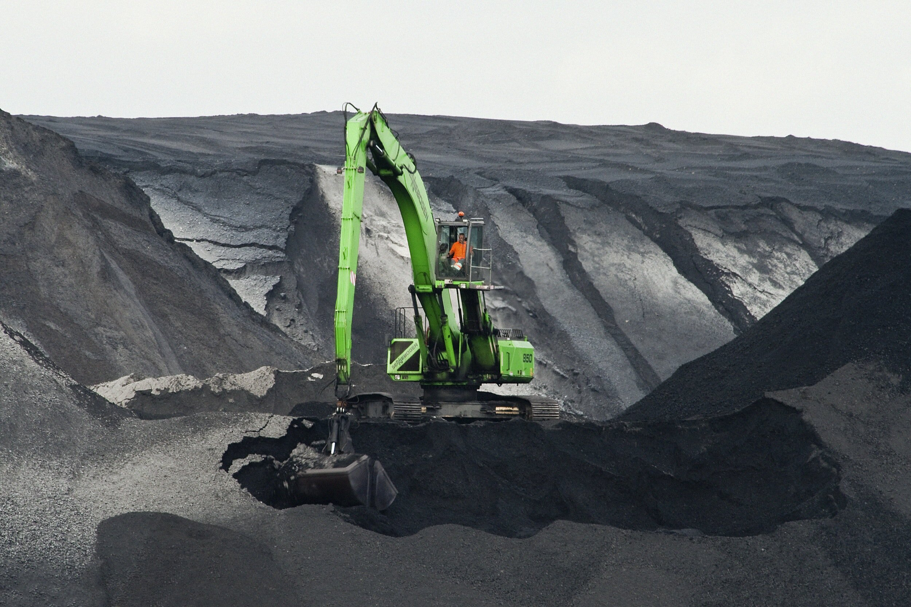
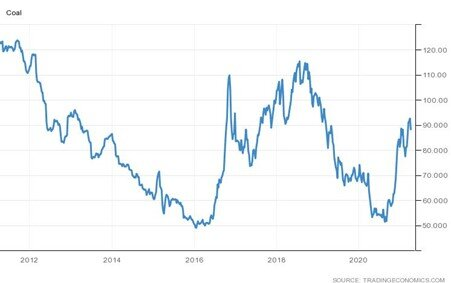

# Coal: Contradictions Define Chinese Demand

**Date:** April 09, 2021  
**Publisher:** Breakwave Advisors | **Category:** Market Insights  
**Original URL:** [https://www.breakwaveadvisors.com/insights/2021/4/9/coal-contradictions-define-chinese-demand](https://www.breakwaveadvisors.com/insights/2021/4/9/coal-contradictions-define-chinese-demand)  

---

*By Ulf Bergman*

> **Figure 1: Unsplash Image Dqgiay0k08o**  
> [Local Asset](file:///C:/Users/Dell/Github/Shipping/corpus/03-breakwave/insights/2021/assets/2021-04-09_coal-contradictions-define-chinese-demand_img_unsplash-image-dqgiay0k08o_06ec6c295fef.jpg)

There are currently several contradictions and question marks regarding the Chinese demand for coal, both in the short and longer terms. The increasing political drive towards a decarbonised economy by the Chinese leadership would suggest a decreasing demand for the black stuff in the not too distant future. At the same time, the country is the global leader in developing new coal-fired power plants by a considerable margin.

According to recent data from Global Energy Monitor, China commissioned more than 38 gigawatts of new coal plants in 2020, which more than offset all of the plant retirements globally. Much of the new developments were initiated around March last year, as many provinces used coal projects to stimulate the local economies in the wake of the slowdown caused by the accelerating pandemic. Conventional wisdom would suggest that the new power plants will be used for energy production for many years to come and support the country’s continued extensive demand for thermal coal. However, China’s Central Environment Inspection Group has recently issued strong criticism of the nation’s energy administration for poor enforcement of restrictions on new coal developments. In light of this, there are some suggestions that the Chinese love affair with thermal coal may start to cool off.

The Chinese government will also release its objectives for the use of coal power in the energy sector later in the year, but only modest goals are stated for the use of non-fossil fuels during the current five-year plan. Hence, coal-fired power generation is likely to continue to grow until 2025 at least. For now, the Chinese economy is reliant on coal for its continued prosperity and a rapid move away from coal-generated energy would come at quite a steep cost. China is facing the same challenge as the rest of the world when aiming to strike a balance between a reduction in the use of carbon and maintaining living standards. Hence, the process to reduce the use of thermal coal in China looks set to be a drawn-out affair.

It is widely expected among analysts that China’s coal imports will decrease this year, as the domestic output is currently cheaper than the imported. It is also in line with the Chinese government’s desire to reduce the reliance on the global supply chains. Nevertheless, in the short term imports may see an increase, as coal stockpiles in Qinhuangdao, the main transhipment port, currently are ten per cent below the summer target of five million tonnes set by the main economic planning agency. It is unclear if domestic mines will heed the call from NDRC and increase output to cover the shortfall, as increased environmental restrictions and safety inspections are curbing production. Coal imported from neighbouring Mongolia has also seen restrictions after the Chinese authorities imposed more stringent pandemic controls in Gan Qimaodu in late March. Tightening supplies and higher restocking demand have also seen coal prices trading near the two-year high set at the end of March.

### Coal (Usd/tonne)

> **Figure 2: Ulf 1a**  
> [Local Asset](file:///C:/Users/Dell/Github/Shipping/corpus/03-breakwave/insights/2021/assets/2021-04-09_coal-contradictions-define-chinese-demand_img_ulf1a_5e864d796c76.jpg)

While China has a provider of high-quality coal, both thermal and coking, in the vicinity which has also been its main supplier in the past, the ongoing trade issues have seen the Australian output off-limits to Chinese buyers. The change in trade patterns, as replacements for the Australian imports are sourced, have been a mixed blessing for dry bulk shipping. In some cases, such as land-based shipments from Mongolia or shorter sea voyages from Indonesia, it has led to a reduction in tonne-mile demand, while sourcing coal from South Africa, and other distant shores, is adding to it. Likewise, the Australian supplies, normally reserved for China, are offered to more faraway markets in Europe and South America.

The ban on Australian coal has also led to more US coal cargoes finding their way to China, with shipments increasing five-fold in the first two months of the year. Hence, the embargo on many Australian products has conveniently given China a greater chance to live up to some of the ambitious commitments made under the “Phase One” trade deal. According to data from the Peterson Institute for International Economics, Chinese imports of US energy products were at 80 per cent of the year-to-date target during the first two months of the year. While energy products include oil and LNG, in addition to coal, it is unlikely that Chinese imports from the US would have reached such a level without the ban on Australian coal being in place.

The year-old trade deal implies that China will import just shy of 41 billion dollars worth of energy products from the US in 2021, with just over three billion dollars done in the first two months of the year. Hence, it is likely that we will see US coal export ports remaining busy with loading cargo on China-bound vessels and contributing to the increase in tonne-mile demand that was envisaged when the deal was announced.

---

**Tags:** Coal  
