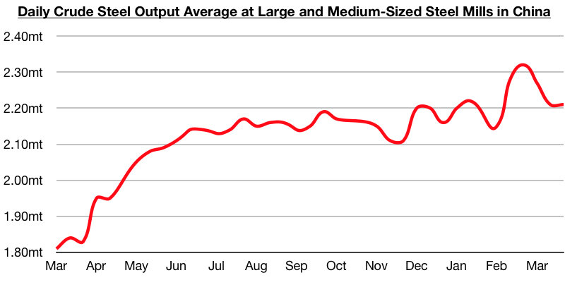
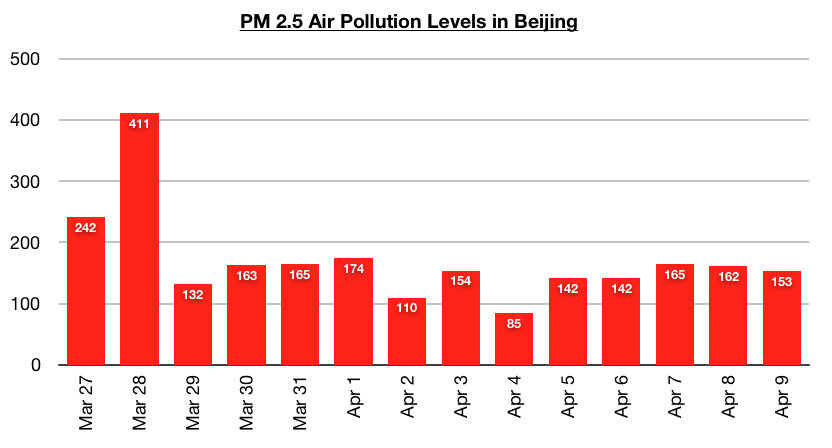

# Chinese Steel Market Continues to Fare Very Well; Air Pollution Remains Much Improved

**Date:** April 12, 2021  
**Publisher:** Breakwave Advisors | **Category:** Market Insights  
**Original URL:** [https://www.breakwaveadvisors.com/insights/2021/4/12/chinese-steel-market-continues-to-fare-very-well-air-pollution-remains-much-improved](https://www.breakwaveadvisors.com/insights/2021/4/12/chinese-steel-market-continues-to-fare-very-well-air-pollution-remains-much-improved)  

---

Daily crude steel output at large and medium-sized mills in China averaged 2.21 million tons during March 21 - March 31. This is the same robust level that was seen during the previous ten days and is up year-on-year by 21%. As we have been discussing in our recent Weekly Dry Bulk Reports and Weekly China Reports, China’s steel production has been poised to stay strong even as the government works to place limitations on heavy polluting mills near Beijing. We remain of our view that China’s total steel production this year will not come close to contracting. We also still cannot imagine China shying away from importing an ever increasing amount of iron ore this year, as imported iron ore is of much higher quality than what is mined domestically in China.

> **Figure 1: Comm 1a**  
> [Local Asset](file:///C:/Users/Dell/Github/Shipping/corpus/03-breakwave/insights/2021/assets/2021-04-12_chinese-steel-market-continues-to-fare-very-well-air-pollution-remains-much-impr_img_comm1a_7b2567462051.jpg)

Also of note in Beijing is that air pollution remains greatly improved from the much higher levels seen in mid and late March. As discussed in today's Weekly China Report, there were no days last week where PM 2.5 levels exceeded 200 in Beijing (which is where air pollution is usually the highest). Also of note is that the peak PM 2.5 level last week was 165. In comparison, the previous week saw a peak level of 411. As recently as in late March, there were three consecutive days where PM 2.5 levels exceeded 200 (with levels peaking at 411 on March 28th). In mid-March, there were also seven consecutive days where levels exceeded 200.

> **Figure 2: Comm 2a**  
> [Local Asset](file:///C:/Users/Dell/Github/Shipping/corpus/03-breakwave/insights/2021/assets/2021-04-12_chinese-steel-market-continues-to-fare-very-well-air-pollution-remains-much-impr_img_comm2a_e5b78c67a7e0.jpg)

Also of note in China is steel prices set another 2021 record last week and steel stockpiles have also continued to decline. The average price of hot rolled coil, for example, ended last week at 5,710 yuan/ton ($871). This is 220 yuan (4%) more than a week ago and up year-on-year by 2,205 yuan (63%). Remaining encouraging is that prices have continued to set new highs for this year and have now increased for nine consecutive weeks, even as steel production has remained robust. Stockpiles of flat and construction steel products now stand at 18.9 million tons. This is 1 million tons (-5%) less than a week ago and is 3.5 million tons (-23%) less than was stockpiled at this time last year.

---

**Tags:** China, Coal  
