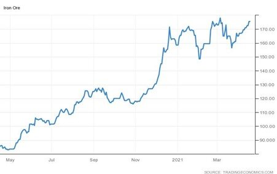

# Global Steel Demand to Continue to Recover Into Next Year

**Date:** April 20, 2021  
**Publisher:** Breakwave Advisors | **Category:** Market Insights  
**Original URL:** [https://www.breakwaveadvisors.com/insights/2021/4/20/global-steel-demand-to-continue-to-recover-into-next-year](https://www.breakwaveadvisors.com/insights/2021/4/20/global-steel-demand-to-continue-to-recover-into-next-year)  

---

*By Ulf Bergman*

The world’s demand for steel is set to grow by almost six per cent this year, after edging down by 0.2 per cent last year. The World Steel Association is projecting in its latest outlook that the full-year global demand will reach 1,874 million tonnes and continue to grow next year by an additional 2.7 per cent. The more restrained outlook for 2022 reflects a diminished impact of stimulus spending programmes.

While China will remain the dominant actor in the steel market, a wider and more diversified global recovery will assist in driving demand higher during the remainder of the year and into the next. Most notably, the recently announced fiscal stimulus proposal by the US government contains provisions for substantial infrastructure investment over several years. The plan, which is expected to be considered by Congress during the second half of the year, could provide a considerable boost to the long-term demand for steel in the US. The eight-year infrastructure investment plan, which includes initiatives such as high-speed internet connectivity, will channel around 200 billion dollars to more traditional projects, such as roads and railways. The physical infrastructure projects are expected to lift the demand for long steel products, such as rebar and wire rod. Some analysts are expecting US steel demand to increase by around 4 million short tons (1 short ton ≈ 0.9 metric tonnes), which can be compared with the 110 million short tons consumed in 2019, according to the American Iron and Steel Institute.

The increase in US demand for steel driven by the construction of infrastructure will help imports recover from the drop caused by the pandemic. In 2020 imported volumes of steel fell by more than twenty per cent to twenty million tonnes, which was the lowest reading since 2009 according to the US Department of Commerce. Last year just shy of a million tonnes of rebar products were imported by American buyers with a large part requiring seaborne transportation, as almost half were arriving from Turkey. Of the other two main suppliers, Spain and Mexico, only products from the latter do not require to be carried by sea.

While European stimulus measures are considerably more modest than their US equivalents, the World Steel Association is still expecting demand to recover during this year and next. The demand growth is expected to be broadly based across all steel-using sectors, but especially in the automotive sector and public construction. As of yet, the recovery in European steel demand has not been derailed by the unfolding third waves of the pandemic. Likewise, another large steel market, India, is seeing a strong recovery in demand following a near collapse in volumes last year. The Indian steel requirements are expected to grow by twenty per cent this year and exceed the ones of 2019.

Recent data from China have also shown a healthy increase in iron ore imports by the world’s largest steel producer as output picked up, with volumes surging to a five-month high in March. This increase came despite the Caixin survey recently showed that Chinese manufacturing activity unexpectedly expanded at the slowest pace in almost a year during March and a crackdown on pollution in many Chinese cities that hampered steel production. The resurgent Chinese demand for the steel-making ingredient has also helped push iron ore prices back to the vicinity of the ten year high set in early March.

### Iron Ore One-Year Performance (Usd/tonne)

> **Figure 1: Ulf 2c**  
> [Local Asset](file:///C:/Users/Dell/Github/Shipping/corpus/03-breakwave/insights/2021/assets/2021-04-20_global-steel-demand-to-continue-to-recover-into-next-year_img_ulf2c_77aa2b6442bd.jpg)

A continued strong global recovery in steel demand will benefit the dry bulk sector, with iron ore volumes requiring seaborne transportation remaining strong and supporting freight rates, especially for the larger tonnage. Additionally, the steel products, such as rebar, will in many cases require onward transportation across the oceans to their buyers and add to the tonne-mile demand, which is likely to benefit the medium and smaller vessels. Furthermore, output from the world’s top iron ore producer, Brazilian Vale, is expected to recover to normal levels during the latter part of the year, following earlier mining accidents, contributing to a higher tonnage demand.

---

**Tags:** China  
