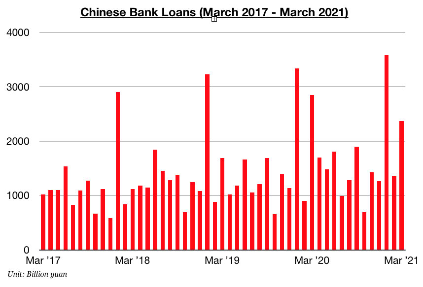
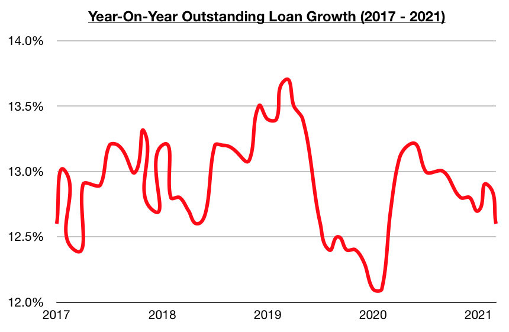

# Chinese Lending Finally Contracts

**Date:** April 21, 2021  
**Publisher:** Breakwave Advisors | **Category:** Market Insights  
**Original URL:** [https://www.breakwaveadvisors.com/insights/2021/4/19/chinese-lending-finally-contracts](https://www.breakwaveadvisors.com/insights/2021/4/19/chinese-lending-finally-contracts)  

---

After previously experiencing seven consecutive months of year-on-year growth, lending in China finally contracted last month. Chinese banks issued 2.37 trillion yuan in new loans in March, which marks a month-on-month increase of 1.01 trillion yuan (74%) but a year-on-year decline of 480 billion yuan (-17%). One month on its own does not mark the start of a trend, but this contraction is new and noteworthy and lending will continue to be monitored very closely.

> **Figure 1: Chart 1 Comm**  
> [Local Asset](file:///C:/Users/Dell/Github/Shipping/corpus/03-breakwave/insights/2021/assets/2021-04-21_chinese-lending-finally-contracts_img_chart1comm_77e4af115de1.jpg)

Also of note is that outstanding loan growth last month came in at 12.6%, which marks the lowest growth since February 2020. Just one month prior in February, though, it came in at 12.9% which marked the highest outstanding loan growth seen since October. In total, the last thirteen months have now seen China’s outstanding loan growth average 12.9%. In comparison, the previous eight months (July 2019 through February 2020) saw outstanding loan growth average 12.4%, which marked the lowest outstanding loan growth seen since 2001.

> **Figure 2: Chart 2 Comm**  
> [Local Asset](file:///C:/Users/Dell/Github/Shipping/corpus/03-breakwave/insights/2021/assets/2021-04-21_chinese-lending-finally-contracts_img_chart2comm_617bf3932030.jpg)

New loans in China have finally contracted on a year-on-year basis and outstanding loans also are clearly on a downward trajectory -- but lending nevertheless continues to find itself at a very healthy level. For now, the slowdown in lending is not a large concern. In fact, there are only six other months in history where new loans exceeded March’s 2.37 trillion yuan total. Prospects for China’s overall economy and industrial and agriculture demand all remain very promising.

---

**Tags:** China  
