# China Economy 2021: How is the world second largest economy really doing?

**Date:** April 26, 2021  
**Publisher:** Breakwave Advisors | **Category:** Market Insights  
**Original URL:** [https://www.breakwaveadvisors.com/insights/2021/4/26/china-economy-2021-how-is-the-world-second-largest-economy-really-doing](https://www.breakwaveadvisors.com/insights/2021/4/26/china-economy-2021-how-is-the-world-second-largest-economy-really-doing)  

---

*by Maria Bertzeletou*

News reports trumped the record growth rate in the first quarter compared to a year earlier. But that didn’t reflect actual economic performance since the comparison was against the largest-ever contraction in the Chinese economy. A look at a shorter-term indicator, first quarter growth versus the fourth quarter, showed a sharp slowdown. But that was due in large part to special factors, such as a resurgence in coronavirus infections and its impact on the Lunar New Year holiday in early February.

What can be said is that China’s economic rebound from the coronavirus continued. But the pace of growth in future months and quarters remains uncertain, dependent on a series of factors, some of which are outside the control of policymakers. China’s economic data paints a comprehensive picture of the state of the world’s second-largest economy.

### How Is the Chinese Economy Doing?

China’s quarterly growth rate averaged 9.4 per cent from 1989 to 2019, reaching an all-time high of 15.4 per cent in the first quarter of 1993. But under pressure from the trade war and long-standing structural issues, China’s growth rate slowed to 6.1 per cent in 2019, which was the slowest since 1990. In the first quarter of 2020, China’s economy shrank by 6.8 per cent after the coronavirus shut down large swathes of the country. It recovered and ended the coronavirus-ravaged year with a strong growth surge and a GDP growth rate of 2.3 per cent in 2020. China’s government has set an economic growth target of “above 6 per cent” for 2021.

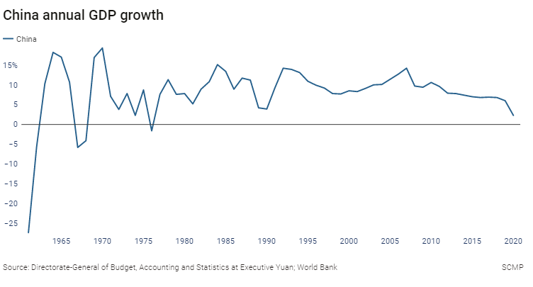

> **Figure 1: A1**  
> [Local Asset](file:///C:/Users/Dell/Github/Shipping/corpus/03-breakwave/insights/2021/assets/2021-04-26_china-economy-2021-how-is-the-world-second-largest-economy-really-doing_img_a1_2c75dee2f212.png)

**China’s consumer price index (CPI):**China’s consumer price index (CPI) rose to plus 0.4 per cent in March from a year earlier, from minus 0.2 per cent in February. Beijing has set a CPI growth target for 2021 of around 3 per cent, compared to around 3.5 per cent in 2020.

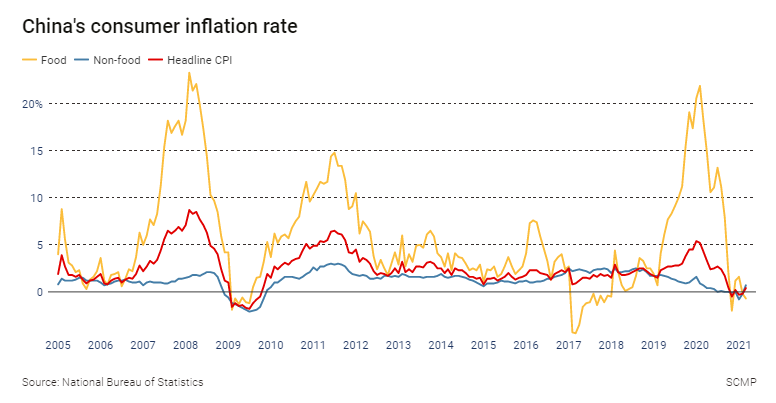

> **Figure 2: A2**  
> [Local Asset](file:///C:/Users/Dell/Github/Shipping/corpus/03-breakwave/insights/2021/assets/2021-04-26_china-economy-2021-how-is-the-world-second-largest-economy-really-doing_img_a2_164a588589f5.png)

**China’s producer price index (PPI):**China’s producer price index (PPI) rose to 4.4 per cent in March, from 1.7 per cent in February.

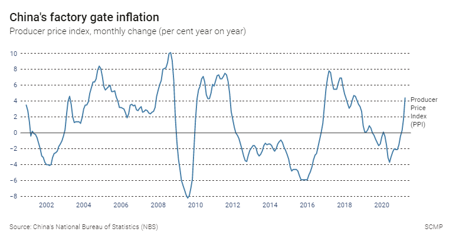

> **Figure 3: A3**  
> [Local Asset](file:///C:/Users/Dell/Github/Shipping/corpus/03-breakwave/insights/2021/assets/2021-04-26_china-economy-2021-how-is-the-world-second-largest-economy-really-doing_img_a3_9f60169b1f34.png)

**China’s official manufacturing purchasing managers’ index (PMI):**China’s official manufacturing purchasing managers’ index (PMI) stood at 51.9 in March, with a reading above 50 signifying growth in activity in this survey of factory operators. This followed a reading of 50.6 in February.

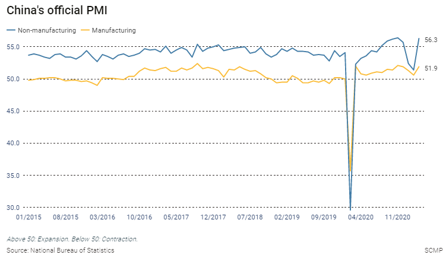

> **Figure 4: A4**  
> [Local Asset](file:///C:/Users/Dell/Github/Shipping/corpus/03-breakwave/insights/2021/assets/2021-04-26_china-economy-2021-how-is-the-world-second-largest-economy-really-doing_img_a4_e43fe9b35cdf.png)

**China’s official non-manufacturing purchasing managers’ index (PMI):**China’s official non-manufacturing purchasing managers’ index (PMI), a gauge of sentiment in the services and construction sectors, was 56.3 in March, compared with 51.4 in February.

**China’s Caixin manufacturing purchasing managers’ index (PMI):**The Caixin/Markit manufacturing purchasing managers’ index (PMI) fell to 50.6 in March, from 50.9 in February.

**China’s Caixin services purchasing managers’ index (PMI):**The Caixin/Markit services purchasing managers’ index (PMI), which focuses on smaller, private firms, rose to 54.3 in March, from 51.5 in February.

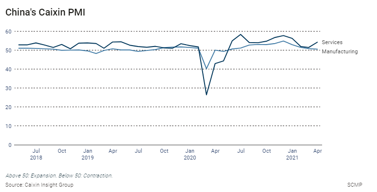

> **Figure 5: A5**  
> [Local Asset](file:///C:/Users/Dell/Github/Shipping/corpus/03-breakwave/insights/2021/assets/2021-04-26_china-economy-2021-how-is-the-world-second-largest-economy-really-doing_img_a5_8b56b24f0cee.png)

**China’s imports:**China's imports grew by 38.1 per cent in March 2021 from a year earlier, up from the 22.2 per cent growth seen in January and February, and well above the Bloomberg survey, which predicted 24.5 per cent growth. Imports have become a closely watched gauge of China’s economic health as the country has transitioned from an export-driven growth model to a more consumption-based model.

**China’s exports:**China's exports grew by 30.6 per cent in March 2021 from a year earlier in US dollar terms, down from the 60.6 per cent seen in January and February, and below the median result of a survey of analysts conducted by Bloomberg, which predicted 38.1 per cent growth. China’s export-driven economy was for decades the workshop of the world. In 2001, when it joined the World Trade Organization (WTO), China accounted for 4 per cent of the world’s exports, and by 2017, that had risen to 13 per cent.

The trade war with the United States, though, damaged China’s exports as tariffs made its goods more expensive for American buyers.

**China’s trade balance**: China’s total trade surplus stood at US$13.8 billion in March, compared to US$103.25 billion in January and February.

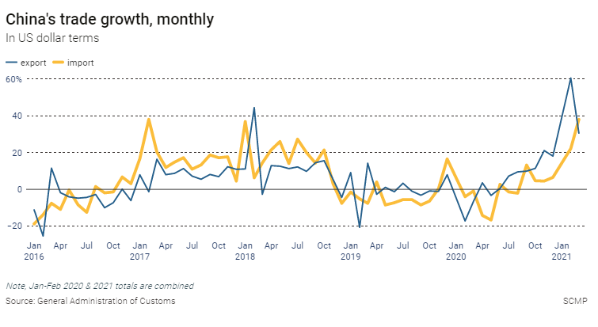

> **Figure 6: A6**  
> [Local Asset](file:///C:/Users/Dell/Github/Shipping/corpus/03-breakwave/insights/2021/assets/2021-04-26_china-economy-2021-how-is-the-world-second-largest-economy-really-doing_img_a6_2869f3c386e8.png)

**China’s retail sales:**China’s retail sales, a gauge of consumer spending in the world’s most populous nation, grew by 34.2 per cent in March 2021 compared with a year earlier. This was a up from a rise of 33.8 per cent in combined figures for January and February 2021. This has become increasingly important in China as it attempts to switch from an export-driven economy to one that relies on domestic consumption.

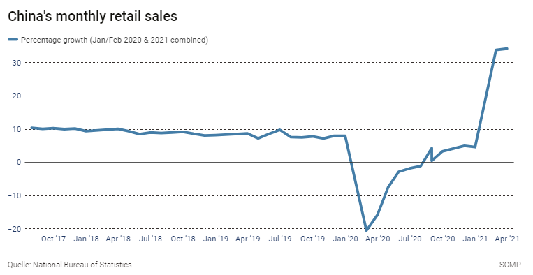

> **Figure 7: A7**  
> [Local Asset](file:///C:/Users/Dell/Github/Shipping/corpus/03-breakwave/insights/2021/assets/2021-04-26_china-economy-2021-how-is-the-world-second-largest-economy-really-doing_img_a7_f67b8e5ba80c.png)

**China’s industrial profits:**China’s industrial profits from January to December grew by 4.1 per cent, an improvement on the increase of 2.4 per cent in the first 11 months of the year. This covers the profits received from the principal business of industrial enterprises above a designated size.

**China’s industrial production:**China’s industrial production, a measurement of output in China’s manufacturing, mining and utilities sectors, grew by 14.1 per cent in March 2021 compared with a year earlier, up from 35.1 per cent in combined figures for January and February 2021.

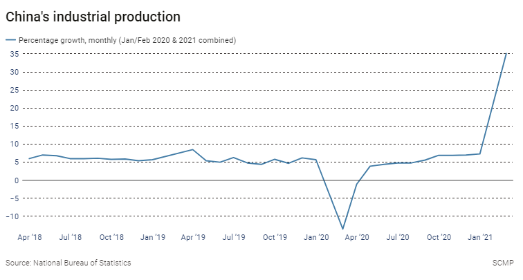

> **Figure 8: A8**  
> [Local Asset](file:///C:/Users/Dell/Github/Shipping/corpus/03-breakwave/insights/2021/assets/2021-04-26_china-economy-2021-how-is-the-world-second-largest-economy-really-doing_img_a8_70c02c24cba1.png)

**China’s new loans:**Chinese banks extended 2.73 trillion yuan in new yuan loans in March, up from 1.36 trillion yuan in February and exceeding analyst expectations.

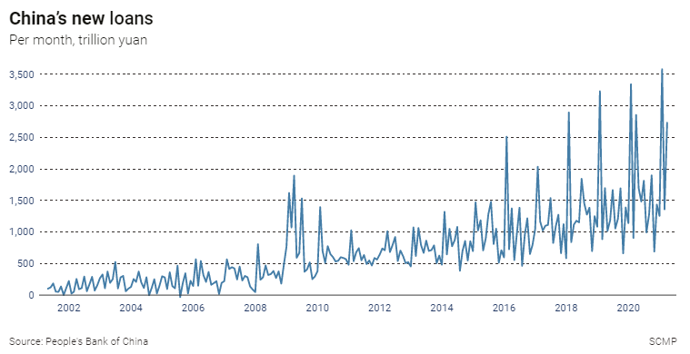

> **Figure 9: A9**  
> [Local Asset](file:///C:/Users/Dell/Github/Shipping/corpus/03-breakwave/insights/2021/assets/2021-04-26_china-economy-2021-how-is-the-world-second-largest-economy-really-doing_img_a9_a6aa9bfdb879.png)

**China’s surveyed jobless rate:**China’s surveyed jobless rate, an imperfect measurement of unemployment in China that does not include figures for the nation’s tens of millions of migrant workers, stood at 5.3 per cent in March, down from 5.5 per cent in February. Beijing has set a target of creating over 11 million new urban jobs in 2021, compared to a target of 9 million in 2020, and a surveyed urban unemployment rate of 5.5 per cent, compared to around 6 per cent in 2020.

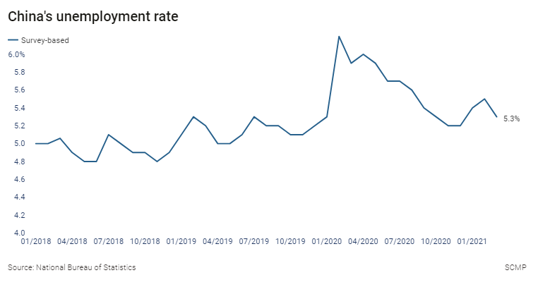

> **Figure 10: A10**  
> [Local Asset](file:///C:/Users/Dell/Github/Shipping/corpus/03-breakwave/insights/2021/assets/2021-04-26_china-economy-2021-how-is-the-world-second-largest-economy-really-doing_img_a10_b31d18943edd.png)

**China’s foreign exchange reserves:**China’s foreign exchange reserves, the largest in the world, fell to US$3.17 trillion in March, compared with US$3.205 trillion in February.

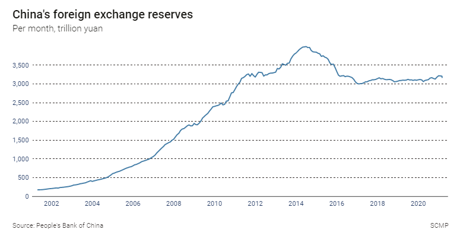

> **Figure 11: A11**  
> [Local Asset](file:///C:/Users/Dell/Github/Shipping/corpus/03-breakwave/insights/2021/assets/2021-04-26_china-economy-2021-how-is-the-world-second-largest-economy-really-doing_img_a11_5bed3ff5add3.png)

### Uncertainty for the Future Growth and Doubts for the Current Firmness

The outlook for Chinese growth remains somewhat uncertain, as Premier Li Keqiang admitted earlier this month, given that some of the causes of better growth last year may be tapering off.

**First,**Beijing and local governments have introduced a series of measures to curb property markets in big cities and keep surging housing prices under control. These include limits on the amount of debt that large property developers can hold - the “three red lines.”

**Second**, Beijing has started to withdraw the economic stimulus it implemented last year to support the coronavirus-hit economy. The government trimmed this year’s budget deficit target as well as the limit for local government bond issues - meaning there will be less money for local governments to spend on infrastructure and other projects. The People’s Bank of China, the nation’s central bank, has refocused its attention to reducing the nation’s high debt level, which rose sharply during the pandemic, but denied that early steps to cut back on monetary stimulus were a sharp reversal of efforts to support the economy.

**Thirdly**, skyrocketing exports may start to ease in coming months as developed economies - particularly the US and European Union - start their own economic rebounds from the coronavirus and no longer suck in huge amounts of coronavirus related goods - from personal protection equipment to video and audio equipment for the stay-at-home movement - and increasingly supply themselves.

**Beijing’s growth target of above 6 per cent is well below the the full-year growth rate of over 8 per cent expected by analysts and the International Monetary Fund (IMF).**Some say that growth rate was chosen to acknowledge that this year’s growth was skewed upwards by comparison to 2020 - when growth rose 2.3 per cent - and the 6 per cent figure represents the annualised growth rate Beijing expects to see in the fourth quarter this year, effectively the same growth as in the fourth quarter of 2019, before the pandemic.

There are projections that the US growth rate - aided by US government economic stimulus - will surpass that of China beginning in the third quarter, but only for a few quarters, with the IMF projecting China growth will easily exceed that of the US for the full year 2022.

However, China remains the fastest-growing large economy in the world, and so its outlook is the single biggest factor in the outlook for the world economy this year and next. The progression ofChinese growth and how Chinese officials get their policy mix right will determine the outlook for the world economy this year and next.

---

**Tags:** China, Economy  
