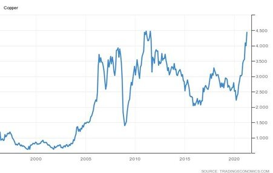

# Are the Stars Aligning for the World Economy?

**Date:** April 27, 2021  
**Publisher:** Breakwave Advisors | **Category:** Market Insights  
**Original URL:** [https://www.breakwaveadvisors.com/insights/2021/4/27/are-the-stars-aligning-for-the-world-economy](https://www.breakwaveadvisors.com/insights/2021/4/27/are-the-stars-aligning-for-the-world-economy)  

---

*By Ulf Bergman*

> **Figure 1: Unsplash Image Ncmd8ule8h0**  
> [Local Asset](file:///C:/Users/Dell/Github/Shipping/corpus/03-breakwave/insights/2021/assets/2021-04-27_are-the-stars-aligning-for-the-world-economy_img_unsplash-image-ncmd8ule8h0_0f5120b520b3.jpg)

A strong rebound in global economic activity and optimism about the continued growth has kept pushing many commodity prices higher, as demand recovers from the lows of last year. China recently published its record-breaking first-quarter growth in GDP and on Thursday this week it is the turn of the US to report how its economy performed in the early parts of the year. While the numbers are not expected to reach the dizzy heights of the Chinese, it is anticipated that the US economy grew by 6.1 per cent (annualized rate) from January through March, according to a Reuters survey of economists. This would be considerably above the more moderate recovery of 4.3 per cent registered in the fourth quarter of last year. New orders for US-manufactured capital goods have also risen solidly in March, according to data from the US Department of Commerce, cementing the expectations that economic growth accelerated in the first quarter on the back of demand boosted by extensive government aid and improving public health. US equity markets are also in an all-time high territory following solid corporate earnings and an expectation that the Federal Reserve will retain an accommodative stance, even as the vigorous growth takes the world’s largest economy back to its pre-pandemic levels.

Elsewhere, the struggling service sector in the Eurozone is again showing signs of life, with the latest PMI from IHS Markit indicating it to be in expansion for the first time in eight months. In combination with a manufacturing sector that has already been at its strongest for two decades during the last few months, the European economy looks set to enter a strong recovery phase in due course. While the recovery is likely to lag the US, following a slower roll-out of vaccines and the recent surge in infection rates, the European rebound is likely to gain further momentum in the second half of the year.

The strengthening momentum in the developed economies, in combination with the continued strong conditions in the Chinese economy, are pushing the prices of many industrial commodities sharply higher. While iron ore may have hogged the headlines as it flirts with its all-time high levels, copper has been doing equally well. A traditional bellwether of the strength of the global economy, copper is currently trading just below the all-time high set in 2011. Copper’s fundamental role in everything from electrical wiring to motors is also likely to drive further price gains, as nations around the world implement more aggressive decarbonization targets that will fuel additional demand for the metal.

### Copper (Usd/lbs)

> **Figure 2: Ulf April 27**  
> [Local Asset](file:///C:/Users/Dell/Github/Shipping/corpus/03-breakwave/insights/2021/assets/2021-04-27_are-the-stars-aligning-for-the-world-economy_img_ulfapril27_2e73a0e9a466.jpg)

The recent strong performance for copper and other industrial commodities have also led to higher factory prices, stoking concerns of rising inflation in the wake of the recovery. Additionally, agricultural commodities have soared to an eight-year high and renewed fears of food inflation. It remains to be seen if it is the early stages of the much-hyped commodities super-cycle we are witnessing or if prices will eventually moderate. However, it is likely to be the first instalment of rising inflation, while the rising debt due to the pandemic and stimulus measures could amplify such an increase at a later stage.

While large parts of the global economy are recovering, or are about to enter a recovery phase, there are parts where a return to normality looks very distant. Most notably in India, the pandemic is far from being under control, with conditions worsening. Beyond the immense human tragedy and costs, there is also the risk that the extensive spread of the coronavirus will give rise to new variants that potentially could not be controlled by the existing vaccines and drive new outbreaks around the world. The worsening conditions have also seen crude oil retreating amid concerns that demand from India could fall after the nation reported a million new coronavirus cases in three days. The severe health crisis could also reduce the agricultural output in the country, with additional imports required and adding additional upward pressure on global prices for crops.

Global trade volumes are likely to increase in the coming months as many parts of the world recover from the worst effects of the pandemic. The current strength of the stimulus-driven recovery in both the US and China will keep demand for commodities strong and with Europe catching up in due course, prices are likely to remain high. The continued growth in consumption of commodities will also support freight rates, as demand for seaborne transport will remain strong. However, the global recovery could come under some pressure if there were a new wave of infections of vaccine-resistant COVID19-variants and trade volumes could suffer as a result. There is also the risk that commodity prices would rise to such an extent that they would have a negative impact on consumer spending and traded volumes.

---

**Tags:** Global Economy  
