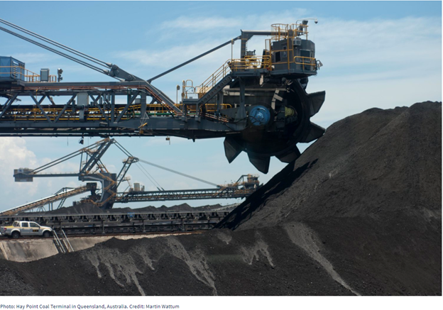
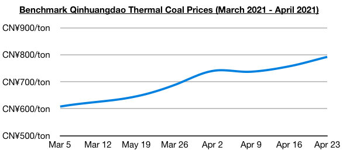

# Chinese Coal Demand to Remain Strong

**Date:** April 28, 2021  
**Publisher:** Breakwave Advisors | **Category:** Market Insights  
**Original URL:** [https://www.breakwaveadvisors.com/insights/2021/4/28/chinese-coal-demand-to-remain-strong](https://www.breakwaveadvisors.com/insights/2021/4/28/chinese-coal-demand-to-remain-strong)  

---

[*By Jeffrey Landsberg*](mailto:jeffrey@commodore-research.com)

> **Figure 1: Klav Pic**  
> [Local Asset](file:///C:/Users/Dell/Github/Shipping/corpus/03-breakwave/insights/2021/assets/2021-04-28_chinese-coal-demand-to-remain-strong_img_klavpic_edbb3f50e3f5.png)

As we have been discussing in our Weekly China Reports, it has been very encouraging for the dry bulk market that China's coal-derived electricity generation growth returned to exceeding coal production growth last month. Coal-derived electricity generation rose year-on-year by 27% in March, while coal production was flat. In addition, another key theme in our reports in recent months has been that China's coal-derived electricity generation has been poised to stay strong even as renewable sources of electricity continue to experience their own production increases. This remains our view, and further adding to our conviction has been the announcement from the government last week that China will only start reducing coal consumption beginning in 2026.

Of note in March is that coal-derived electricity generation grew year-on-year by 27% even as nuclear power production, wind power production, and solar power production all experienced their own strength. These renewable sources of electricity still only contribute to a fraction of China’s total electricity production and coal-derived electricity generation is poised to stay robust (coal-derived electricity generation has been responsible for 75.4% of China’s total electricity production so far this year). Nuclear power production in March totaled 34.2 billion kilowatt hours, which has marked year-on-year growth of 12%. Wind power production totaled 47.3 billion kilowatt hours, which has marked year-on-year growth of 9%. Solar power production totaled 14.1 billion kilowatt hours, which has marked year-on-year growth of 9%.

Also of note is hydropower production (which is China’s largest source of renewable energy) contracted on a year-on-year basis last month which has also been helpful for coal-derived electricity generation and coal import prospects. Hydropower power production totaled 67 billion kilowatt hours, which has marked a year-on-year contraction of 12%. Last month marked the first time since May that China’s hydropower production has contracted on a year-on-year basis.

Going forward, we remain bullish for China’s near-term coal import prospects. Also of note is that domestic thermal and coking coal prices have climbed further (with thermal continuing to fare the best), as demand has stayed strong while port and power plant stockpiles also continue to decline. The price of benchmark Qinhuangdao thermal coal ended last week at approximately 790 yuan/ton, which has marked a week-on-week increase of 5% and is up year-on-year by 68%. The price of benchmark Shanxi coking coal ended last week at approximately 1,585 yuan/ton, which has marked a week-on-week increase of 4% and is up year-on-year by 20%.

> **Figure 2: Commodore April 26**  
> [Local Asset](file:///C:/Users/Dell/Github/Shipping/corpus/03-breakwave/insights/2021/assets/2021-04-28_chinese-coal-demand-to-remain-strong_img_commodoreapril26_ed6d89d7e9aa.jpg)

---

**Tags:** China, Coal  
