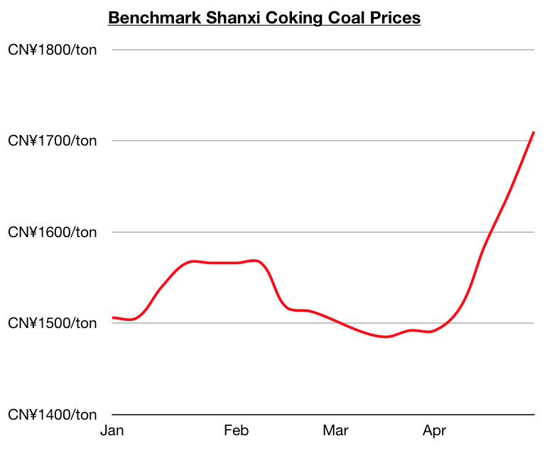
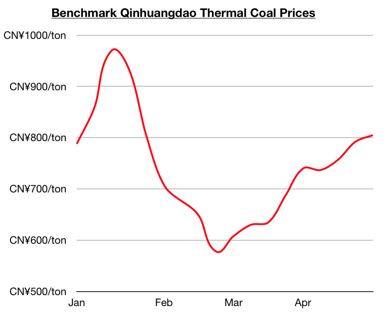

# Global Dry Bulk Market and Chinese Coal Market Remain Bullish

**Date:** May 03, 2021  
**Publisher:** Breakwave Advisors | **Category:** Market Insights  
**Original URL:** [https://www.breakwaveadvisors.com/insights/2021/5/3/global-dry-bulk-market-and-chinese-coal-market-remain-bullish](https://www.breakwaveadvisors.com/insights/2021/5/3/global-dry-bulk-market-and-chinese-coal-market-remain-bullish)  

---

*By*[*Jeffrey Landsberg*](mailto:jeffrey@commodore-research.com)

> **Figure 1: Unsplash Image Aig78yghdmm**  
> [Local Asset](file:///C:/Users/Dell/Github/Shipping/corpus/03-breakwave/insights/2021/assets/2021-05-03_global-dry-bulk-market-and-chinese-coal-market-remain-bullish_img_unsplash-image-aig78yghdmm_f996e64aa9dc.jpg)

Dry bulk rates increased across the board again last week, with capesize rates again finding the largest amount of support. Capesize rates ended last week up by 17%. Panamax rates ended up by 2%. Supramax rates ended up by 3%. Handysize rates ended up by 5%. As we have also discussed in this week's Weekly Dry Bulk Report, Chinese coastal coal freight rates fell by 5%. However, this has marked the first decline since early April, and rates remain very high and are still very close to 2017 highs. Before last week, Chinese coastal coal freight rates had fallen just once during the previous eleven weeks. Also significant is that last week's decline was brief. Coastal coal freight rates started to rise again during the second half of last week.

Overall, we remain very bullish for both the dry bulk market and Chinese coastal coal freight market. Global dry bulk fundamentals have long remained encouraging — and as we discussed in a client note that was published on Tuesday, new quite recently is that China's National Development and Reform Commission is now positioning for China to import more coal in the near term. As we have also continued to stress in our recent Weekly Dry Bulk Reports and Weekly China Reports, Chinese coal stockpiles have stayed relatively low and both domestic coking coal prices and thermal coal prices continue to rise.

We remain bullish for China’s near-term coal import prospects. Of note globally in the coking coal market is new daily coronavirus cases in Mongolia remain high and China’s limitations on Mongolian coal trucks remain in place. This continues to provide support to coking coal prices and will continue to lead to China importing more coking coal from much further exporters. Also of note in China is that the price of benchmark Shanxi coking coal ended last week at approximately 1,710 yuan/ton, which is up week-on-week by 4% and up year-on-year by 27%. Domestic coking coal prices in China have been climbing since mid-March and are now at the highest level seen since March 2019.

> **Figure 2: Jeff 1**  
> [Local Asset](file:///C:/Users/Dell/Github/Shipping/corpus/03-breakwave/insights/2021/assets/2021-05-03_global-dry-bulk-market-and-chinese-coal-market-remain-bullish_img_jeff1_786a3de340a7.jpg)

Thermal coal prices in China have also continued to climb as consumption remains very strong and as domestic coal port stockpiles have remained particularly low. Chinese coal production growth also remains under pressure due to coal mine inspections and safety restrictions put in place last month following a series of tragic coal mine accidents. The price of benchmark Qinhuangdao thermal coal ended last week at approximately 805 yuan/ton, which is up week-on-week by 2% and up year-on-year by 71%. Domestic thermal coal prices have been climbing since the beginning of March and are now at the highest level seen since late January.

> **Figure 3: Jeff 2**  
> [Local Asset](file:///C:/Users/Dell/Github/Shipping/corpus/03-breakwave/insights/2021/assets/2021-05-03_global-dry-bulk-market-and-chinese-coal-market-remain-bullish_img_jeff2_b4fa03e27d5c.jpg)

---

**Tags:** China, Coal  
