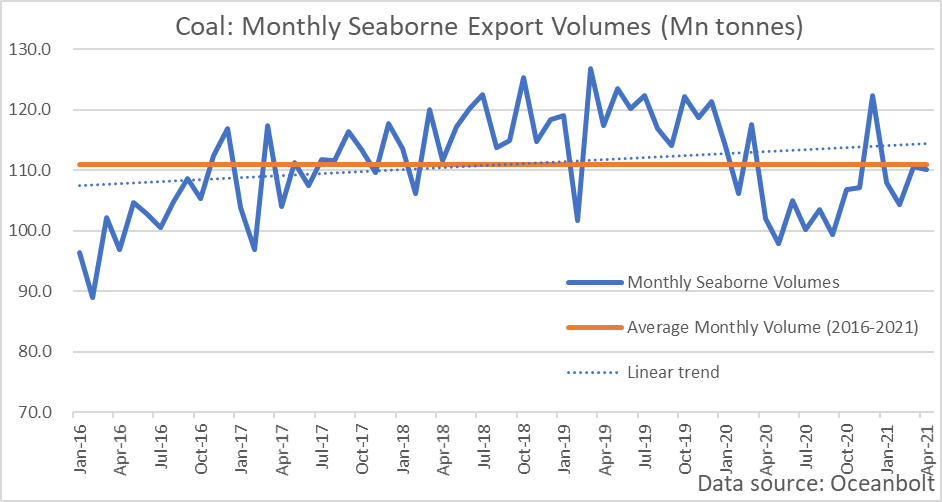
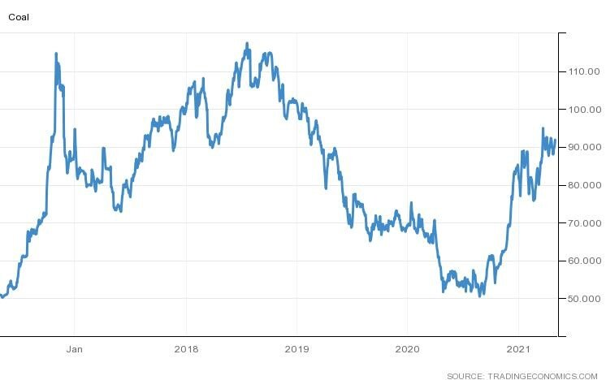

# Coal: Demand Remains Strong with Decarbonization Goals Yet to Make an Impact

**Date:** May 04, 2021  
**Publisher:** Breakwave Advisors | **Category:** Market Insights  
**Original URL:** [https://www.breakwaveadvisors.com/insights/2021/5/4/coal-demand-remains-strong-with-decarbonization-goals-yet-to-make-an-impact](https://www.breakwaveadvisors.com/insights/2021/5/4/coal-demand-remains-strong-with-decarbonization-goals-yet-to-make-an-impact)  

---

*By Ulf Bergman*

The much-maligned global trade in coal trade shows no signs of diminishing, despite many nations publicly committing to decarbonize and limiting their use of coal and other fossil fuels. The world’s largest consumer, China, has recently declared that it will start reducing the use of coal in earnest during the next economic five-year plan, while the annual increase in demand should be “limited” during the current plan. Therefore, the peak in Chinese demand is likely to be in the middle of the decade, when the current five-year plan ends. Nevertheless, if the goal of annual economic growth above six per cent remains in place, it would suggest that demand is unlikely to subside quickly during the early parts of the next five-year plan, given the importance of coal to the Chinese economy.

The central position of Chinese buyers in the market is likely to keep seaborne coal volumes high during the foreseeable future. While the pandemic had a negative impact on the quantity of coal transported across the oceans, the strong economic recovery, especially in China, has seen a strong rebound in shipped volumes. Data from dry bulk cargo tracking platform Oceanbolt show that monthly seaborne export volumes of coal currently are around their five-year average, albeit below the long-term linear trend.

> **Figure 1: A1**  
> [Local Asset](file:///C:/Users/Dell/Github/Shipping/corpus/03-breakwave/insights/2021/assets/2021-05-04_coal-demand-remains-strong-with-decarbonization-goals-yet-to-make-an-impact_img_a1_72396520a36c.png)

The top three coal destinations, China, India and Japan, account for more than half of the seaborne imports of coal. Of the trio, only the latter is likely to reduce its dependency on the commodity in the near term. China and India, on the contrary, look set to increase the use of coal and there are also other Asian nations, such as Vietnam, which have new coal-fired power plants coming online that will offset some of the losses from Japan. Hence, the demand for the black stuff looks set to remain robust, despite falling out of favour in many developed countries.

The continued strong demand, in combination with a tight supply situation, has kept coal prices near the two-year high set in late March. China has been facing production restrictions amid coal mine safety checks, while some production suspensions, aiming at curbing pollution levels, in Inner Mongolia have reduced output further. The tight supply situation has also seen domestic Chinese coal prices well above the official range of 500 to 570 yuan per tonne, which has been set by the central economic planning agency to safeguard profitability. The unofficial ban on Australian coal imports, which was put in place last year, has also contributed to the high prices by limiting supplies.

### Coal – 5-Year Price Development (Usd/tonne)

> **Figure 2: A2**  
> [Local Asset](file:///C:/Users/Dell/Github/Shipping/corpus/03-breakwave/insights/2021/assets/2021-05-04_coal-demand-remains-strong-with-decarbonization-goals-yet-to-make-an-impact_img_a2_a5a663f306dd.jpg)

The rising prices in the Chinese coal hubs are unlikely to lead to a softening of Bejing’s trade policy vis-à-vis Australia. There are no obvious signs of rapprochement between the two nations, if anything the relations could deteriorate further. The announcement by the Australian government that it is reviewing the Chinese ownership of a lease on a strategically important port in the northern city of Darwin, could provoke additional ire from the Chinese leadership. Canberra may consider the current state of the bilateral relationship so bad that any additional strain is unlikely to do much further harm to trade, as Australian iron ore exports look safe, for the time being at least, due to the lack of substitutes.

The number of vessels leaving Australian ports for China with a cargo of coal have been reduced to zero, but at the same time the flow of coal from the US has picked up considerably. While only representing a fraction of Australia’s pre-ban coal exports to China, volumes have risen progressively from practically nothing in October last year according to data from Oceanbolt. Although Chinese import volumes of US coal have reached similar levels in the past, the trade has often been characterized by volatility. However, the existence of the year-old Phase One trade agreement may prevent history from repeating itself and maintain a steady flow of American coal to Chinese ports. At the same time as Australian coal finds often more distant alternative markets, the US coal is mostly shipped from ports on the Eastern Seaboard or in the US Gulf. Both developments are adding a considerable amount of distance to the tonne-mile demand. The data also highlights a recent dominance of the Panamax segment on the US to China coal trade, accounting for around three-quarters of the cargo volumes moved since October.

---

**Tags:** China, Decarbonization, Coal  
