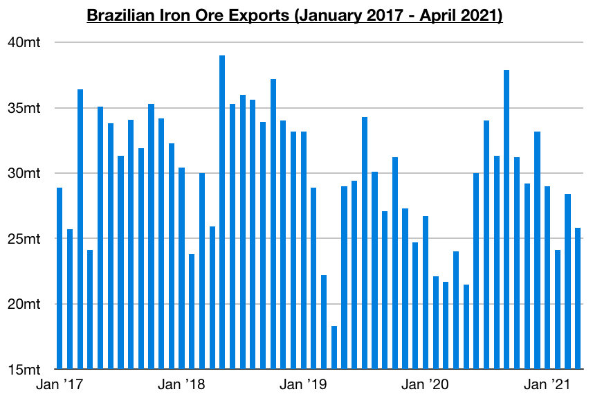

# Global Dry Bulk Market Continues to Fare Very Well; Indian Outbreak Not Having Large Detrimental Impact

**Date:** May 10, 2021  
**Publisher:** Breakwave Advisors | **Category:** Market Insights  
**Original URL:** [https://www.breakwaveadvisors.com/insights/2021/5/10/global-dry-bulk-market-continues-to-fare-very-well-indian-outbreak-not-having-large-detrimental-impact](https://www.breakwaveadvisors.com/insights/2021/5/10/global-dry-bulk-market-continues-to-fare-very-well-indian-outbreak-not-having-large-detrimental-impact)  

---

[*By Jeffrey Landsberg*](mailto:jeffrey@commodore-research.com)

> **Figure 1: Vale Iron Ore 2**  
> [Local Asset](file:///C:/Users/Dell/Github/Shipping/corpus/03-breakwave/insights/2021/assets/2021-05-10_global-dry-bulk-market-continues-to-fare-very-well-indian-outbreak-not-having-la_img_valeironore2_073efe0c6191.jpg)

Dry bulk rates increased across the board again last week, with panamax rates this time finding the largest amount of support. Capesize rates ended last week up by 2%. Panamax rates ended up by 11%. Supramax rates ended up by 2%. Handysize rates ended up by 4%. Also of note is that Chinese coastal coal freight rates increased and are now at the highest levels since December 2017. Overall, it is particularly encouraging that rates outside of the capesize market found the largest amount of support last week and that Chinese coastal coal freight rates are also now at even higher levels. The capesize market remains extremely healthy and their prospects remain very positive due in part as Brazilian iron ore exports have continued to experience consistent year-on-year strength (which is a relatively new development not seen since 2018), but the rest of the market is independently also enjoying its own strength.

Coal India’s production finally rose on a year-on-year basis last month, but we expect that a contraction will occur this month. India’s coronavirus pandemic has continued to intensify and Coal India is being directly affected. New daily coronavirus cases throughout India set an all-time high of 414,433 cases on Thursday. Deaths attributed to coronavirus have continued to surge as well. Coronavirus-related deaths in India set an all-time high of 3,982 deaths on Wednesday. Of note regarding Coal India is that over 5,470 full-time employees have officially contracted coronavirus. While this is only 2% of Coal India’s workforce, operations are expected to be significantly affected. Also of note is that Coal India has already set up more than 3,000 coronavirus-related beds.

Overall, the coronavirus surge in India tragically continues to intensify and near-term prospects for the Indian economy remain the most negative issue for the dry bulk market — but this still is not set to have a very large impact on the dry bulk market. Related too is that some ports globally are not allowing vessels to dock if the vessels previously had docked in India (and various other nations experiencing their own surges in coronavirus cases). Inefficiencies like these always help to further tighten up spot vessel supply and are supportive to dry bulk freight rates. Crew changeovers are also being affected. Going forward, the outlook for the entire dry bulk market remains positive. Rates never simply move straight up, but the best is still yet to come.

We remain very bullish for the entire dry bulk shipping market and are most bullish for the Capesize market for the rest of this year. As we have been stressing in our Weekly Dry Bulk Reports this year, it has remained particularly encouraging that Brazil's iron ore exports have continued to climb on a year-on-year basis. Most recently, Brazil’s iron ore exports totaled 25.8 million tons in April which is up year-on-year by 8%. Brazil’s iron ore exports have now increased on a year-on-year basis for six consecutive months, which marks a feat not seen since 2018. All signs going forward are that the year-on-year strength will continue, and so too will normal Brazilian iron ore export seasonality.

> **Figure 2: Comm 2ab**  
> [Local Asset](file:///C:/Users/Dell/Github/Shipping/corpus/03-breakwave/insights/2021/assets/2021-05-10_global-dry-bulk-market-continues-to-fare-very-well-indian-outbreak-not-having-la_img_comm2ab_0fff1bfc92a9.jpg)

---

**Tags:** Capesize, Dry Bulk  
