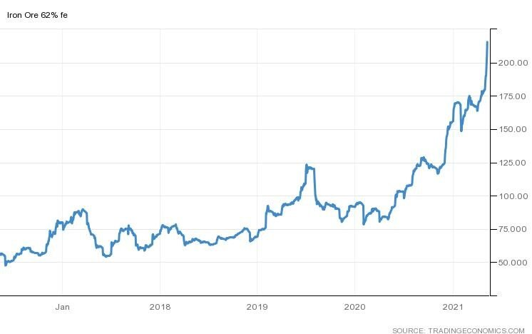

# South American Grain Exports on the Rise but in the Shadow of Iron Ore

**Date:** May 11, 2021  
**Publisher:** Breakwave Advisors | **Category:** Market Insights  
**Original URL:** [https://www.breakwaveadvisors.com/insights/2021/5/11/south-american-grain-exports-on-the-rise-but-in-the-shadow-of-iron-ore](https://www.breakwaveadvisors.com/insights/2021/5/11/south-american-grain-exports-on-the-rise-but-in-the-shadow-of-iron-ore)  

---

*By Ulf Bergman*

The drought and rain that delayed the Brazilian soybean harvest have produced some statistical consequences. The Brazilian Trade Ministry announced last week that the country exported 12.6 million tonnes to China in April, an increase of nineteen per cent on the same month last year. It represented the largest monthly increase since records began in 1997. While the numbers are impressive, it is a bit of the statistical equivalent of comparing apples with pears. Under normal conditions, the Brazilian soybean would have been ready to ship in large quantities in March, while April would represent the tail end of the proceedings. This year, however, much of the soybean harvest was shipped in April creating an anomaly in the year-on-year comparisons. For shipping, it was nevertheless good news as it disrupted some traditional trade flows and contributed to congestion, first around the US ports in the Gulf and then off the Brazilian coast, as the Chinese buyers kept up their purchases despite the delays.

Beyond statistical anomalies, soybeans look set to lose the crown as Brazil’s main export earner to iron ore despite posting strong numbers. An expected recovery in output, following constraints imposed by the pandemic and mining accidents, and market prices that keep recording new records on a daily basis, iron ore is set to increase its export revenues by 60 per cent this year. While export volumes of soybeans could be on course for yet another new record this year, the strong performance of iron ore prices looks set to propel the commodity to the top spot. So far this year iron ore prices have risen by 38 per cent, while soybeans have gained 24 per cent.

### Iron Ore 62% Fe (Usd/tonne)

> **Figure 1: A1**  
> [Local Asset](file:///C:/Users/Dell/Github/Shipping/corpus/03-breakwave/insights/2021/assets/2021-05-11_south-american-grain-exports-on-the-rise-but-in-the-shadow-of-iron-ore_img_a1_48f2bd5430a3.jpg)

There is however good news for soybean exporters as a consolation, with Chinese soybean acreage likely to decrease for the first time in six years. Data released by the China National Grain and Oils Information Center suggests the land planted with soybeans is set to shrink by 7.3 per cent, compared with the previous growing season. Hence, soybean imports are projected to rise to 102 million tonnes in the year starting in October, up from 98 million tonnes during the current year. The existence of the phase one trade agreement, which was agreed by the previous US administration, could however suggest that a majority of the increase in Chinese import demand would be sourced in the more distant US.

At the same time as Brazil could be on course to record agricultural exports, weather gods permitting, its southern neighbour, Argentina, is already logging new export records. The first four months of the year saw Argentina’s agricultural exports reach a record high of USD 9.8 billion, beating the previous record set in 2016 by USD 1.4 billion. The country is the world’s largest exporter of soymeal livestock feed and the third-largest exporter of corn and, according to the Ministry of Agriculture, Argentine growers have sold 16.4 million tonnes of soybeans during the 2020/21 growing season. While the country’s agricultural export markets are rather diversified, China is the largest customer but not in a dominant fashion. However, given the extensive political and commercial ties between Argentina and China, Argentinian farmers may find the Chinese export market growing in importance. Especially in the light of the deteriorating Sino-Australian relationship, with Chinese import embargoes in place on most Australian agricultural commodities.

---

**Tags:** Soybeans, Brazil, Argentina  
