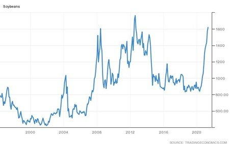
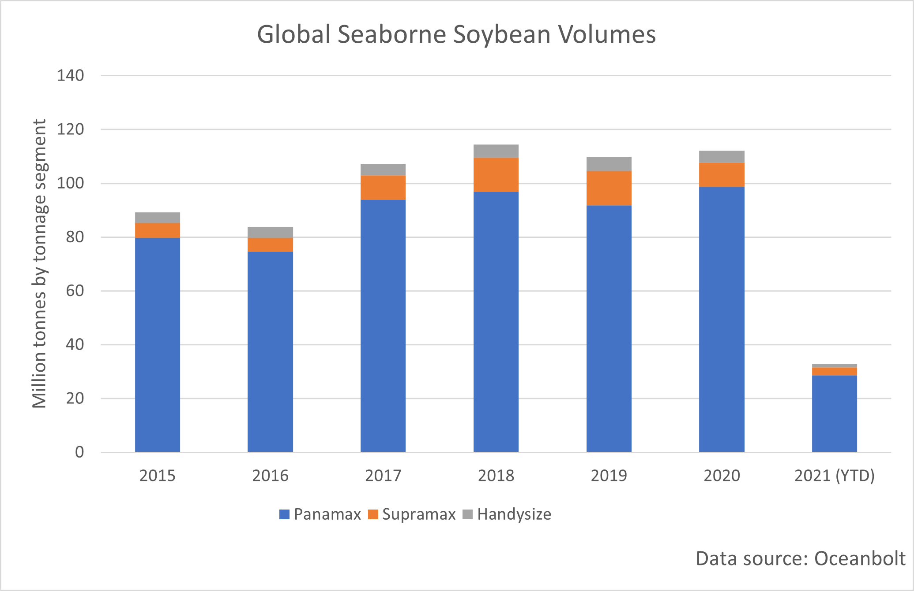

# Soybeans: Global Production and Trade Set to Continue to Grow

**Date:** May 14, 2021  
**Publisher:** Breakwave Advisors | **Category:** Market Insights  
**Original URL:** [https://www.breakwaveadvisors.com/insights/2021/5/14/soybeans-global-production-and-trade-set-to-continue-to-grow](https://www.breakwaveadvisors.com/insights/2021/5/14/soybeans-global-production-and-trade-set-to-continue-to-grow)  

---

*By Ulf Bergman*

Soybean futures are trading within striking distance of the all-time high set in September 2012. After gaining over 90 per cent in the last year, another eight per cent price rise would relegate the previous record to the history books. The robust prices have been supported by the low inventories of oilseeds, despite fears that the worsening coronavirus situation in India would reduce vegetable oil demand in India. The continued strong demand of the crop from the Chinese livestock has also supported the country's import, with volumes in April rising by eleven per cent year-on-year to 7.5 million tonnes.

### Soybean Prices 1996-2021 (Us Cents/bushel)

> **Figure 1: Ulf 5.14**  
> [Local Asset](file:///C:/Users/Dell/Github/Shipping/corpus/03-breakwave/insights/2021/assets/2021-05-14_soybeans-global-production-and-trade-set-to-continue-to-grow_img_ulf514_747e3e2e5ac5.jpg)

The latest projections on trade and inventory levels for soybeans recently released by the US Department of Agriculture are unlikely to pour cold water on the rising prices. A positive demand outlook is expected to keep US stockpiles near a seven-year low, with the USDA projecting that soybean stocks will increase by just 20 million bushels from 120 million bushels. The USDA is forecasting that the global soybean production in 2021/22 will reach 386 million tonnes, an increase of around six per cent compared to the current agricultural marketing year. A great majority of the supply growth is anticipated to come from the Americas, with the US and Brazil expected to account for two-thirds of the increased production.

The boost in output is primarily driven by larger areas planted with soybeans across the world, rather than just increasing productivity, which is accelerated by the highest prices since the peak in 2012. The soybean acreage in Brazil, the world’s largest producer, is expected to reach a record high, as a favourable exchange rate versus the US dollar further augments the producers’ returns in local currency terms. This would be the fifteenth straight year of expanded soybean plantings in the country, driven by strong export demand and exceptional grower returns. The increase is expected to see Brazilian soybean production rise by 8 million tonnes to 144 million. In the US, the soybean plantings are anticipated to be the most extensive since 2018. However, the oilseed is also facing competition from corn, which has had an even stronger year, as farmers apportion acreage for the crops this spring.

The USDA is expecting US soybean exports to decrease by 5.6 million tonnes to 56.5 million during 2021/22, as the limited inventories restrict export availability. At the same time, Brazilian exports are projected to rise to 93 million tonnes, seven million above the 2020/21 forecast. Chinese demand is expected to account for 60 per cent of the growth in the global trade of the oilseed. Chinese imports are expected to rise by three million tonnes to 103 million tonnes, driven by both increasing demand and reduced domestic production.

Global seaborne volumes of soybeans could be on course for eclipsing the previous high set in 2018. According to data from Oceanbolt, last year’s volumes were approximately two million tonnes below the ones recorded during 2018. The rising Brazilian exports more than offset the reduction in shipments from the US, potentially pushing total volumes above the previous high. The soybean trade is traditionally dominated by the Panamax segment, with vessels capable of carrying between 68,000 and 110,000 tonnes accounting for 87 per cent of the trade. Stable, or increasing, volumes in an otherwise tight market could lend support to Panamax charter rates when the US harvest and the second Brazilian harvest get underway during the third quarter.

> **Figure 2: Ulf 5.14b**  
> [Local Asset](file:///C:/Users/Dell/Github/Shipping/corpus/03-breakwave/insights/2021/assets/2021-05-14_soybeans-global-production-and-trade-set-to-continue-to-grow_img_ulf514b_8997bc4ed3f6.png)

---

**Tags:** Soybeans, Dry Bulk  
