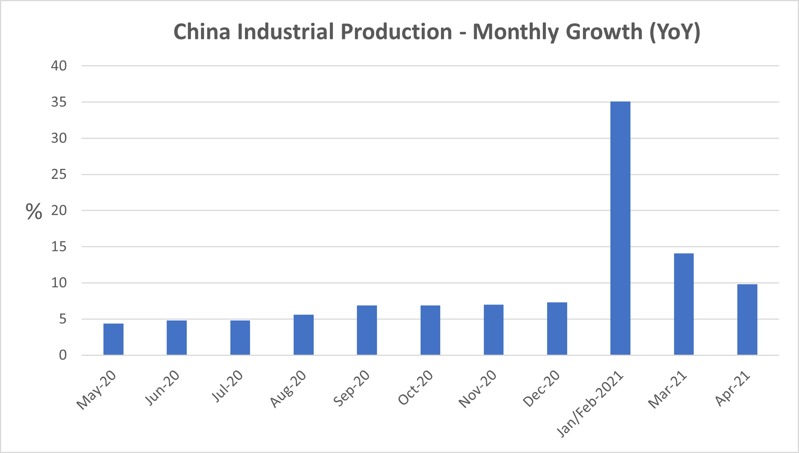

# China: The Base Effects Are Easing Off

**Date:** May 18, 2021  
**Publisher:** Breakwave Advisors | **Category:** Market Insights  
**Original URL:** [https://www.breakwaveadvisors.com/insights/2021/5/18/china-the-base-effects-are-easing-off](https://www.breakwaveadvisors.com/insights/2021/5/18/china-the-base-effects-are-easing-off)  

---

*By Ulf Bergman*

The first few months of last year saw many parts of the Chinese economy severely impacted by the early stages of the global pandemic, something that has had considerable base effects as the strong recovery continued into this year. However, as the year progresses these effects will disappear with the points of reference now being after the Chinese economy started its strong recovery. Given the strength of the recovery during last autumn, numbers may even start to look underwhelming for the casual observer during the second half of the year. For now, though, Chinese industrial production continues to perform well and grew by 9.8 per cent in April compared to a year ago, which was only marginally below the ten per cent median forecast in a Bloomberg survey. While not on par with March’s 14.4 per cent growth, the diminishing base effect suggests that the Chinese manufacturing growth is still strong.

> **Figure 1: Data Source: National Bureau of Statistics of China**  
> *Data source: National Bureau of Statistics of China*  
> [Local Asset](file:///C:/Users/Dell/Github/Shipping/corpus/03-breakwave/insights/2021/assets/2021-05-18_china-the-base-effects-are-easing-off_img_ulfmay18_1d50ff0240fe.png)

Although the industrial production was broadly in line with pundits’ expectations, the data for retail sales failed to impress. An expansion of 17.7 per cent fell well short of the consensus projection of 25 per cent, highlighting the difference between the export and stimulus-driven manufacturing industry and the domestic consumption. The consumers have so far failed to return to their spending habits of recent years, with the continued uncertainty regarding the pandemic and sluggish income growth weighing on sentiment. There are some early signs of a tightening labour market, which could lead to stronger consumer spending in the coming months.

The continued strength of the Chinese industrial production suggests that China will remain an important driver for global economic growth and commodity demand, but the present dominance may diminish somewhat. The unbalanced nature of the latest data release also underlines the challenges the policymakers in Beijing are facing, to increase consumer spending and the strength of the domestic economy while controlling the industrial growth and scaling back infrastructure stimulus spending. The data release also suggests that economic expansion probably peaked during the first quarter, with decelerating growth rates during the rest of the year. However, while the growth rates may become modest by recent Chinese standards, the sheer extent of Chinese commodity consumption will continue to contribute to a robust demand.

> **Figure 2: Unsplash Image Lh Q8dbkgz0**  
> [Local Asset](file:///C:/Users/Dell/Github/Shipping/corpus/03-breakwave/insights/2021/assets/2021-05-18_china-the-base-effects-are-easing-off_img_unsplash-image-lh-q8dbkgz0_6e05ddc62797.jpg)

Recent attempts by the Chinese authorities to rein in the flourishing manufacturing sector, with steel production becoming an early target, appears to have had a neglible effect so far. Despite moves to impose stricter environmental oversight and changes to the tax regime, crude steel output in April hit a new record of 97.9 million tonnes. The news pushed iron ore prices back above USD 200 per tonne, helped by the inventory levels in Chinese ports declining for a third consecutive week. Unless there is a lag in the effect of the measures to control the output, China may be on course for yet another year of record-breaking steel production with the year to date production is already approximately fifteen per cent ahead of last year’s.

The continued strength of the Chinese steel industry may lead to even stronger measures from the government, as Prime Minister Li Keqiang recently urged the country to take action to control the raw material price rally of the past months. The surging commodity prices have seen the Chinese producer price index rise the most since 2017 in April, while the consumer prices remained relatively subdued and boosted the image of an uneven economic recovery. There are concerns that the rising producer prices in China could spur global inflation rates, as export prices are on the rise.

While Chinese authorities may eventually be successful in their attempts to control the output and consumption of commodities, increasing demand in other parts of the world is likely to support prices as the supply situation for many commodities remains tight. Stimulus driven infrastructure investments in the US and Europe, in combination with recovering manufacturing output, could offset slowing demand growth in China and negate any efforts to control the rising prices.

---

**Tags:** China, Economics  
