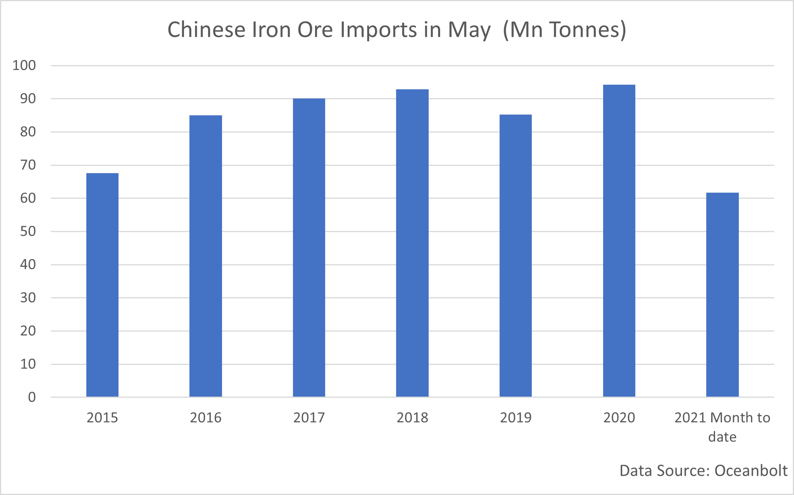
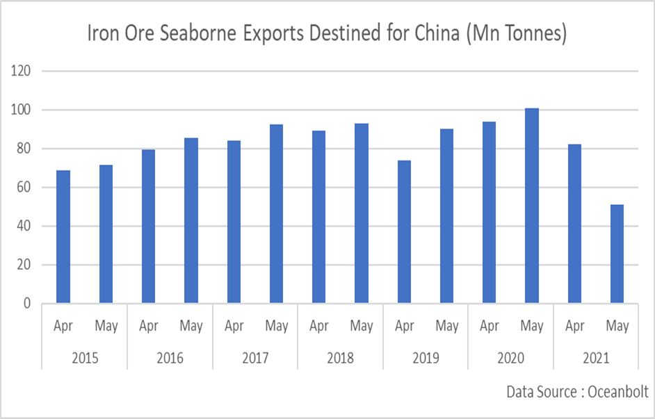

# Commodity Inflation: China Increases the Pressure

**Date:** May 21, 2021  
**Publisher:** Breakwave Advisors | **Category:** Market Insights  
**Original URL:** [https://www.breakwaveadvisors.com/insights/2021/5/20/commodity-inflation-china-increases-the-pressure](https://www.breakwaveadvisors.com/insights/2021/5/20/commodity-inflation-china-increases-the-pressure)  

---

*By Ulf Bergman*

> **Figure 1: Unsplash Image P Er1ghmtyy**  
> [Local Asset](file:///C:/Users/Dell/Github/Shipping/corpus/03-breakwave/insights/2021/assets/2021-05-21_commodity-inflation-china-increases-the-pressure_img_unsplash-image-p-er1ghmtyy_529fcb5f3a40.jpg)

As mentioned in Ocean Analytics’ previous contribution, the Chinese Premier Li Keqiang recently urged the country to take action to control the raw material price rally of the past months. Beijing has since stepped up its rhetoric on the rising commodity prices. Following a meeting by The State Council on Wednesday, it was announced that authorities will pay closer attention to the unfavourable impact of high commodity prices and deploy a dual approach to calm the markets by increasing domestic supply and enhancing supervision. Hoarding and speculation have been singled out as the perceived culprits for the soaring prices. Much of the Chinese government’s focus has so far been on iron ore and steel, with steel output, and by extension iron ore demand, targeted through a clampdown on emissions. As a consequence of the State Council’s declaration, the steel rebar futures traded in Shanghai tumbled eight per cent on Thursday and the iron ore futures fell below USD 200 in Singapore.

The Chinese leadership appears to be concerned about high commodity prices being passed through to small manufacturers, many of which, unlike the large export companies, have not yet fully recovered from the impact of the pandemic. As recently reported, the factory gate prices increased by almost seven per cent in April and fueled fears that the rising commodity prices will push up inflation rates. However, consumer prices only rose by 0.9 per cent last month, on a year-on-year basis, and remain well below the full-year control target of three per cent, as the consumers hold back on their spending as pandemic-driven uncertainties

As the world’s preeminent consumer of many commodities, such as iron ore, non-ferrous metals and crude oil, China is exposed to international inflation pressures. But as the lion's share of the country’s upstream industries is controlled by the Chinese government, there are also ample opportunities for interventions in the domestic market. The strong statement delivered by the State Council underscores the challenges the policymakers currently are facing, controlling rising commodity prices without penalising the weaker parts of the economy. Tightening the monetary policy, by tapering the stimulus programmes, would help stem the upward pressure on commodity prices but could harm the lagging parts of the economy which have not yet recovered to their pre-pandemic levels.

Any attempts by Beijing to control the rising commodity prices by reducing demand may take some time to pay a dividend. The more forceful rhetoric may reduce the appetite for iron ore futures among investors who use it as a proxy for the Chinese economic growth and introduce a degree of price control this way. However, the effect on imported volumes of iron ore may take some time to materialise. So far this month import volumes have been strong and could be on track to beat the record for May set last year. Assuming a degree of linearity on the iron ore deliveries to Chinese ports, data from Oceanbolt suggest that the volumes could edge above those recorded in May last year. With two-thirds of the month already behind us, around 62 million tonnes of iron ore have been discharged in Chinese ports putting the month on track for approximately 96 million tonnes delivered, but not necessarily customs cleared.

> **Figure 2: Ulf 5.20**  
> [Local Asset](file:///C:/Users/Dell/Github/Shipping/corpus/03-breakwave/insights/2021/assets/2021-05-21_commodity-inflation-china-increases-the-pressure_img_ulf520_780752ac04bd.png)

The nature of seaborne transportation means that any changes to import and export policies could take quite some time to turn up in the data. The potential record-breaking volumes for May is a result of transactions taking place during the preceding months. Hence, the effectiveness of any measures from the Chinese authorities will show up in the import data during the coming months. While this week’s statement from China’s State Council was strong, the issue of rising commodity prices has undoubtedly been on the minds of the leadership for the last month(s). Hence, it could be useful to consider the volumes loaded onto vessels heading for Chinese ports during April and May. Given the distances involved, much of it is still en route. Based on data from Oceanbolt, the volumes of iron ore heading for China do not match last year’s record levels. Iron ore exports heading for China in April this year was in line with the average for the month, while volumes shipped during May could be on course for the lowest since 2015 (again assuming linearity). Given the modest numbers, imported volumes may start to decrease in the coming months.

> **Figure 3: Ulf 2 5.20**  
> [Local Asset](file:///C:/Users/Dell/Github/Shipping/corpus/03-breakwave/insights/2021/assets/2021-05-21_commodity-inflation-china-increases-the-pressure_img_ulf2520_126f7369a99d.png)

The measures by the Chinese government may prove successful in controlling the commodity prices, but it may also shift steel production and iron ore imports to other parts of the world. Global steel demand looks set to remain strong as the rest of the global economy is regaining its traction. Hence, any policy changes by the Chinese authorities may only result in falling demand without the desired price effect, as other parts of the world make up for the short-fall and keep prices and demand firm.

---

**Tags:** China, Commodities, Inflation  
