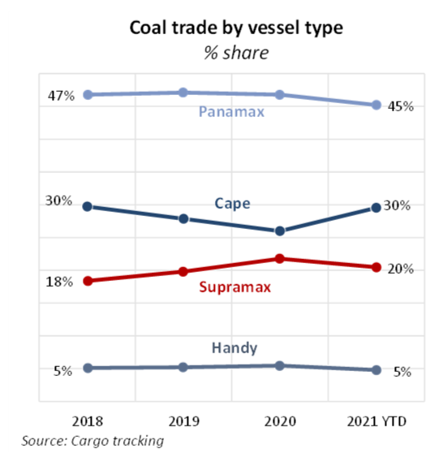
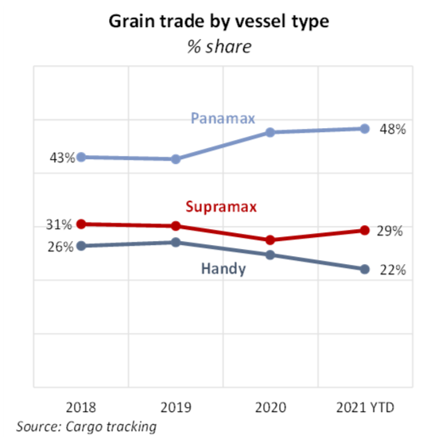
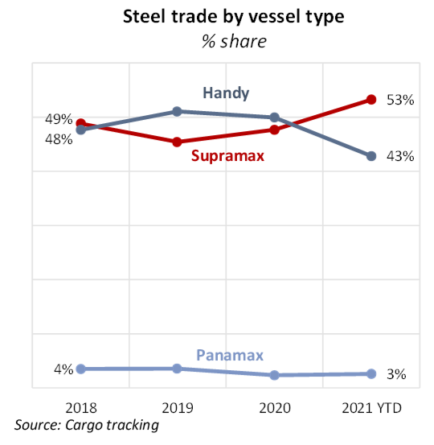
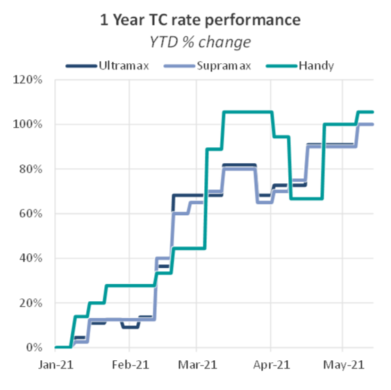
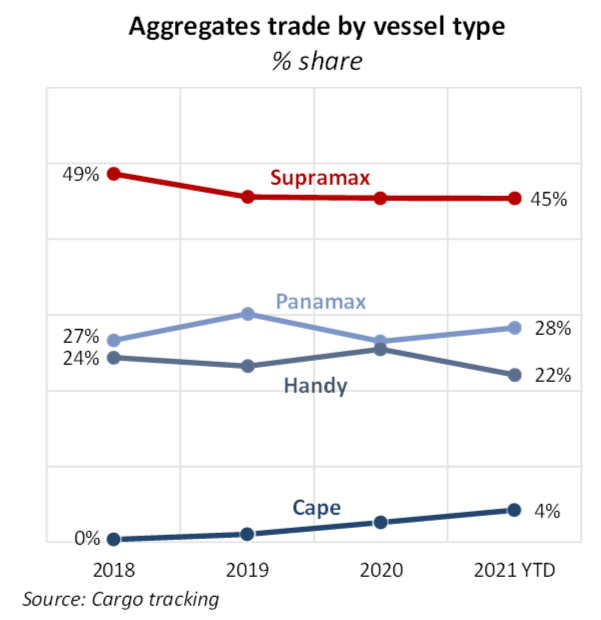

# The Big Picture: Vessel requirements

**Date:** May 21, 2021  
**Publisher:** Breakwave Advisors | **Category:** Market Insights  
**Original URL:** [https://www.breakwaveadvisors.com/insights/2021/5/21/the-big-picture-vessel-requirements](https://www.breakwaveadvisors.com/insights/2021/5/21/the-big-picture-vessel-requirements)  

---

*By Nick Ristic*

*Between COVID-19 disruptions, geopolitical tensions, and soaring freight rates, we’ve recorded several shifts in the flows of goods between regions and the types of ships used to move them.*

### Shifting Gears

The largest market where we have recently seen significant changes in the shares of different vessel types used is coal. As we wrote a couple of weeks ago, 2021 has so far bucked the long-term trend of declining coal trade on Capes. Year-to-date, Capes have accounted for about 30% of total coal trade, up by four percentage points YoY, returning to their market share in 2018.

> **Figure 1: Bmr 5.21**  
> [Local Asset](file:///C:/Users/Dell/Github/Shipping/corpus/03-breakwave/insights/2021/assets/2021-05-21_the-big-picture-vessel-requirements_img_bmr521_c7a4f37fef02.png)

Cape use in the coal trades was hit hard by the pandemic last year, as the crisis put a dent in demand from traditional Cape importers India, Japan and Korea, exacerbating a pattern of declining imports. Robust demand from smaller importers who were not hit as hard by the pandemic kept demand for geared ships intact. But over the past few months, this trend has been reversed, with India in particular driving a ramp-up in Cape imports. This has partly been aided by an abundance of discounted cargoes from Australia, which remain off-limits for Chinese buyers. China, meanwhile, has increased its intake from Colombia, the US, Canada and Russia, which has recently begun shipping more coal on Capes. Trade on the smaller ships, appears to have now weakened, falling to mid-pandemic levels. China has been the greatest driver of this pattern, though a dip in trade into countries in Southeast Asia has also contributed, with a worsening COVID-19 situation in likely hitting power demand.

Vessel requirements for relatively high-value commodities, such as grains, also seem to have changed. Although Handies have continued to lose market share to the Panamaxes, Supras appear to have made some gains so far this year, climbing to 29% from 27% in 2020.

> **Figure 2: Bmr 2 5.21**  
> [Local Asset](file:///C:/Users/Dell/Github/Shipping/corpus/03-breakwave/insights/2021/assets/2021-05-21_the-big-picture-vessel-requirements_img_bmr2521_4cf95b4304e6.png)

The trend of a growing portion of grains shipped on Panamaxes can be attributed to sustained growth in volumes from Brazil, which has consistently used this size for about three quarters of total grain exports over the past five years, and expanding port infrastructure in smaller exporters such as Ukraine. However, a resurgence in grain shipments from the US appears to have generated additional employment for the Supras. Volumes from the US Gulf, which accounts for 65% of the country’s shipments, jumped by 62% YoY to 28.5m tonnes in Q1, and geared vessels are vital to exports from this region due to the draft constraints there.

A surge in US fertiliser imports may also play a role here. Fertiliser shipments to the US over Jan-Apr 2021 jumped by 37% YoY to almost 6m tonnes, with Supramaxes hauling two thirds of this volume. A greater number of these ships opening up in the US after discharging has likely translated to greater availability for grain liftings in the same region.

### Steeling the Top Spot

We’ve also seen Supras gain market share in the steel sector this year as shipment volumes have soared. Supras have accounted for 53% of bulk steel trade so far in 2021, up by more than five percentage points versus last year, while the share of trade on Handies as fallen by the same degree.

> **Figure 3: This Does Not Necessarily Signal That Supramaxes Are Poaching**  
> *This does not necessarily signal that Supramaxes are poaching Handy demand. Steel shipments on Supras so far this year have surged by 30% YoY to 34.2m tonnes as producers in some countries capitalise on deficits in other regions (seeThe Big Pictureon April 8th), but trade on Handies has also increased, growing by about 17% YoY to 25.9m tonnes.*  
> [Local Asset](file:///C:/Users/Dell/Github/Shipping/corpus/03-breakwave/insights/2021/assets/2021-05-21_the-big-picture-vessel-requirements_img_bmr3521_d66071c6a556.png)

However, the rapid surge in demand for steel, and the fact that much of the increase has been felt in more long-duration East-West trade, is also likely driving an increase in stem sizes. Handysize freight has performed extremely well this year, with short-duration timecharter rates at times exceeding those for Ultramaxes. The tightening spread between the two has likely pushed shippers to size up, opting for a near-doubling in cargo intake for relatively small increases in freight costs.

> **Figure 4: Bmr 4 5.21**  
> [Local Asset](file:///C:/Users/Dell/Github/Shipping/corpus/03-breakwave/insights/2021/assets/2021-05-21_the-big-picture-vessel-requirements_img_bmr4521_dd293dd76b82.png)

### Low-Value Goods

At the lower-value end of the cargo spectrum, we also see this effect, though cargoes appear to be moving in even larger ships. In the aggregates trade, for example, Capesizes’ share of tonnes moved has grown from virtually nothing in 2018 to 4% so far this year. The portion of this trade hauled by Panamaxes has meanwhile increased from 26% last year to 28% so far this year.

Again, the larger vessels are not displacing the smaller ships - aggregates trade on geared vessels has remained flat over the past few years - but the low value of this cargo means that it is very easy to scale up stem sizes when smaller ships become relatively expensive, as was the case for much of Q1 this year.

> **Figure 5: Bmr5 5.21**  
> [Local Asset](file:///C:/Users/Dell/Github/Shipping/corpus/03-breakwave/insights/2021/assets/2021-05-21_the-big-picture-vessel-requirements_img_bmr5521_4c2b604080fa.png)

A growing pool of overage tonnage in the Cape and Panamax sectors is also partly responsible. With major iron ore and grain charterers imposing age restrictions on vessels they use, aggregates trade in the Arab Gulf, for example, is one of the limited trades where these vessels can find employment, and these old ships often come at a discount to benchmark rates.

---

**Tags:** Dry Bulk, Capesize, Panamax, Supramax, Coal  
