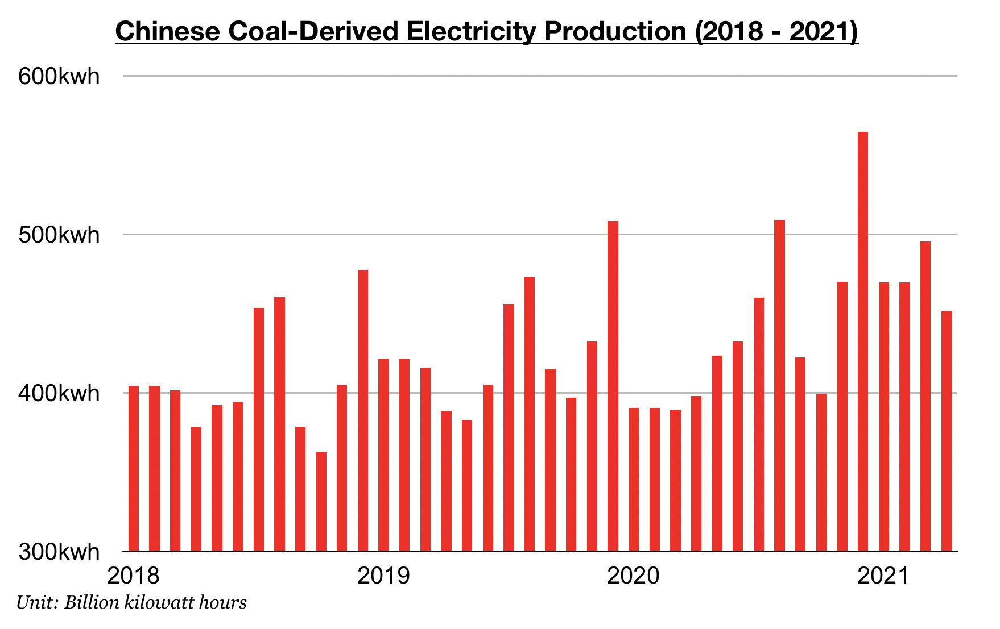

# Coal Remains King in China

**Date:** May 26, 2021  
**Publisher:** Breakwave Advisors | **Category:** Market Insights  
**Original URL:** [https://www.breakwaveadvisors.com/insights/2021/5/26/coal-remains-king-in-china](https://www.breakwaveadvisors.com/insights/2021/5/26/coal-remains-king-in-china)  

---

[*By Jeffrey Landsberg*](mailto:jeffrey@commodore-research.com)

China's coal-derived electricity generation has continued to fare much better than coal production, and this remains very positive for China’s near-term coal import prospects. The last two months have seen coal-derived electricity generation grow year-on-year by 20% while coal production growth has been flat. Coal production growth has been coming under pressure as we have been anticipating (due to mine inspections and restrictions following earlier accidents and death) and it is likely to remain under government-driven pressure in the near term. This will remain supportive for the seaborne coal market and dry bulk shipping market.

> **Figure 1: Comm 5.26**  
> [Local Asset](file:///C:/Users/Dell/Github/Shipping/corpus/03-breakwave/insights/2021/assets/2021-05-26_coal-remains-king-in-china_img_comm526_dd0697e45851.jpg)

As we have been stressing often in our Weekly Dry Bulk Reports and Weekly China Reports, coal has been set to remain king in China for many years. So far this year, coal has contributed to 75% of China’s total electricity production. While many renewable sources of electricity in China continue to experience significant growth — they still contribute to only a relatively small amount of China's total electricity production.

Hydropower power most recently last month grew year-on-year by 3%. So far this year, hydropower production has contributed to 11% of China’s total electricity production. Wind power production last month grew year-on-year by 29%. So far this year, wind power production has contributed to 7% of China’s total electricity production. Nuclear power production last month grew year-on-year by 5%. So far this year, nuclear power production has contributed to 5% of China’s total electricity production. Solar power production last month grew year-on-year by 7%. So far this year, solar power production has contributed to 2% of China’s total electricity production.

---

**Tags:** Coal, China  
