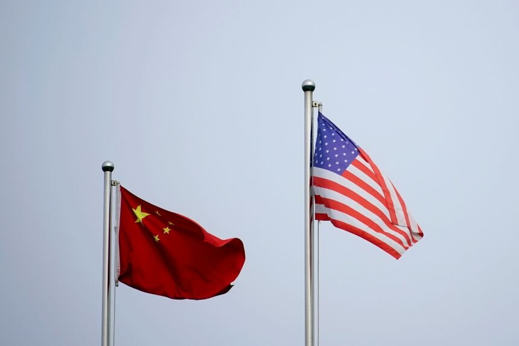
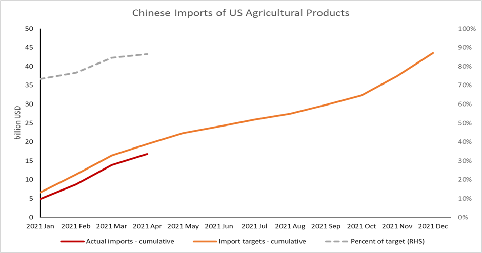
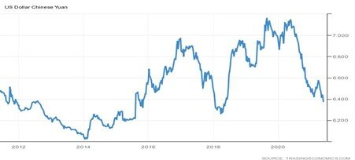

# Trade Tensions Back on the Trans-Pacific Agenda

**Date:** May 28, 2021  
**Publisher:** Breakwave Advisors | **Category:** Market Insights  
**Original URL:** [https://www.breakwaveadvisors.com/insights/2021/5/28/trade-tensions-back-on-the-trans-pacific-agenda](https://www.breakwaveadvisors.com/insights/2021/5/28/trade-tensions-back-on-the-trans-pacific-agenda)  

---

*By Ulf Bergman*

> **Figure 1: Us China1**  
> [Local Asset](file:///C:/Users/Dell/Github/Shipping/corpus/03-breakwave/insights/2021/assets/2021-05-28_trade-tensions-back-on-the-trans-pacific-agenda_img_uschina1_5900e6b585e3.jpg)

The trade tensions between the US and China of recent years have been largely absent in the news flow during the past few months. There has been no shortage of potential flashpoints between the two countries, but trade has not featured in any meaningful way in the disagreements since President Biden was inaugurated. While many analysts view this week’s over-due resumption of trade talks as a positive development, any immediate breakthroughs look unlikely to materialise. The comment by the White House’s top official for Asia, Kurt Campbell, earlier in the week that the US see the bilateral relations shifting from engagement to competition and the US calls for increased Chinese transparency on the COVID19 virus could add to an already complicated picture. Reports that China is increasing the inspections of corn imported from the US, which led to some mills cancelling their US cargoes, could potentially be seen as a Chinese response to surging commodity prices and heightened US political rhetoric. However, less than one million tonnes of corn have so far been cancelled, which, as Beijing has boosted its purchases to fulfil its commitments under the phase-one trade deal, must be seen as fairly limited damage.

The ambitious commitments made by China during the phase-one trade negotiations at the beginning of last year are yet to be met. While some progress has been made and, compared to last year, Chinese imports of US products have increased, they are still well below the agreed targets. According to the latest monthly analysis by the Peterson Institute for International Economics (PIIE), China has made only 73 per cent of its year-to-date targets for purchases of all covered products outlined in the agreement. There is also quite a difference between different product types, with agricultural imports doing relatively better than manufactured goods and energy. As of the end of April, the imports of US agricultural products had reached 87 per cent of their year-to-date targets, with manufactured products and energy at 71 and 56 per cent of their targets respectively.

> **Figure 2: Data Source:the Peterson Institute for International Economics**  
> *Data source:the Peterson Institute for International Economics*  
> [Local Asset](file:///C:/Users/Dell/Github/Shipping/corpus/03-breakwave/insights/2021/assets/2021-05-28_trade-tensions-back-on-the-trans-pacific-agenda_img_ulf528_02ee6a566f12.png)

From a US export perspective, the numbers look even more underwhelming with agricultural exports reaching 79 per cent of target and manufactured goods and energy lagging at 64 and 32 per cent of targets respectively. The agreement allows for both data sets to be used, making any conclusions a bit ambiguous. However, the Biden administration’s earlier insistence on China living up to its commitments under the accord should maintain a strong flow of US exports heading for Chinese ports. The cancellation of corn shipments should probably be seen as part of the current efforts to control market prices, rather than a serious attempt to reduce the imports.

The high commodity prices, despite recent corrections, have helped China getting closer to the objectives under the trade deal, as the targets are based on values rather than volumes. However, the surging commodity prices are causing domestic problems in China. In combination with an underperforming domestic consumer goods sector, the record-breaking commodity prices of recent weeks have weighed on industrial profits. While a year-on-year growth in April of 57 per cent may look impressive, it failed to match the 93 per cent recorded in March. In addition, the corporate performance is, like the economic recovery in general, unbalanced. The export-driven manufacturing and the metals industry are doing very well, while domestic-oriented industries are struggling to generate profits.

There is also a concern that the high commodity prices will drive inflation higher in China. Producer prices are on the rise, but consumer prices are still only registering modest increases. Beijing’s various attempts to try to control the commodity prices and inflationary pressures may however be aided by the strengthening of its currency. The yuan has been rallying since late March, amid the improving outlook for China’s economy, strong capital inflows and general dollar weakness. Although a stronger yuan will help to curb the imported inflation and rising commodity costs, it will also increase the price of exported goods. Hence, the Chinese central bank may act against the strengthening currency if it is starting to harm exports. In the meantime, the strength of the yuan is likely to contribute to a continued strong Chinese demand for commodities.

> **Figure 3: Ulf 2 5.28**  
> [Local Asset](file:///C:/Users/Dell/Github/Shipping/corpus/03-breakwave/insights/2021/assets/2021-05-28_trade-tensions-back-on-the-trans-pacific-agenda_img_ulf2528_7f895e768317.jpg)

---

**Tags:** China, Australia, Trade  
