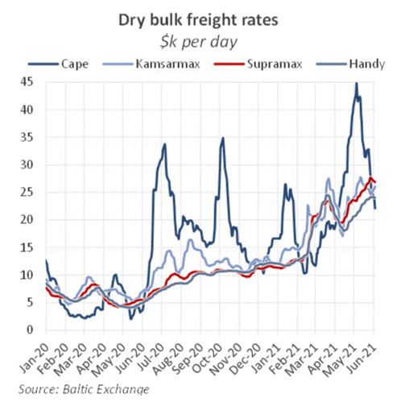
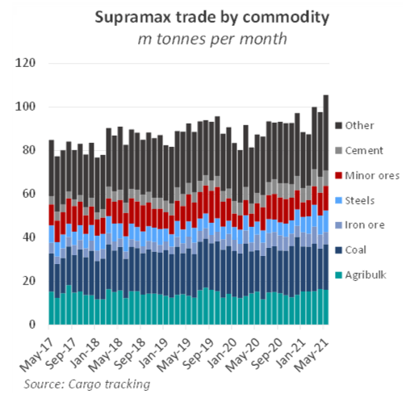
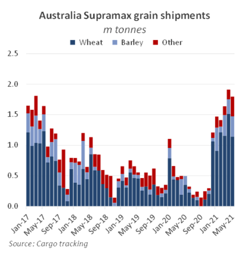
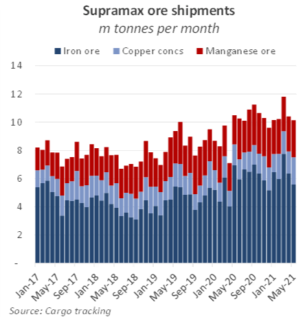
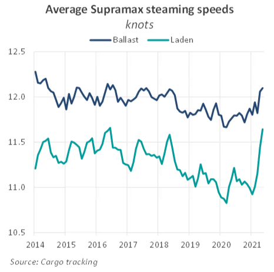

# The Big Picture: Supramax market

**Date:** June 04, 2021  
**Publisher:** Breakwave Advisors | **Category:** Market Insights  
**Original URL:** [https://www.breakwaveadvisors.com/insights/2021/6/3/the-big-picture-supramax-market](https://www.breakwaveadvisors.com/insights/2021/6/3/the-big-picture-supramax-market)  

---

*By Nick Ristic*

*Supramaxes have now taken the lead as the highest-earning bulker size, as the geared ships continue to outperform larger vessels and benefit from the resurgence in economic activity around the world.*

### Up and Away

The Supramax market has gone from strength to strength so far this year, with these vessels now earning a premium over all of the other designs assessed by the Baltic Exchange. Since the start of the year, freight rates for these ships have surged by 138%to over $27,000 per day. This is the greatest YTD percentage gain of all of the dry asset classes, and while these ships often outperform Capes in weak markets, this kind of premium while the wider market is so strong is almost unheard of. Over the last few weeks, the Baltic’s assessed 58k dwt ship has also clawed back a premium to the 38k dwt Handy, after trading at near-parity last year.

> **Figure 1: Bmr 1 6.3**  
> [Local Asset](file:///C:/Users/Dell/Github/Shipping/corpus/03-breakwave/insights/2021/assets/2021-06-04_the-big-picture-supramax-market_img_bmr163_dcdac14a1202.png)

### Trade Boost

Naturally, underlying the surge in freight has been a jump in raw material trade. Total dry bulk shipments on geared vessels hit a record 155.7m tonnes last month, an improvement of 4% MoM and 16% YoY, according to our cargo tracking, which excludes cabotage trade. Trade on ships in our Supramax group category (see p.15) specifically grew by 5% MoM and 17% YoY to over 102m tonnes in May. Within this increase, there are a few specific commodities worth mentioning. We have covered the boost in steel trade and subsequent growth in long-haul employment on these ships extensively over the last few weeks, but some of the less glamorous commodities are also in high demand.

> **Figure 2: Volumes of Aggregates on Supras**  
> *Volumes of aggregates on Supras, another relatively low-value commodity group, have also made gains. Some market share has been lost to the bigger ships, given that stem sizes for this type of good can be upped relatively easily (seeThe Big Pictureon 20 May), but liftings grew by 11% YoY in the last five months to almost 30m tonnes, underpinned again by growth from developing regions.*  
> [Local Asset](file:///C:/Users/Dell/Github/Shipping/corpus/03-breakwave/insights/2021/assets/2021-06-04_the-big-picture-supramax-market_img_bmr263_2ceb40b9fb1d.png)

Supramax shipments of cement so far this year are up by 30% YoY, and hit a record 7.8m tonnes in March, accounting for 745 voyages. The jump in imports has partly been driven by China (which sits on the margin of being an importer or exporter) as the recent infrastructure push has raised domestic demand for this good. But we’ve also seen a surge in demand from developing countries such as Bangladesh, Ghana and the Ivory Coast, which are also urbanising at a rapid pace. At the same time, US imports of this material grew by 25% YoY over January - May. This is likely down to elevated construction activity following the country’s enormous stimulus injection, which is now being felt in the dry bulk market.

### Agribulks in the Pacific

In absolute terms, the agribulks have also been a major driver of growth in tonnes moved. Over the first five months of the year, agribulk trade on Supras has grown by 10% YoY to almost 75m tonnes. As we have covered recently, these ships have benefitted from bumper exports of soybeans and corn from North and South America, backed by enormous Chinese demand, but we’ve also seen this market enjoy gains in trades which have been out of the spotlight.

Wheat exports from Australia, for example, have also surged so far this year, with volumes on Supras hitting a record 1.5m tonnes in April. YTD, wheat liftings on these ships are up by 170% YoY at 5.7m tonnes. (113 shipments), and have mostly headed to buyers in Southeast Asia. This is in part driven by favourable crop conditions, but also a lack of drought in East Australia, which in the past few years has restricted total volumes available for export. Meanwhile, Australian Barley exports, which were hammered by Chinese tariffs last year, have now recovered back to 2018 levels as Saudi Arabia, Vietnam and Thailand emerge as buyers of this crop.

> **Figure 3: Bmr 3 6.3**  
> [Local Asset](file:///C:/Users/Dell/Github/Shipping/corpus/03-breakwave/insights/2021/assets/2021-06-04_the-big-picture-supramax-market_img_bmr363_ff4453cb5d9e.png)

### Ore-Some Growth

As metal prices surge across the board, heightened demand for their raw ores and concentrates has benefitted the smaller bulkers, particularly in the basins of the Pacific and Indian Ocean. Supramaxes have seen a 20% YoY increase in copper concentrate shipments so far this year, as prices of the refined metal have soared by as much as 80% since the start of 2020. China is the biggest player in this market, pulling in tonnes from Chile and Peru. Trade of manganese ore, a key steelmaking ingredient, has also received a bump in volumes over the past few months as the global steel industry runs hot. YTD volumes are up by 14% YoY at 12.4m tonnes, again backed by strong imports from China. Iron ore and Supramaxes are rarely mentioned in the same sentence, but scarce supply of this commodity and regional disparities in steelmaking activity have driven record levels of cargoes shipped on these vessels. Supply from Brazil and Australia, which overwhelmingly ship on Capesizes, remains relatively inflexible, and so China has looked to less traditional sources to satisfy record levels of steel output, which tend to use smaller ships.

Indian iron ore exports on Supras have boomed, which is partly down to lower domestic demand there, but we’ve also recorded an uptick from other producers such as Liberia and Norway, and from distribution hubs such as Bahrain.

> **Figure 4: Bmr 4 6.3**  
> [Local Asset](file:///C:/Users/Dell/Github/Shipping/corpus/03-breakwave/insights/2021/assets/2021-06-04_the-big-picture-supramax-market_img_bmr463_b8a279843ec3.png)

There are plenty of other positive growth stories across the smaller commodities, but the bottom line is that the geared fleet is well placed to supply re-opening economies with the wide variety of raw materials needed to get growth back on track. This is also evident in rapidly rising vessel speeds, which indicate that spare capacity is being squeezed out of the fleet where it can be.

> **Figure 5: Bmr 5 6.3**  
> [Local Asset](file:///C:/Users/Dell/Github/Shipping/corpus/03-breakwave/insights/2021/assets/2021-06-04_the-big-picture-supramax-market_img_bmr563_f8c76b0bd92d.png)

Average laden speeds for Supras jumped to 11.6 kts in May, up by 6% from 2020’s average, while ballast speeds have increased by 3% to 12.1 kts, despite bunker prices also being on the rise. At these high utilisation rates, we expect the continued global economic rebound to keep rates elevated over the next few months.

---

**Tags:** Supramax, Dry Bulk  
